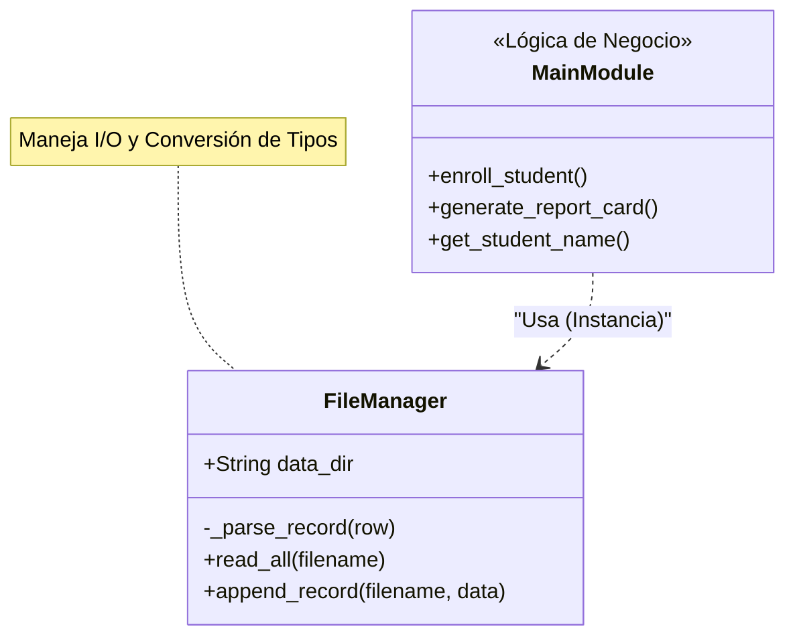
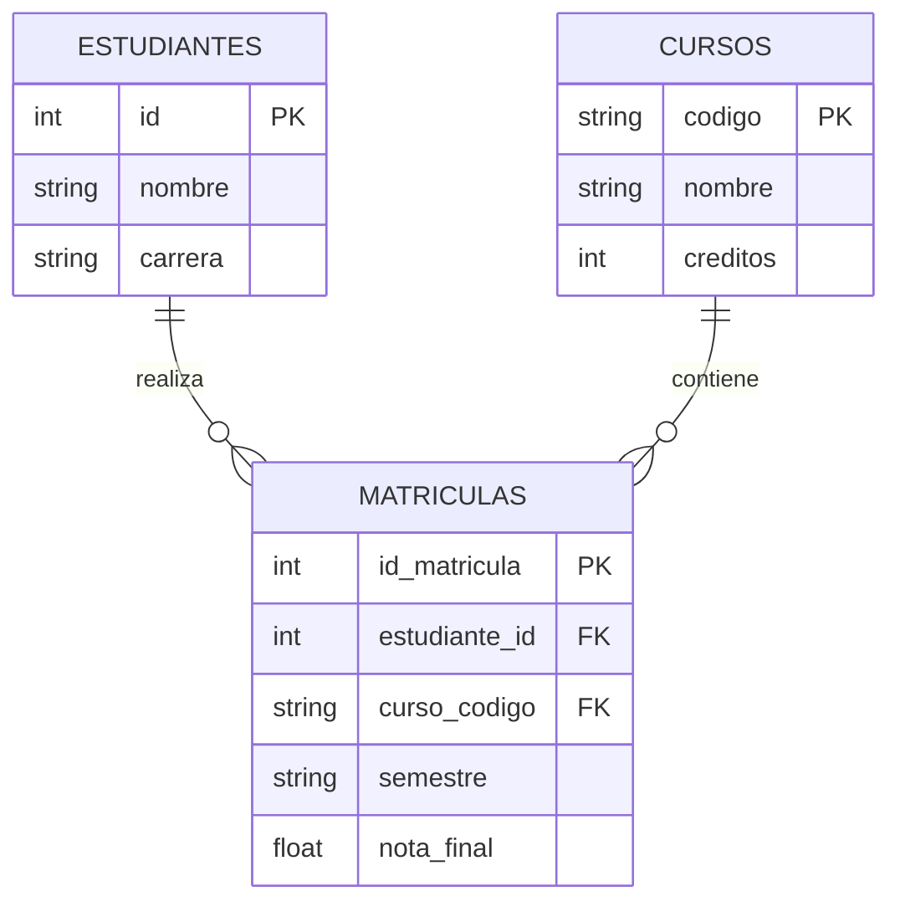

# Caso de uso: Sistema de Información Académica (Mini-SIA)

## 1. Contexto del Problema

Antes de la masificación de los Sistemas Gestores de Bases de Datos (DBMS) modernos como PostgreSQL, Oracle o MySQL, el software empresarial gestionaba la información utilizando **"Archivos Planos" (Flat Files)**.

En este modelo "a la antigua", el programador es responsable absoluto de todo:
* Definir el formato de almacenamiento (CSV).
* Asegurar que los datos no se corrompan al escribir.
* Optimizar la velocidad de búsqueda (que suele ser lineal $O(n)$).
* Validar manualmente que las relaciones entre datos sean coherentes (Integridad Referencial).

Este proyecto implementa una versión muy simple de un **Sistema de Información Académica (SIA)**. Este **Mini-SIA** basado enteramente en archivos **CSV** y **Python**. Sirve como caso de estudio para entender la complejidad algorítmica y estructural que los Motores de Base de Datos resuelven automáticamente.

## 2. Objetivos de Aprendizaje

Al finalizar el análisis y ejecución de este código, el estudiante deberá ser capaz de:

1.  **Implementar Persistencia:** Leer y escribir datos estructurados en disco utilizando la librería estándar de Python (`csv`).
2.  **Gestionar Tipos de Datos (Parsing):** Comprender el problema de convertir texto plano a enteros, flotantes o nulos (`None`) manualmente.
3.  **Simular Integridad Referencial:** Escribir lógica de código para validar relaciones (Foreign Keys) antes de guardar datos.
4.  **Analizar Complejidad:** Identificar por qué buscar datos en archivos secuenciales es ineficiente comparado con el indexado de bases de datos.
5.  **Testing Automatizado:** Ejecutar pruebas de integración para validar la lógica sin intervención humana.

## 3. Arquitectura del Proyecto

El código sigue una estructura modular estándar para separar la **Lógica de Negocio**, el **Acceso a Datos** y las **Pruebas**.

```text
proyecto_sia/              <-- RAÍZ DEL PROYECTO (Ejecutar comandos desde aquí)
│
├── data/                  # Capa de Datos (Base de Datos Física)
│   ├── estudiantes.csv    # Maestro de Estudiantes
│   ├── cursos.csv         # Maestro de Cursos
│   └── matriculas.csv     # Tabla Transaccional (Relación Muchos a Muchos)
│
├── src/                   # Código Fuente
│   ├── db_manager.py      # Capa de Persistencia (DAO / Driver CSV)
│   └── main.py            # Lógica de Negocio y Menú de Usuario
│
├── tests/                 # Aseguramiento de Calidad (QA)
│   └── test_backend.py    # Pruebas de integración automatizadas
│
└── README.md              # Documentación

```

### 3.1 Modelo de Datos (Esquema CSV)

**A. `estudiantes.csv`**

* **PK (Primary Key):** `id` (int)
* **Datos:** `nombre`, `email`, `carrera`, `semestre` (int).

**B. `cursos.csv`**

* **PK:** `codigo` (string)
* **Datos:** `nombre`, `creditos` (int), `profesor`.

**C. `matriculas.csv`**

* **PK:** `id_matricula` (Auto-incremental).
* **FK (Foreign Keys):**
* `estudiante_id`: Valida contra `estudiantes.csv`.
* `curso_codigo`: Valida contra `cursos.csv`.


* **Datos:** `semestre` (String, ej: "2024-1"), `nota_final` (Float, permite vacíos).

---

## 4. Especificación Técnica (Ingeniería de Software)

### 4.1 Requerimientos Funcionales

El sistema cumple con los siguientes requisitos mínimos de funcionamiento:

| ID | Requerimiento | Descripción Técnica | Criterio de Aceptación |
| --- | --- | --- | --- |
| **RF-01** | **Motor de Persistencia** | Capacidad de transformar texto plano (CSV) a tipos de datos Python (`int`, `float`, `None`) y viceversa. | `db.read_all` retorna enteros y flotantes reales, no strings. |
| **RF-02** | **Integridad Referencial** | Validar que `estudiante_id` y `curso_codigo` existan en sus respectivos archivos maestros antes de escribir en `matriculas.csv`. | El sistema rechaza matrículas con IDs inexistentes. |
| **RF-03** | **Consulta con JOIN** | Algoritmo de búsqueda cruzada para relacionar `matriculas` con `cursos` y obtener el nombre de la materia. | El reporte muestra "Cálculo Integral", no solo el código "MAT200". |
| **RF-04** | **Transaccionalidad** | Escritura de nuevos registros utilizando modo *append* (`a`) para no corromper datos previos. | El archivo crece, no se sobrescribe ni se borra. |

> [!note]
> El tema de levantamiento de **requisitos** se ve en el curso de **Análisis y Diseño de Sistemas I**. 

### 4.2 Diagramas de Diseño

#### Diagrama de Clases (Estructura del Código)



> [!note]
> El diagrama UML se ve en el curso de **Análisis y Diseño de Sistemas I**.

#### Diagrama Entidad-Relación (Modelo de Datos)


> [!note]
> El uso de diagramas de entidad relación se aborda en el curso de **Bases de datos** (proximo semestre).

## 5. Instrucciones de Ejecución

> [!important]
> Todos los comandos deben ejecutarse desde la carpeta raíz `proyecto_sia/` para que el sistema encuentre la carpeta `data/`.

### Opción A: Modo Usuario (Interactivo)

Use este modo para probar el menú, ver estudiantes, matricular y generar reportes manualmente.

```bash
# Windows
python src\main.py

# Mac/Linux
python3 src/main.py

```

### Opción B: Modo Desarrollador (Tests Automáticos)

Use este modo para verificar la integridad del sistema. Este script prueba la lectura, validación de integridad referencial y persistencia (lectura tras escritura) sin intervención humana.

```bash
# Windows
python tests\test_backend.py

# Mac/Linux
python3 tests/test_backend.py

```

## 6. Análisis Crítico: Archivos vs. Bases de Datos

Este ejemplo evidencia las limitaciones críticas de usar archivos planos frente a un motor SQL real:

| Característica | En este Sistema de Archivos (Python) | En una Base de Datos (SQL) |
| --- | --- | --- |
| **Búsqueda** | **Lenta ():** Para validar un estudiante, recorremos toda la lista fila por fila. Inviable con millones de datos. | **Rápida ():** Usan Índices B-Tree para encontrar datos instantáneamente. |
| **Relaciones** | **Manual:** Debemos programar `if` y bucles anidados para cruzar datos ("Joins" a mano). | **Nativa:** Se usa `JOIN` y el motor optimiza el algoritmo de cruce (Hash Join, Merge Join). |
| **Integridad** | **Frágil:** Si borramos un estudiante del archivo `estudiantes.csv` manualmente (Excel), las matrículas quedan "huérfanas". | **Robusta:** Las restricciones `FOREIGN KEY` impiden borrar un estudiante si tiene notas asociadas. |
| **Concurrencia** | **Nula:** Si dos usuarios guardan una matrícula al mismo tiempo, el archivo se corrompe. | **ACID:** Soportan transacciones seguras multi-usuario y bloqueos de fila. |

## 7. Trabajo Futuro

A continuación, se describen posibles mejoras que el sistema puede tener:
1. **Nivel Básico:** Implementar la función de **"Actualizar Nota"**. Requiere buscar el registro en la lista, modificarlo y reescribir *todo* el archivo CSV.
2. **Nivel Intermedio:** Optimizar la búsqueda usando **Diccionarios (Hash Maps)** en memoria para no recorrer la lista de estudiantes cada vez ( vs ).
3. **Nivel Avanzado:** Implementar un mecanismo de **Lock (Bloqueo)** creando un archivo temporal `.lock` antes de escribir, para simular control de concurrencia.

> [!important]
> Este material fue desarrollado con apoyo de herramientas de IA como asistente de redacción y estructuración. El contenido ha sido supervisado, validado y refinado por intervención humana para garantizar su precisión técnica y coherencia pedagógica. No obstante, pueden haber errores.