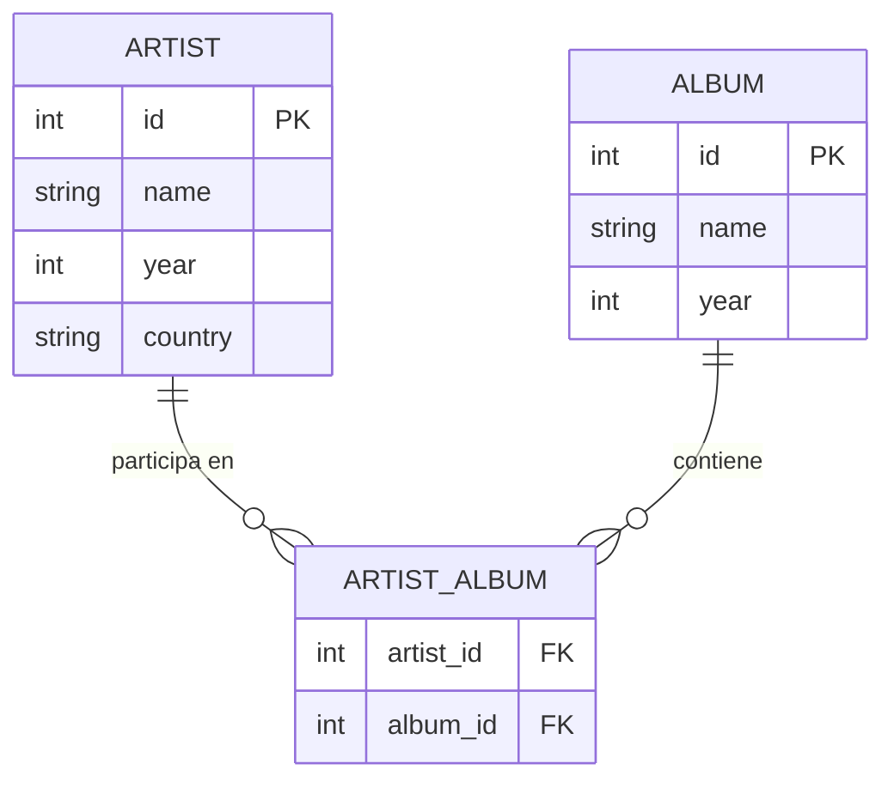
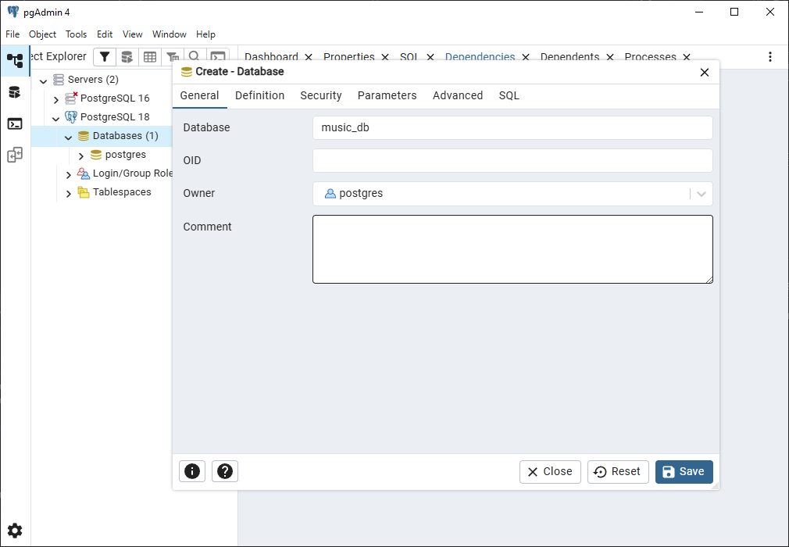
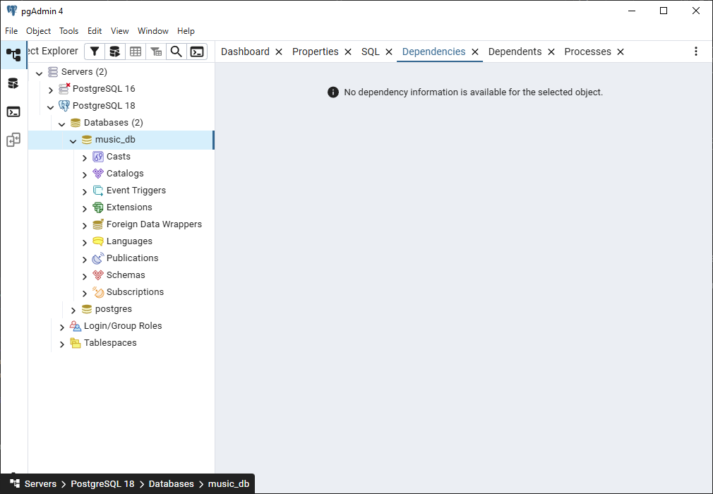
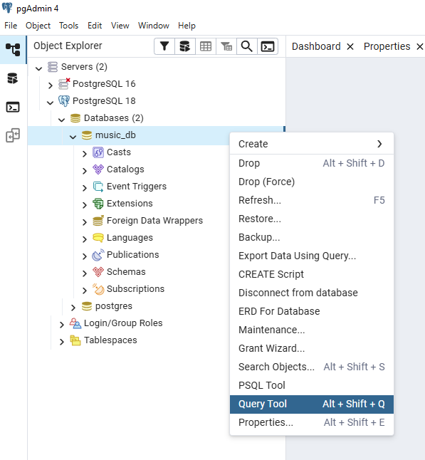
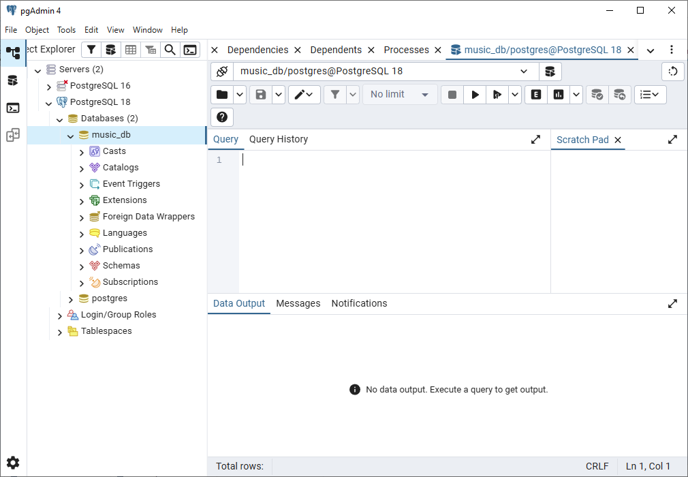
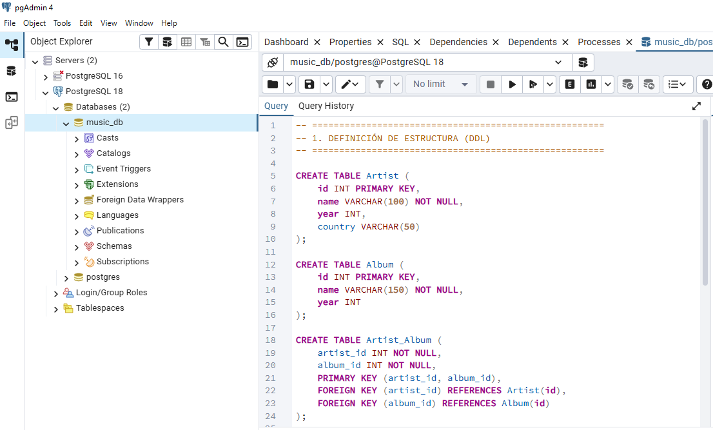
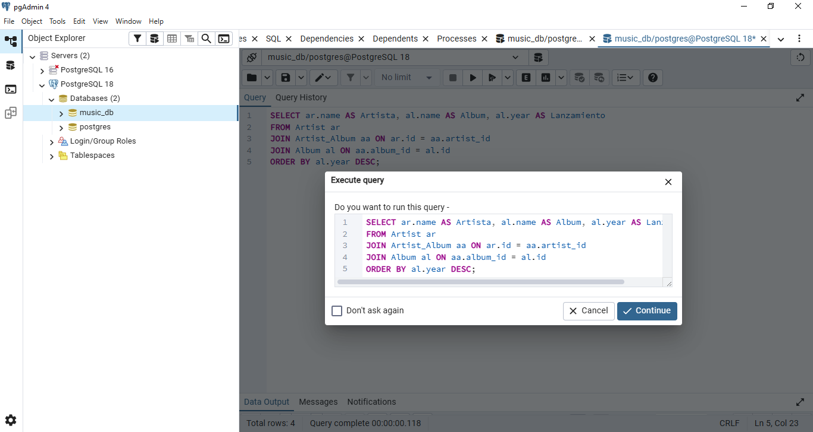
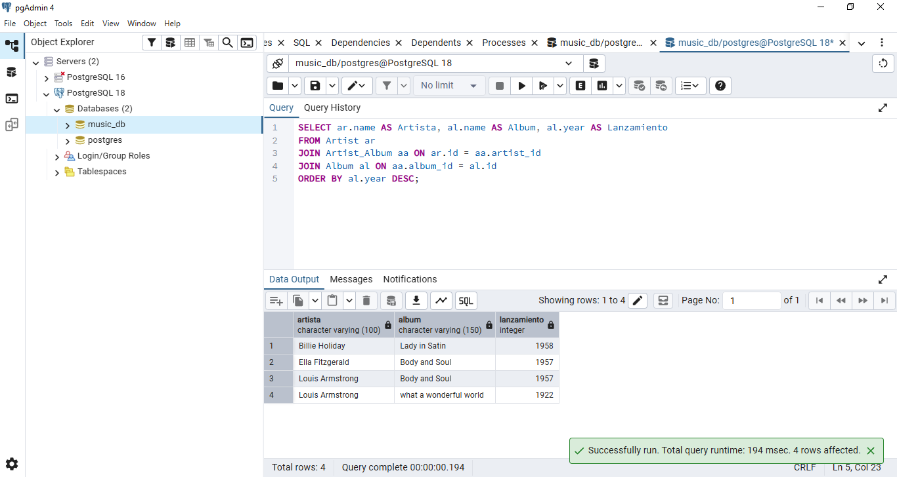
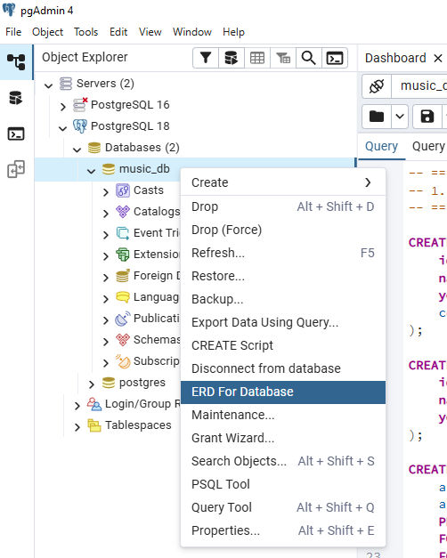
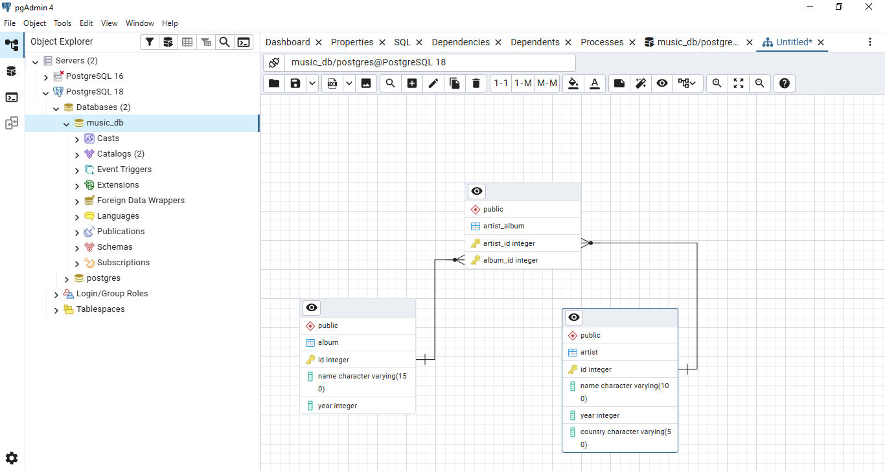

# Creación y Despliegue de Base de Datos en PostgreSQL

Esta guía técnica detalla el proceso de creación, estructuración y carga de datos para una base de datos de gestión musical mostrada en la clase.

> [!important]
> Antes de empezar, se recomienda que tener instalado PostgreSQL y algunos de sus complementos. Si aun no lo ha instalado, puede consultar el proceso de instalación siguiendo el siguiente [link](../../../labs/tools/postgresql/)

---

## 1. Fundamentos Teóricos

Para este laboratorio, trabajaremos bajo el paradigma **Relacional**. Es vital comprender los siguientes conceptos:

* **Modelo Entidad-Relación (E-R):** Representación visual de las entidades y cómo se conectan entre sí.
* **Relación Muchos a Muchos (N:M):** Un artista puede tener varios álbumes y un álbum puede tener varios artistas. Esto se resuelve mediante una **tabla asociativa** (`Artist_Album`).
* **Normalización:** El diseño asegura que los datos de los artistas no se repitan innecesariamente en la tabla de álbumes.

### Diagrama del Modelo (Mermaid)



---

## 2. Estructura y Contenido de las Tablas

A continuación, se detalla la información que se implementará en el sistema:

### Tabla: `Artist`

| ID (PK) | Name | Year (Debut) | Country |
| --- | --- | --- | --- |
| 101 | Billie Holiday | 1933 | USA |
| 102 | Ella Fitzgerald | 1917 | USA |
| 103 | Louis Armstrong | 1922 | USA |

### Tabla: `Album`

| ID (PK) | Name | Year |
| --- | --- | --- |
| 11 | Lady in Satin | 1958 |
| 22 | Body and Soul | 1957 |
| 33 | What a Wonderful World | 1922 |

### Tabla: `Artist_Album` (Relacional)

| Artist_id (FK) | Album_id (FK) |
| --- | --- |
| 101 | 11 |
| 102 | 22 |
| 103 | 22 |
| 103 | 33 |

---

## 3. Proceso de Creación en PostgreSQL

### Paso 1: Creación de la Base de Datos

1. Inicia **pgAdmin 4**.
2. Haz clic derecho en **Databases** > **Create** > **Database...**.
3. Asigna el nombre `music_db`.





### Paso 2: Conexión y Query Tool

Una vez creada, selecciónala y abre el **Query Tool** (icono del rayo o clic derecho sobre la DB).





---

## 4. Implementación de Scripts (DDL & DML)

Copia y ejecuta el siguiente bloque de código para construir el esquema y poblar las tablas.

```sql
-- ======================================================
-- 1. DEFINICIÓN DE ESTRUCTURA (DDL)
-- ======================================================

CREATE TABLE Artist (
    id INT PRIMARY KEY,
    name VARCHAR(100) NOT NULL,
    year INT,
    country VARCHAR(50)
);

CREATE TABLE Album (
    id INT PRIMARY KEY,
    name VARCHAR(150) NOT NULL,
    year INT
);

CREATE TABLE Artist_Album (
    artist_id INT NOT NULL,
    album_id INT NOT NULL,
    PRIMARY KEY (artist_id, album_id),
    FOREIGN KEY (artist_id) REFERENCES Artist(id),
    FOREIGN KEY (album_id) REFERENCES Album(id)
);

-- ======================================================
-- 2. CARGA DE DATOS (DML)
-- ======================================================

INSERT INTO Artist (id, name, year, country) VALUES
(101, 'Billie Holiday', 1933, 'USA'),
(102, 'Ella Fitzgerald', 1917, 'USA'),
(103, 'Louis Armstrong', 1922, 'USA');

INSERT INTO Album (id, name, year) VALUES
(11, 'Lady in Satin', 1958),
(22, 'Body and Soul', 1957),
(33, 'what a wonderful world', 1922);

INSERT INTO Artist_Album (artist_id, album_id) VALUES
(101, 11),
(102, 22),
(103, 22),
(103, 33);

```



---

## 5. Verificación de Integridad

Para validar que las llaves foráneas y las relaciones están funcionando, realiza una consulta de unión (**JOIN**):

```sql
SELECT ar.name AS Artista, al.name AS Album, al.year AS Lanzamiento
FROM Artist ar
JOIN Artist_Album aa ON ar.id = aa.artist_id
JOIN Album al ON aa.album_id = al.id
ORDER BY al.year DESC;
```





---

## 6. Visualización del Modelo (ERD Tool)

pgAdmin permite generar automáticamente el diagrama de relaciones para verificar visualmente nuestro diseño.

1. En el panel **Browser**, haz clic derecho sobre el nombre de la base de datos `music_db`.
2. Busca y selecciona la opción **ERD Tool**.
   
   

3. Se abrirá una nueva pestaña donde verás las tablas y sus conexiones (las líneas que unen las PK con las FK).

   

---

## 6. Resultados de Aprendizaje

Al finalizar esta guía, el estudiante estará en capacidad de:
1. Implementar bases de datos relacionales desde cero utilizando el motor PostgreSQL.
2. Traducir un modelo lógico a un esquema físico mediante el uso de comandos **DDL** (Data Definition Language).
3. Gestionar la integridad referencial a través de la correcta definición de Llaves Primarias (**PK**) y Foráneas (**FK**).
4. Poblar estructuras de datos complejas empleando comandos **DML** (Data Manipulation Language).
5. Validar la consistencia de las relaciones entre tablas mediante herramientas de visualización (**ERD**) y consultas de unión (**JOIN**).

## 7. Recursos Adicionales

Si eres principiante y quieres profundizar en el mundo de las bases de datos relacionales, te recomendamos los siguientes recursos:

* **[Kaggle SQL Courses](https://www.kaggle.com/learn/intro-to-sql):** Excelente para aprender SQL aplicado a la ciencia de datos con ejercicios interactivos.
* **[PostgreSQL Tutorial (Inglés)](https://www.postgresqltutorial.com/):** Una guía paso a paso desde lo más básico hasta niveles avanzados.
* **[SQLZoo](https://sqlzoo.net/):** Plataforma interactiva para practicar consultas SQL directamente en el navegador.
* **[Documentación Oficial de PostgreSQL](https://www.postgresql.org/docs/):** La "biblia" técnica; ideal para consultar tipos de datos y funciones específicas.
* **[Khan Academy - Intro a SQL](https://es.khanacademy.org/computing/computer-programming/sql):** Un curso muy amigable y visual para entender la lógica de las consultas.


> [!important]
> Este material fue desarrollado con apoyo de herramientas de IA como asistente de redacción y estructuración. El contenido ha sido supervisado, validado y refinado por intervención humana para garantizar su precisión técnica y coherencia pedagógica. No obstante, pueden haber errores.