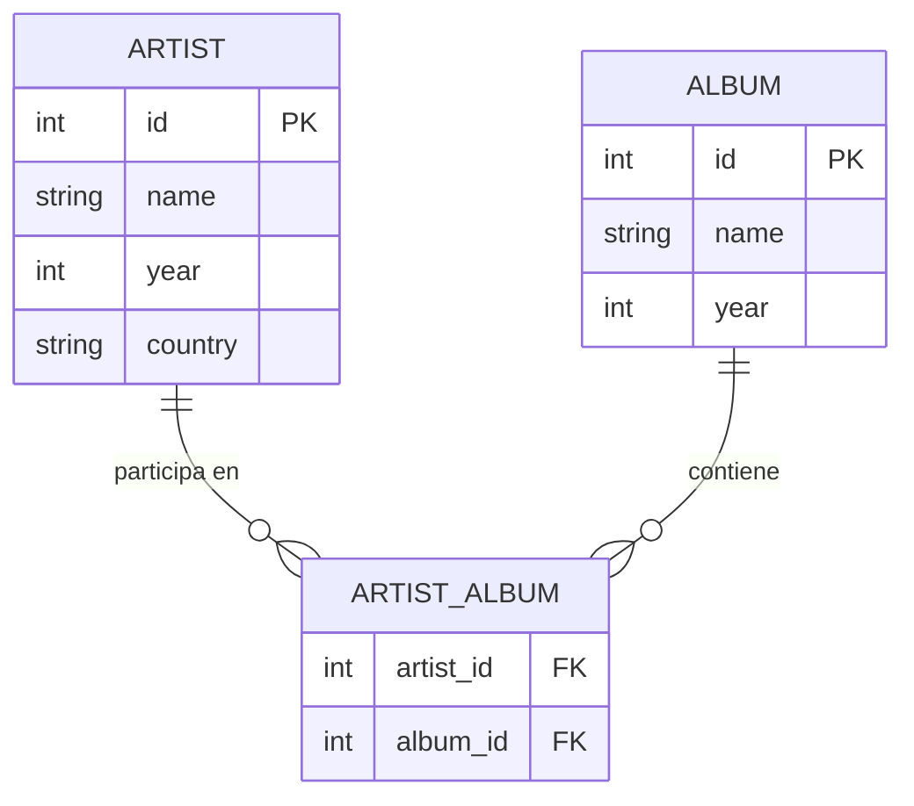

# Conexión a una base de datos

En construcción...

* https://realpython.com/python-sql-libraries/

<!--
## Base de datos

### Modelo Entidad relación

### Tablas y datos

#### Tabla: `Artist`

| ID (PK) | Name | Year (Debut) | Country |
| --- | --- | --- | --- |
| 101 | Billie Holiday | 1933 | USA |
| 102 | Ella Fitzgerald | 1917 | USA |
| 103 | Louis Armstrong | 1922 | USA |

#### Tabla: `Album`

| ID (PK) | Name | Year |
| --- | --- | --- |
| 11 | Lady in Satin | 1958 |
| 22 | Body and Soul | 1957 |
| 33 | What a Wonderful World | 1922 |

#### Tabla: `Artist_Album` (Relacional)

| Artist_id (FK) | Album_id (FK) |
| --- | --- |
| 101 | 11 |
| 102 | 22 |
| 103 | 22 |
| 103 | 33 |

>[!caution]
>En la tabla relacional hay un registro malo pues el album Body and Soul pertenece a Billie Holiday y no a Ella Fitzgerald y Louis Armstrong como esta en la tabla.

## Operaciones SQL

Teniendo la base de datos con la información de las tablas realizar las consultas para ver si los datos coinciden

Nuestro objetivo es realizar las siguientes tareas sencillo que:
1. Corrija el error del album (update)
2. Agregar registros nuevos:
   * Nuevo album con artistas conocidos (Louis Armstrong y Ella Fitzgerald)
   * Nuevo album (con artista aun no agregado)
   * Intenta asociar el nuevo album a un artista que no esta registrado (ver que error saca). ¿Seria util colocar una información asociada a un artista no conocido?, ¿Se puede poner un NULL en ese campo?
   * Actualizar el artista asociado al album, luego reintentar la operación.
   * Eliminar el album que tiene dos artistas.
  

## Uso de lenguaje de programación

Reiniciar la base de datos a sus valores iniciales.
-->