# Proyecto Base de Datos: Music Database (PostgreSQL)

## 1. Descripción general

El presente proyecto tiene como propósito ilustrar el flujo básico de trabajo en PostgreSQL mediante la creación y manipulación de una base de datos sencilla relacionada con artistas y álbumes musicales.

A través de este ejercicio se refuerzan los siguientes conceptos:
* Definición de tablas (DDL – Data Definition Language)
* Inserción de datos (DML – Data Manipulation Language)
* Claves primarias y claves foráneas
* Relación muchos-a-muchos
* Consultas con `JOIN`
* Operaciones básicas CRUD (Create, Read, Update, Delete)

El proyecto está organizado en tres archivos SQL:

```
schema.sql   → Define la estructura de la base de datos
data.sql     → Inserta datos de ejemplo
querys.sql   → Contiene consultas de verificación y práctica
```

---

## 2. Requisitos previos

Para ejecutar este proyecto en un entorno local se requiere:

* PostgreSQL instalado
* pgAdmin 4 instalado y configurado
* Conexión activa a un servidor PostgreSQL local

No se requieren conocimientos avanzados de SQL; el ejercicio está diseñado para consolidar fundamentos.

---

## 3. Flujo de ejecución en pgAdmin 4

A continuación, se describen los pasos necesarios para ejecutar correctamente el proyecto.

### Paso 1: Crear una nueva base de datos

1. Abrir **pgAdmin 4**.

2. En el panel izquierdo, expandir:

   ```
   Servers → PostgreSQL → Databases
   ```

3. Hacer clic derecho sobre **Databases**.

4. Seleccionar **Create → Database**.
   
   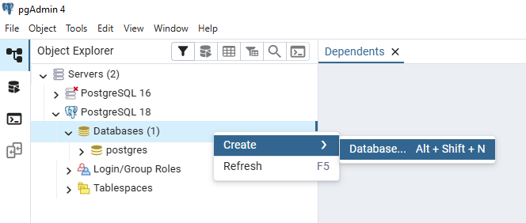

5. Asignar el nombre:

   ```
   music_db
   ```
   
   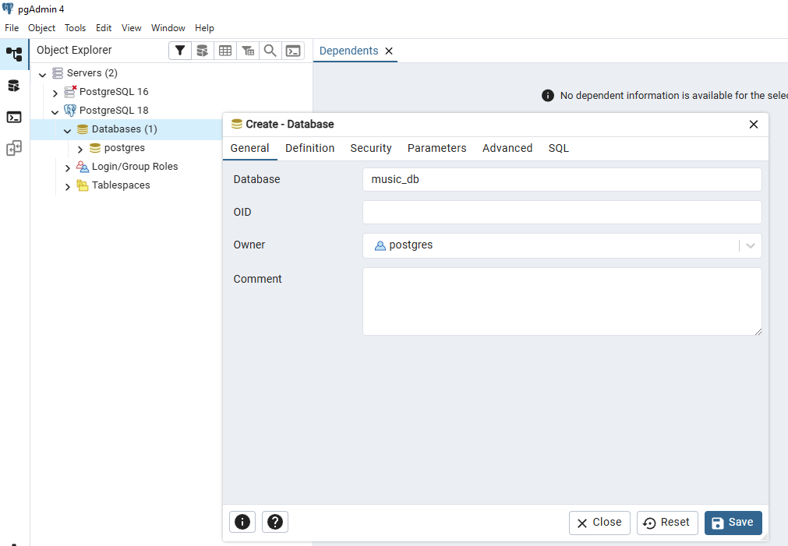

6. Presionar **Save**.

>[!note]
> En este punto se dispone de una base de datos vacía lista para recibir la estructura.

### Paso 2: Abrir el Query Tool

1. Hacer clic derecho sobre la base de datos `music_db`.
   
2. Seleccionar **Query Tool**.

Se abrirá el editor SQL, donde se ejecutarán los scripts del proyecto.

### Paso 3: Ejecutar `schema.sql` (creación de tablas)

1. En el Query Tool, seleccionar el ícono **Open File (📂)**.
2. Abrir el archivo `schema.sql`.
      
   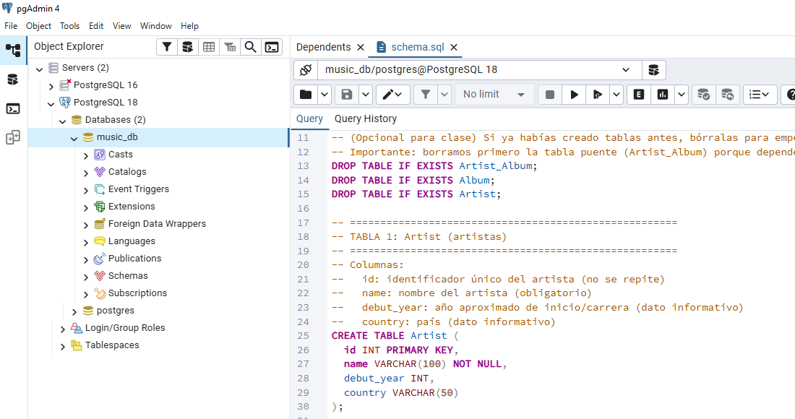

3. Presionar el botón **Execute (▶)**.

> [!note]
> Si el proceso es exitoso, el sistema mostrará un mensaje indicando que la consulta fue ejecutada correctamente.

Este script crea las siguientes tablas:

* `Artist`
* `Album`
* `Artist_Album`

La tabla `Artist_Album` representa una relación muchos-a-muchos entre artistas y álbumes. A continuación se muestra el modelo ER de la base de datos creada:

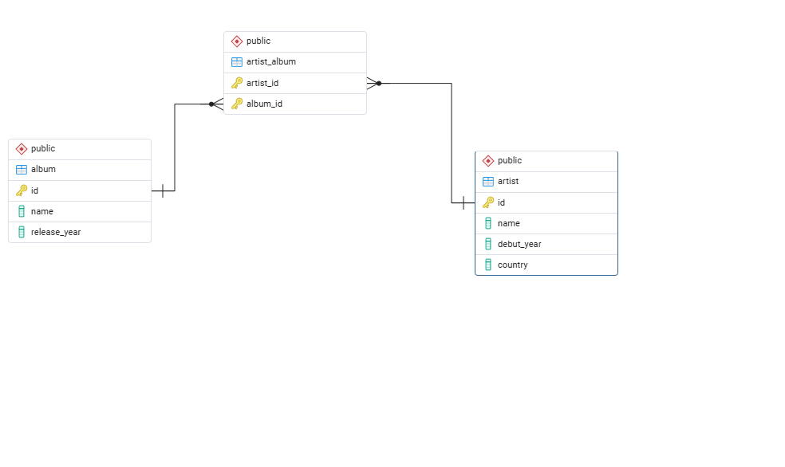

### Paso 4: Ejecutar `data.sql` (inserción de datos)

1. Abrir el archivo `data.sql`.
   
   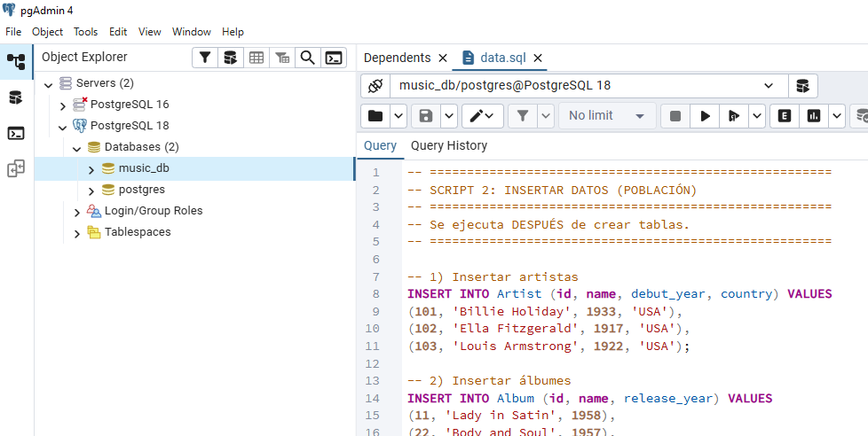

2. Ejecutarlo mediante el botón **Execute (▶)**.
   

> [!note] 
> Este archivo inserta registros de ejemplo en las tablas creadas previamente.

> [!warning]
> Es importante ejecutar primero `schema.sql` antes de `data.sql`, ya que no es posible insertar datos en tablas que aún no existen.

### Paso 5: Ejecutar `querys.sql` (consultas y verificación)

1. Abrir el archivo `querys.sql`.
   
   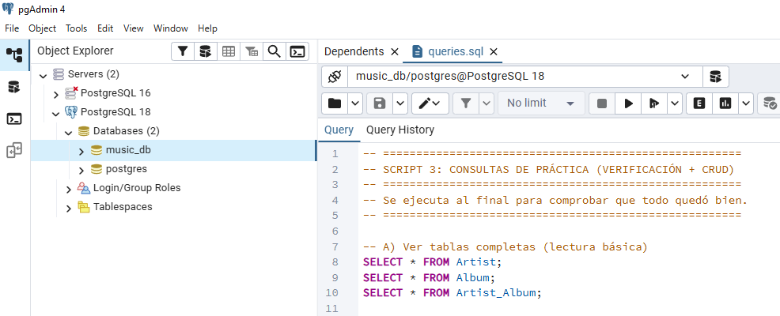

2. Ejecutar las consultas contenidas en el archivo.
   
   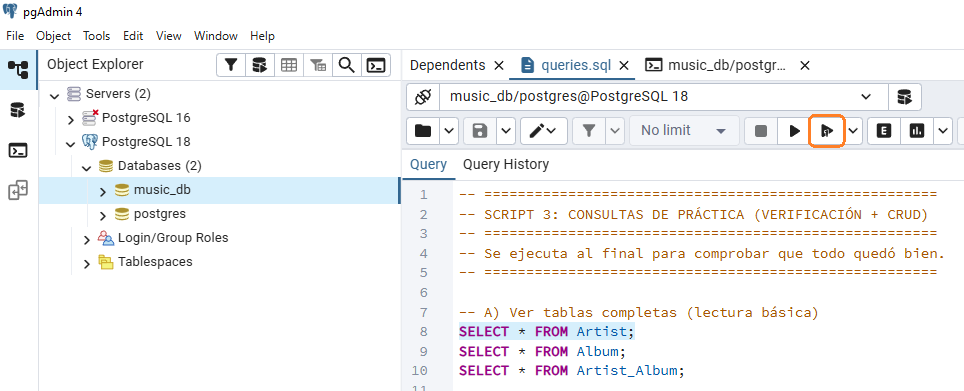

   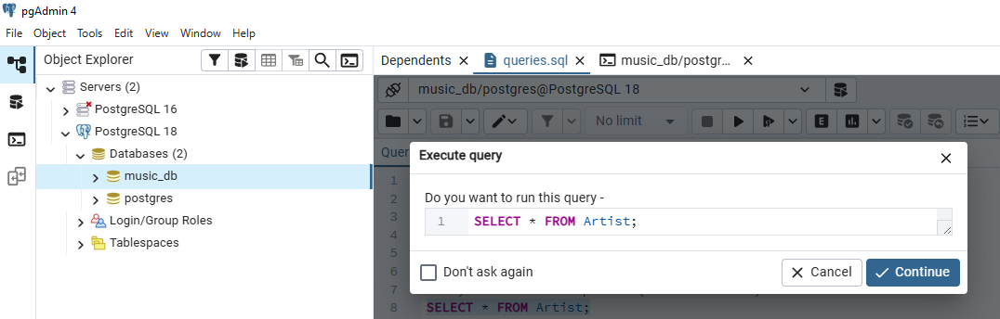

   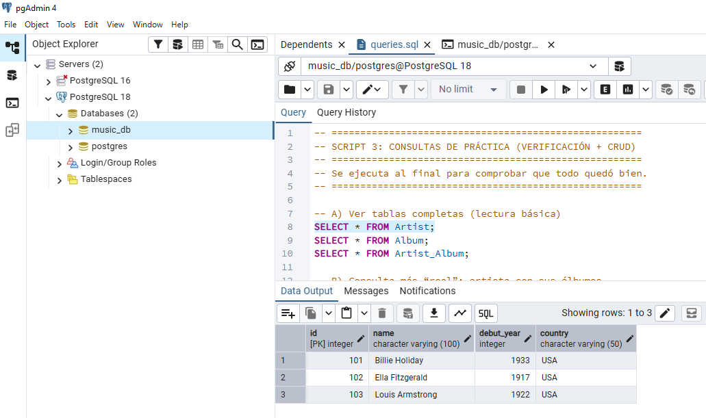

Estas consultas permiten:

* Visualizar el contenido de las tablas.
* Realizar consultas con `JOIN`.
* Probar operaciones CRUD.

> [!note]
> Si se obtienen resultados sin errores, la base de datos ha sido configurada correctamente.

---

## 4. Verificación gráfica alternativa

Además de ejecutar consultas, pgAdmin permite visualizar los datos desde la interfaz gráfica:

1. Navegar en el panel izquierdo a:

   ```
   Databases → music_db → Schemas → public → Tables
   ```
   
   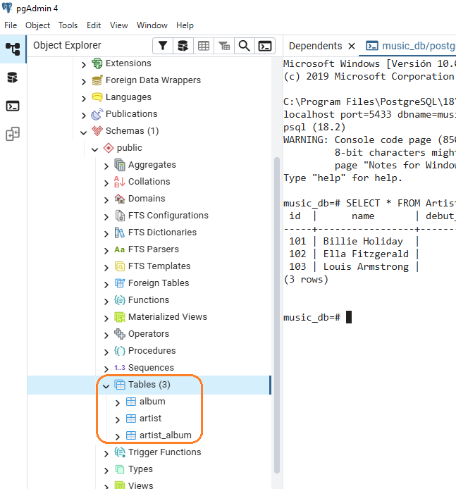

2. Hacer clic derecho sobre una tabla.
   
3. Seleccionar **View/Edit Data → All Rows**.
   
   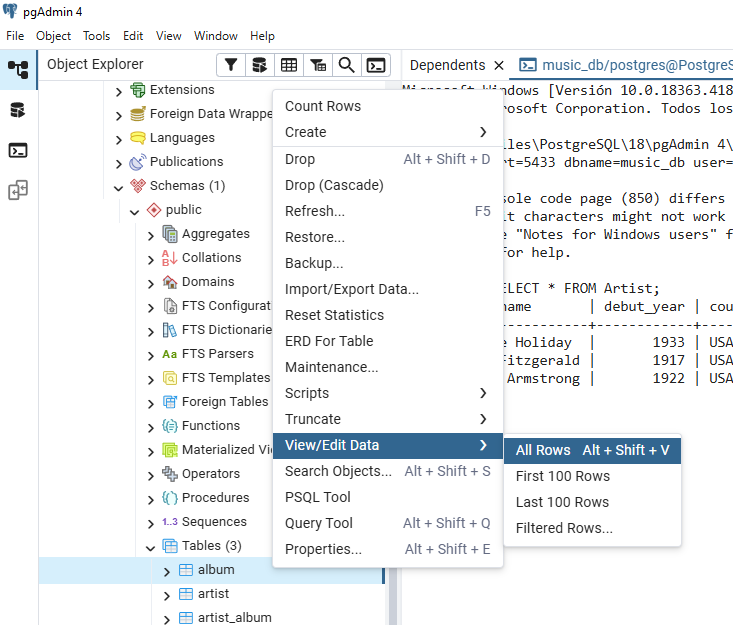


Esto permite confirmar visualmente que los registros fueron insertados correctamente.

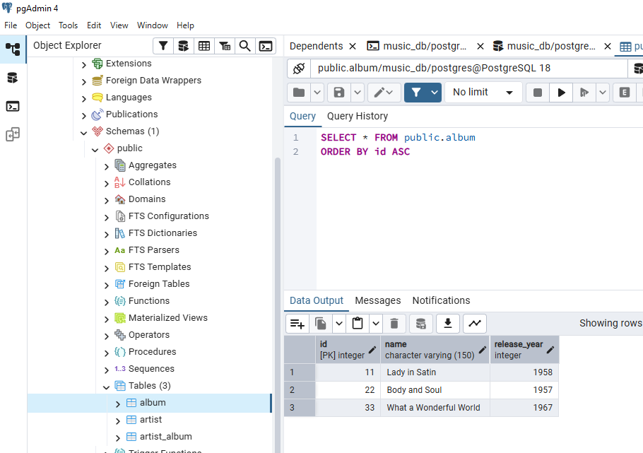

---

## 5. Orden correcto de ejecución

El orden de ejecución es fundamental:

1. `schema.sql`
2. `data.sql`
3. `querys.sql`

Este orden refleja el flujo natural de trabajo en bases de datos:

1. Definir estructura
2. Insertar información
3. Consultar y manipular datos

---

## 6. Ejercicios sugeridos de práctica

> [!tip] 
> **Recursos recomendados para aprender SQL:**
> * 📊 [Kaggle: Intro to SQL](https://www.kaggle.com/learn/intro-to-sql) - Tutoriales rápidos y prácticos.
> * 🦁 [SQLZoo](https://sqlzoo.net/) - Ejercicios interactivos desde nivel básico a avanzado.
> * 🎯 [Mode SQL Tutorial](https://mode.com/sql-tutorial/) - Muy completo para análisis de datos.

Una vez ejecutados los scripts, se recomienda realizar pruebas adicionales:

* Insertar un nuevo artista.
  
  ```sql
  -- Insercion
  INSERT INTO Artist (id, name, debut_year, country)
  VALUES (200, 'Lucho Bermúdez', 1940, 'Colombia');
  -- Verificacion
  SELECT * FROM Artist WHERE id = 200;  
  ```

* Crear un nuevo álbum.
  
  ```sql
  -- Insercion
  INSERT INTO Album (id, name, release_year)
  VALUES (90, 'Colombia Tierra Querida', 1950);
  --- Verificacion
  SELECT * FROM Album WHERE id = 90; 
  ```

* Relacionar un artista con un álbum.
  
  ```sql
  -- Actualizacion
  UPDATE Artist
  SET country = 'CO'
  WHERE id = 200;
  --- Verificacion
  SELECT * FROM Artist WHERE id = 200;
  ```

* Modificar el país de un artista.
  
  ```sql
  -- Insercion
  INSERT INTO Artist_Album (artist_id, album_id)
  VALUES (200, 90);
  --- Verificacion con join
  SELECT
    a.name AS artist,
    al.name AS album,
    al.release_year
  FROM Artist a
  JOIN Artist_Album aa ON aa.artist_id = a.id
  JOIN Album al ON al.id = aa.album_id
  WHERE a.id = 200;
  ```

* Eliminar un registro y analizar el efecto en la tabla puente.
  
  * Intente eliminar un album desde la tabla padre y mire que pasa:
    
    ```sql
    DELETE FROM Album
    WHERE id = 90;
    ```
    

  * Intente eliminar el album eliminando primero la relacion de la tabla hija y procediendo luego con la tabla padre.
    
    ```sql 
    -- Eliminacion de la tabla hija
    DELETE FROM Artist_Album
    WHERE album_id = 90;
    -- Eliminacion de la tabla padre
    DELETE FROM Album
    WHERE id = 90;
    -- Verificacion
    SELECT * FROM Album;
    ```

Este tipo de pruebas permite consolidar el entendimiento de:

* Integridad referencial
* Restricciones
* Relaciones entre tablas


---

## 7. Conclusión

Este ejercicio permite comprender el flujo básico de trabajo en PostgreSQL y constituye un primer paso hacia el diseño estructurado de bases de datos relacionales.

El objetivo no es únicamente ejecutar comandos SQL, sino entender:

* Cómo se modela la información.
* Cómo se relacionan las entidades.
* Cómo se garantiza la integridad de los datos.
* Cómo se estructura un proyecto de base de datos de forma reproducible.

> [!important]
> Este material fue desarrollado con apoyo de herramientas de IA como asistente de redacción y estructuración. El contenido ha sido supervisado, validado y refinado por intervención humana para garantizar su precisión técnica y coherencia pedagógica. No obstante, pueden haber errores.