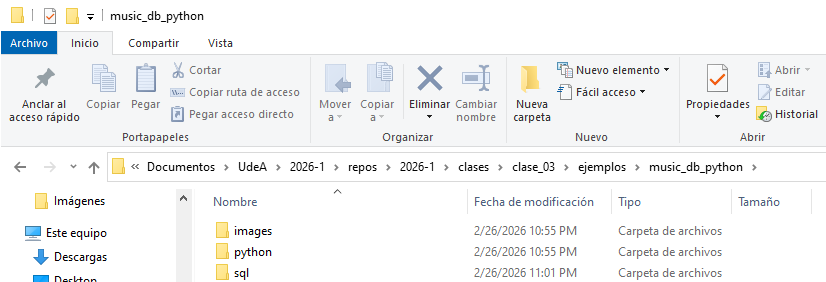
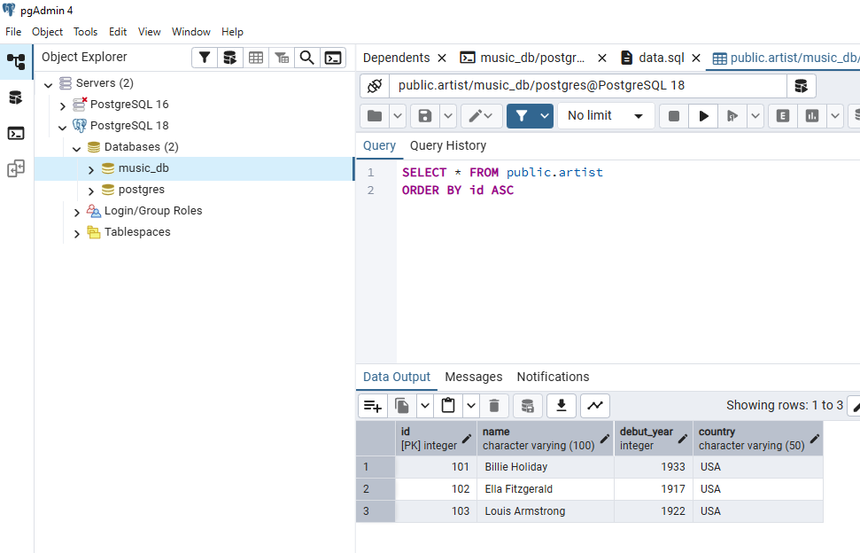
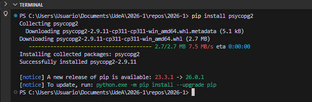
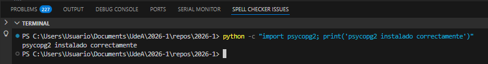
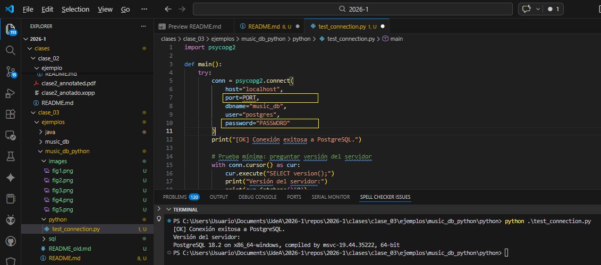
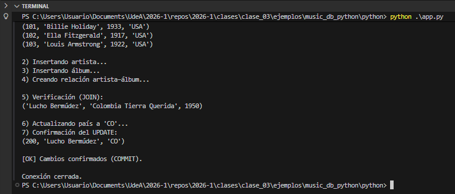
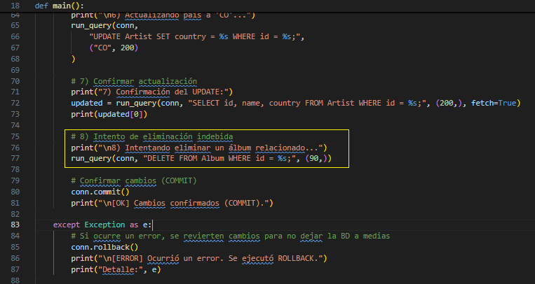
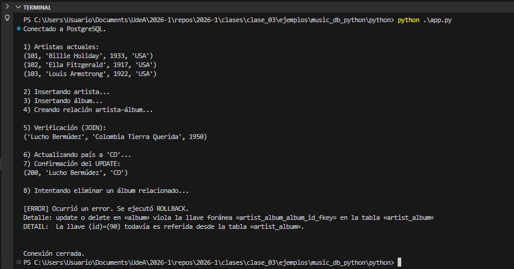

# Implementación en Python: Conexión y operaciones sobre PostgreSQL

---

## 1. Propósito

Este material muestra cómo una aplicación en **Python** puede conectarse a una base de datos **PostgreSQL** y ejecutar operaciones SQL (consultas y modificaciones).

El objetivo es evidenciar que, en escenarios reales, la interacción con bases de datos se realiza desde **aplicaciones desarrolladas en lenguajes de programación** y no únicamente desde herramientas gráficas como pgAdmin.

Este laboratorio continúa el trabajo realizado previamente con:

* `schema.sql`
* `data.sql`
* `querys.sql`

---

## 2. Organización del directorio de trabajo

Los estudiantes deberán crear (o descargar) la siguiente estructura en su máquina local:

```text
music_db_lab/
│
├── README.md
│
├── sql/
│   ├── schema.sql
│   ├── data.sql
│   └── querys.sql
│
├── python/
│   ├── test_connection.py
│   └── app.py
│
└── images/
```

* La carpeta `sql/` contiene los scripts de base de datos.
* La carpeta `python/` contiene la aplicación.
* La carpeta `images/` almacenará las capturas de verificación.



---

## 3. Requerimientos

### 3.1 Software necesario

* PostgreSQL instalado y en ejecución.
* Base de datos `music_db` creada.
* Scripts SQL ejecutados previamente en el orden:
  1. `schema.sql`
  2. `data.sql`
* Python 3.10+ instalado.
* Editor de código (VS Code, PyCharm u otro).



---

## 4. Instalación del driver de conexión

Para permitir que Python se comunique con PostgreSQL, es necesario instalar un driver.

En terminal ejecutar:

```bash
pip install psycopg2
```



---

### 4.1 Verificación de instalación

Ejecutar:

```bash
python -c "import psycopg2; print('psycopg2 instalado correctamente')"
```

Si el mensaje aparece sin errores, la instalación fue exitosa.



---

## 5. Verificación de conexión (Checkpoint 1)

En esta sección se valida que Python logra conectarse al servidor PostgreSQL. Esto permite detectar temprano problemas típicos: usuario/contraseña incorrectos, puerto, servidor apagado, base inexistente, etc.

### 5.1. Parámetros requeridos

En el siguiente script deberán ajustarse estos datos según el entorno local:

* `host` (usualmente `localhost`)
* `port` (por defecto `5432`)
* `dbname` (por ejemplo `music_db`)
* `user` (por ejemplo `postgres`)
* `password` (definida durante la instalación)

### 5.2. Script de prueba de conexión

Dentro de la carpeta `python/`, crear el archivo:

```
test_connection.py
```

Copiar el siguiente codigo:

```py
import psycopg2

def main():
    try:
        conn = psycopg2.connect(
            host="localhost",
            port=5432,
            dbname="music_db",
            user="postgres",
            password="CAMBIAR_AQUI"
        )
        print("[OK] Conexión exitosa a PostgreSQL.")

        # Prueba mínima: preguntar versión del servidor
        with conn.cursor() as cur:
            cur.execute("SELECT version();")
            print("Versión del servidor:")
            print(cur.fetchone()[0])

        conn.close()

    except Exception as e:
        print("[ERROR] Error de conexión.")
        print("Detalle:", e)

if __name__ == "__main__":
    main()
```

Luego, desde la carpeta `python/`, ejecutar:

```bash
python test_connection.py
```

Si la conexión es correcta, se mostrará el mensaje de éxito y la versión de PostgreSQL.



### 5.3. Preguntas de reflexión

1. ¿Qué parámetros son indispensables para establecer la conexión?
2. ¿Qué ocurre si el servidor PostgreSQL no está activo?
3. ¿Por qué es importante validar la conexión antes de desarrollar la aplicación completa?

---

# 6. Reproducción del flujo manual desde Python (Checkpoint 2)

Ahora se replicará programáticamente el proceso realizado previamente en pgAdmin.

### 6.1. Objetivo

En el trabajo previo con pgAdmin se siguió un flujo típico:

1. Consultar tablas existentes.
2. Insertar un nuevo artista.
3. Insertar un nuevo álbum.
4. Crear la relación artista–álbum.
5. Ejecutar una consulta con `JOIN` para verificar.
6. Realizar una actualización y comprobar el resultado.
7. (Opcional) Probar eliminación y observar integridad referencial.

En esta sección se construye una aplicación Python que ejecuta el mismo proceso, de manera programática.

### 4.2. Aplicación `app.py`

En la carpeta `python/`, crear:

```
app.py
```

Copie el siguiente contenido (ajustando credenciales):

```py
import psycopg2

DB_CONFIG = {
    "host": "localhost",
    "port": 5432,
    "dbname": "music_db",
    "user": "postgres",
    "password": "CAMBIAR_AQUI"
}

def run_query(conn, query, params=None, fetch=False):
    """Ejecuta una consulta SQL. Si fetch=True, retorna resultados."""
    with conn.cursor() as cur:
        cur.execute(query, params)
        if fetch:
            return cur.fetchall()

def main():
    conn = psycopg2.connect(**DB_CONFIG)
    print("Conectado a PostgreSQL.")

    try:
        # 1) Leer artistas existentes
        print("\n1) Artistas actuales:")
        rows = run_query(conn, "SELECT id, name, debut_year, country FROM Artist ORDER BY id;", fetch=True)
        for r in rows:
            print(r)

        # 2) Insertar nuevo artista (Lucho Bermúdez)
        print("\n2) Insertando artista...")
        run_query(conn,
            "INSERT INTO Artist (id, name, debut_year, country) VALUES (%s, %s, %s, %s);",
            (200, "Lucho Bermúdez", 1940, "Colombia")
        )

        # 3) Insertar nuevo álbum
        print("3) Insertando álbum...")
        run_query(conn,
            "INSERT INTO Album (id, name, release_year) VALUES (%s, %s, %s);",
            (90, "Colombia Tierra Querida", 1950)
        )

        # 4) Relacionar artista con álbum
        print("4) Creando relación artista–álbum...")
        run_query(conn,
            "INSERT INTO Artist_Album (artist_id, album_id) VALUES (%s, %s);",
            (200, 90)
        )

        # 5) Verificar con JOIN
        print("\n5) Verificación (JOIN):")
        join_rows = run_query(conn, """
            SELECT a.name AS artist, al.name AS album, al.release_year
            FROM Artist a
            JOIN Artist_Album aa ON aa.artist_id = a.id
            JOIN Album al ON al.id = aa.album_id
            WHERE a.id = %s;
        """, (200,), fetch=True)

        for r in join_rows:
            print(r)

        # 6) Actualizar país (ejemplo de UPDATE)
        print("\n6) Actualizando país a 'CO'...")
        run_query(conn,
            "UPDATE Artist SET country = %s WHERE id = %s;",
            ("CO", 200)
        )

        # 7) Confirmar actualización
        print("7) Confirmación del UPDATE:")
        updated = run_query(conn, "SELECT id, name, country FROM Artist WHERE id = %s;", (200,), fetch=True)
        print(updated[0])

        # Confirmar cambios (COMMIT)
        conn.commit()
        print("\n[OK] Cambios confirmados (COMMIT).")

    except Exception as e:
        # Si ocurre un error, se revierten cambios para no dejar la BD a medias
        conn.rollback()
        print("\n[ERROR] Ocurrió un error. Se ejecutó ROLLBACK.")
        print("Detalle:", e)

    finally:
        conn.close()
        print("\nConexión cerrada.")

if __name__ == "__main__":
    main()
```

Desde la carpeta `python/`, ejecutar:

```bash
python app.py
```

El flujo que debe observarse en consola es el siguiente:

1. Consulta de artistas existentes.
2. Inserción de nuevo artista.
3. Inserción de nuevo álbum.
4. Creación de relación artista–álbum.
5. Verificación mediante JOIN.
6. Actualización de registro.
7. Confirmación mediante COMMIT.
8. Cierre de conexión.



---

## 7. Integridad referencial (Checkpoint 3)

### 7.1. Modificación de `app.py`

Modificar temporalmente el archivo `app.py` para intentar eliminar un álbum que esté relacionado:

```python
# 8) Intento de eliminación indebida
print("\n8) Intentando eliminar un álbum relacionado...")
run_query(conn, "DELETE FROM Album WHERE id = %s;", (90,)) 
```



> [!caution]
> Antes de ejecutar nuevamente la versión modificada de `app.py` reinicie la base desde **pgAdmin**.

Ejecutar nuevamente la aplicación.

```bash
python app.py
```

Se debe generar un error relacionado con violación de clave foránea.



---

### 7.2. Preguntas de análisis

1. ¿Por qué PostgreSQL impide eliminar el álbum?
2. ¿Qué tabla depende de `Album`?
3. ¿Qué mecanismo protege la consistencia de los datos?
4. ¿Qué implicaciones tendría eliminar automáticamente las relaciones asociadas?

---

# 8. Observaciones importantes

* **pgAdmin** facilita pruebas manuales y administración.
* **Python** (o Java) permite que la interacción sea parte de un sistema real: aplicaciones, servicios web, APIs, automatización, etc.

En la práctica profesional, lo usual es:
* Guardar la estructura y datos de ejemplo en scripts `.sql` (versionables con Git).
* Usar un lenguaje (Python/Java) para interactuar con la base de datos desde la lógica de negocio.

---

# 9. Conclusiones

El presente trabajo pretende demostrar que:

* La base de datos no es un sistema aislado.
* Las aplicaciones controlan la ejecución de las consultas.
* Las transacciones garantizan consistencia.
* La integridad referencial protege la información.

La interacción con PostgreSQL desde Python constituye el primer paso hacia el desarrollo de sistemas backend completos.
