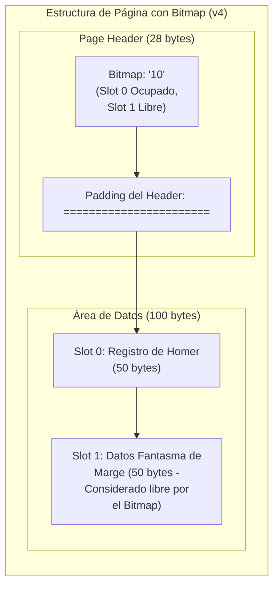

# Implementación de Heap Files - Parte II (Gestión de Espacio con Bitmaps)

Esta segunda parte esta enfocada en el almacenamiento físico de bases de datos. En esta sesión, evolucionaremos nuestro motor de almacenamiento para dotarlo de resiliencia y metadatos persistentes, introduciendo el concepto de Encabezados de Página (*Page Headers*) y Mapas de Bits (*Bitmaps*).

## 1. Contexto y Enlace con la Fase Anterior

Al finalizar la primera parte (Versiones 1 a 3), logramos implementar un sistema de páginas y una lista enlazada para reciclar el espacio de los registros borrados. Sin embargo, concluimos con una advertencia arquitectónica crítica: **nuestro motor dependía de la memoria RAM para mantener el estado de la base de datos**.

La variable `free_list_head`, que indicaba dónde estaba el próximo espacio libre, existía únicamente en el entorno de ejecución del script. En un Sistema Gestor de Bases de Datos (DBMS) real, si el servidor experimenta un corte de energía, la memoria RAM se volatiliza. Al reiniciar, el motor no tendría forma de saber qué espacios dentro del archivo `.dat` están libres u ocupados sin tener que realizar un costoso escaneo secuencial de todo el disco.

Para solucionar este problema de persistencia y separar los metadatos de los datos del usuario, es imperativo estructurar un **Encabezado (Header)** físico dentro de cada bloque de disco.

## 2. Repaso Teórico Fundamental

En esta fase, implementaremos la arquitectura estándar utilizada por motores como PostgreSQL o SQL Server para la gestión de espacio libre dentro de un bloque: el Bitmap.

* **Encabezado de Página (Page Header):** Es una región de bytes reservada estrictamente al inicio de cada página. Su propósito es almacenar metadatos (información sobre los datos). Nunca se utiliza para guardar información de los registros de la tabla.
* **Mapa de Bits (Bitmap):** Es un arreglo secuencial ubicado dentro del Page Header. Cada bit (o en nuestro caso didáctico, cada carácter) corresponde a una ranura (*slot*) específica en la página.
* Un valor de `1` indica que el slot correspondiente está ocupado.
* Un valor de `0` indica que el slot correspondiente está libre o ha sido borrado.


* **Borrado Lógico Optimizado:** Al usar un Bitmap, ya no es necesario ir hasta el registro y sobrescribir su clave primaria con asteriscos (`*****`). El borrado se convierte en una operación ultra rápida de Entrada/Salida (I/O) que consiste únicamente en cambiar un `1` por un `0` en el encabezado.
* **Nueva Formulación Matemática:** La introducción del encabezado desplaza físicamente el inicio de los datos. Por lo tanto, la ecuación para calcular el desplazamiento (*offset*) en tiempo O(1) debe incorporar el tamaño de este encabezado:

$$Offset = (Page\_ID \times Page\_Size) + HEADER\_SIZE + (Slot\_ID \times Record\_Size)$$

### Diagrama de la Nueva Arquitectura (Versión 4)

A continuación, se ilustra la distribución física de los 128 bytes de nuestra página utilizando un Bitmap. Note cómo los 28 bytes que antes representaban "fragmentación interna" al final de la página han sido trasladados al inicio para cumplir una función útil como encabezado.



## 2. Arquitectura de la Implementación

El código de esta fase se encuentra consolidado en el archivo **`heap_file_v4_bitmap.py`**. Las principales innovaciones en el código respecto a la versión anterior son:

1. **`create_empty_page()`:** Una nueva función que inicializa bloques en el disco escribiendo un encabezado limpio (`00====...`) antes de escribir los espacios en blanco.
2. **Independencia de la RAM:** Se eliminan las variables globales. Cada vez que se ejecuta un `INSERT` o `DELETE`, el motor invoca la función `read_page_bitmap()`, la cual va directamente al disco físico a consultar el estado real de la página.
3. **Escaneo de Metadatos:** La función de búsqueda (`search_record_by_rid`) ahora lee el Bitmap primero. Si el bit indica `0`, la función retorna vacío de inmediato, ahorrando el costo de mover el cabezal del disco hacia el área de datos.

## 3. Guía de Ejecución y Validación

Por favor, abran su terminal en el directorio correspondiente y sigan estos pasos para validar el funcionamiento del Bitmap.

Ejecute el script [`heap_file_v4_bitmap.py`](heap_file_v4_bitmap.py)

**Puntos de Control (Checklist):**
* [ ] Verifique en la consola que la eliminación de Marge Simpson reporta una actualización en el Bitmap (cambiando de `'11'` a `'10'`).
* [ ] Confirme en la consola que la subsecuente inserción de Lisa Simpson logra reciclar el espacio de Marge gracias a que el motor detectó el `'0'` en el Bitmap.
* [ ] Abra el archivo `my_database_v4.dat` en un editor de texto. Deberá observar claramente la separación estructural: una cabecera como `11==========================` seguida inmediatamente por los datos de los registros. Ya no hay asteriscos (`*****`) mezclados con la información.

## 4. Tip Avanzado: Inspección Hexadecimal (Hexdump)

Para observar cómo los metadatos y los datos coexisten a nivel de bytes, proceda a realizar un volcado hexadecimal del archivo recién generado.

En una terminal Unix (Linux/macOS), ejecute: `hexdump -C my_database_v4.dat`

Debería observar un patrón similar a este en los primeros bytes de cada página:

```text
00000000  31 31 3d 3d 3d 3d 3d 3d  3d 3d 3d 3d 3d 3d 3d 3d  |11==============|
00000010  3d 3d 3d 3d 3d 3d 3d 3d  3d 3d 3d 3d 20 20 31 32  |============  12|
00000020  33 53 69 6d 70 73 6f 6e  20 20 20 20 20 20 20 20  |3Simpson        |

```

Observe detenidamente la primera línea. Los valores hexadecimales `31 31` corresponden a los caracteres ASCII `11` (nuestro Bitmap indicando que ambos slots están ocupados). Los valores `3d` corresponden al carácter `=` que usamos como relleno del Header. Inmediatamente después del byte de desplazamiento 0x0000001C (28 en decimal), comienzan los datos reales del registro (el ID `123`).

## 5. Referencias y Material para Profundización

Se recomienda complementar esta práctica con la lectura de los siguientes recursos, prestando especial atención a los capítulos sobre Page Layout y Free Space Management:

* **Silberschatz, A., Korth, H. F., & Sudarshan, S.** *Fundamentos de Bases de Datos*.
* **Ramakrishnan, R., & Gehrke, J.** *Sistemas de Gestión de Bases de Datos*.
* **UC Berkeley CS 186 (Curso de Introducción a Sistemas de Bases de Datos):** *Course Notes - Note 3: Storage*. Disponible en: [https://cs186berkeley.net/notes/note3/](https://cs186berkeley.net/notes/note3/).
* **Curso de la Universidad Carnegie Mellon (CMU):** *15-445/645 Intro to Database Systems*. Clases teóricas sobre "Database Storage" impartidas por el profesor Andy Pavlo.

