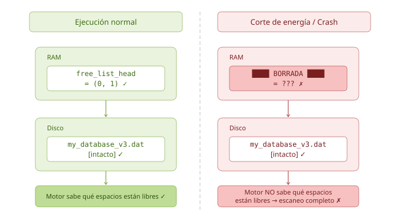
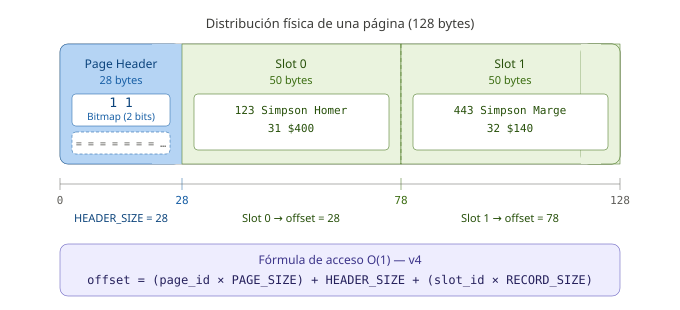
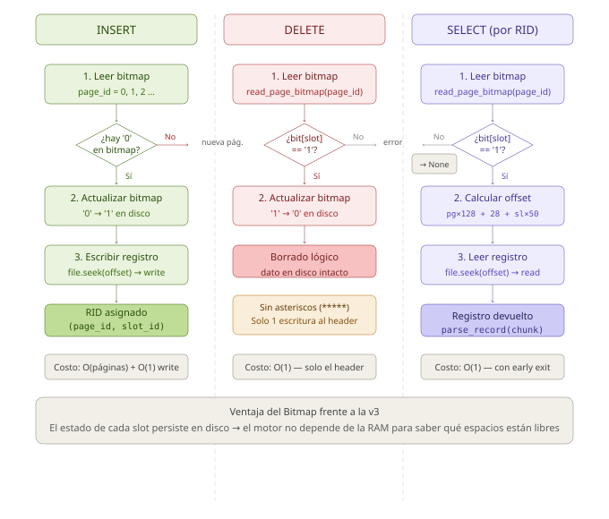

# Heap Files — Parte II: Gestión de Espacio con Bitmaps y Encabezados de Página

* **Laboratorio de Estructuras de Datos · Universidad de Antioquia**
* **Versión del motor:** `heap_file_v4_bitmap.py`
* **Prerrequisito obligatorio:** Haber completado la Parte I (`packet/`)

---

## Tabla de Contenido

- [Heap Files — Parte II: Gestión de Espacio con Bitmaps y Encabezados de Página](#heap-files--parte-ii-gestión-de-espacio-con-bitmaps-y-encabezados-de-página)
  - [Tabla de Contenido](#tabla-de-contenido)
  - [1. Punto de Partida: ¿Por qué esta entrega existe?](#1-punto-de-partida-por-qué-esta-entrega-existe)
  - [2. Repaso Teórico: Los Tres Conceptos Clave](#2-repaso-teórico-los-tres-conceptos-clave)
    - [2.1 Encabezado de Página (Page Header)](#21-encabezado-de-página-page-header)
    - [2.2 Mapa de Bits (Bitmap)](#22-mapa-de-bits-bitmap)
    - [2.3 La Nueva Fórmula de Acceso O(1)](#23-la-nueva-fórmula-de-acceso-o1)
  - [3. Las Operaciones DML (Data Manipulation Language) a través del Bitmap](#3-las-operaciones-dml-data-manipulation-language-a-través-del-bitmap)
    - [3.1 INSERT — Encontrar espacio libre sin depender de la RAM](#31-insert--encontrar-espacio-libre-sin-depender-de-la-ram)
    - [3.2 DELETE — Borrado lógico en una sola operación de disco](#32-delete--borrado-lógico-en-una-sola-operación-de-disco)
    - [3.3 SELECT — Early Exit gracias al Bitmap](#33-select--early-exit-gracias-al-bitmap)
  - [4. Guía de Ejecución y Validación](#4-guía-de-ejecución-y-validación)
    - [4.1 Preparación del entorno](#41-preparación-del-entorno)
    - [4.2 Puntos de Control](#42-puntos-de-control)
      - [Punto 1 — Las inserciones iniciales crean y llenan páginas correctamente](#punto-1--las-inserciones-iniciales-crean-y-llenan-páginas-correctamente)
      - [Punto 2 — El borrado de Marge solo modifica el header](#punto-2--el-borrado-de-marge-solo-modifica-el-header)
      - [Punto 3 — La búsqueda tras el borrado aplica early exit](#punto-3--la-búsqueda-tras-el-borrado-aplica-early-exit)
      - [Punto 4 — La inserción de Lisa recicla el espacio de Marge](#punto-4--la-inserción-de-lisa-recicla-el-espacio-de-marge)
      - [Punto 5 — Inspección visual del archivo `.dat`](#punto-5--inspección-visual-del-archivo-dat)
    - [4.3 Lista de Verificación Final](#43-lista-de-verificación-final)
  - [5. Inspección a Nivel de Bytes (Hexdump)](#5-inspección-a-nivel-de-bytes-hexdump)
    - [5.1 ¿Qué es un Hexdump?](#51-qué-es-un-hexdump)
    - [5.2 Paso 1 — Estado inicial: todas las páginas llenas](#52-paso-1--estado-inicial-todas-las-páginas-llenas)
    - [5.3 Paso 2 — Estado tras el borrado: bitmap modificado](#53-paso-2--estado-tras-el-borrado-bitmap-modificado)
    - [5.4 Paso 3 — Estado final: reciclaje confirmado](#54-paso-3--estado-final-reciclaje-confirmado)
  - [6. Referencias y Material de Profundización](#6-referencias-y-material-de-profundización)

---

## 1. Punto de Partida: ¿Por qué esta entrega existe?

> *"Un sistema que olvida su estado al apagarse no es un sistema de base de datos, es un bloc de notas."*

Al finalizar la Parte I se logró un avance significativo: el motor era capaz de organizar registros en páginas físicas y reciclar el espacio de los borrados mediante una **Free List** encadenada. Sin embargo, al cerrar el análisis de la versión `v3`, quedó expuesta una fragilidad arquitectónica crítica.

Observe el siguiente fragmento de `heap_file_v3_freemospace.py`:

```python
# --- ENGINE STATE (In RAM) ---
# In a real DBMS, this is stored in a "Header Page" (Page 0).
# For simplicity, we keep it in RAM.
free_list_head = None  # Tuple (page_id, slot_id) pointing to the first free slot
```

Esta variable global **vive únicamente en la memoria RAM** del proceso Python. El siguiente diagrama ilustra exactamente el problema:



La versión `v4` resuelve este problema de raíz: **los metadatos sobre el espacio libre se escriben directamente en el disco**, dentro de un encabezado físico al inicio de cada página. El motor ya no necesita recordar nada en RAM.

---

## 2. Repaso Teórico: Los Tres Conceptos Clave

Antes de explorar el código, es fundamental consolidar los conceptos teóricos
que dan sustento a esta versión del motor. Cada uno de ellos fue introducido
en las diapositivas de clase y aquí se aterriza en su implementación concreta.

---

### 2.1 Encabezado de Página (Page Header)

Como se vio en clase, una página de base de datos no es un bloque homogéneo de datos: está dividida en dos zonas con responsabilidades distintas.

> [!note]
> **Page Header:** Región de bytes reservada al **inicio** de cada página, destinada exclusivamente a almacenar **metadatos** — información sobre los datos, no los datos en sí mismos.

En la versión `v4`, el encabezado ocupa los primeros **28 bytes** de cada página y se inicializa de la siguiente manera:

```python
# heap_file_v4_bitmap.py

HEADER_SIZE = 28
RECORDS_PER_PAGE = (PAGE_SIZE - HEADER_SIZE) // RECORD_SIZE  # (128 - 28) // 50 = 2

def create_empty_page():
    """Generates a 128-byte block with a clean initialized header ('00')."""
    bitmap = "0" * RECORDS_PER_PAGE        # '00' — both slots empty
    header_padding = "=" * (HEADER_SIZE - RECORDS_PER_PAGE)  # fill remaining header bytes
    header = bitmap + header_padding

    empty_slots = " " * (RECORDS_PER_PAGE * RECORD_SIZE)  # 100 bytes of blank data area
    return header + empty_slots
```

> [!tip]
> Observe que los **28 bytes** que en la `v3` representaban fragmentación interna al final de la página ahora han sido trasladados al inicio para cumplir una función útil. Nada se desperdicia.

---

### 2.2 Mapa de Bits (Bitmap)

El bitmap es el componente central del encabezado. Como se describió en clase, es un arreglo donde **cada posición corresponde a un slot** de la página:

| Valor del bit | Significado |
|:---:|---|
| `1` | El slot está **ocupado** — hay un registro válido |
| `0` | El slot está **libre** — fue borrado o nunca fue usado |

En la implementación, leer y escribir el bitmap son operaciones quirúrgicas que **no tocan el área de datos**:

```python
def read_page_bitmap(page_id):
    """Reads only the bitmap from the page header — does not touch record data."""
    offset = page_id * PAGE_SIZE
    with open(FILE_NAME, "r") as file:
        file.seek(offset)
        header = file.read(HEADER_SIZE)
        return header[:RECORDS_PER_PAGE]  # returns e.g. '10' or '11' or '00'

def update_page_bitmap(page_id, new_bitmap):
    """Overwrites only the bitmap bytes on disk without touching record data."""
    offset = page_id * PAGE_SIZE
    with open(FILE_NAME, "r+") as file:
        file.seek(offset)
        file.write(new_bitmap)  # writes exactly RECORDS_PER_PAGE characters
```

Esta separación es la clave de la resiliencia: si el proceso termina abruptamente después de un `update_page_bitmap()`, el estado de ocupación de cada slot queda grabado en el disco y puede ser consultado al reiniciar.

---

### 2.3 La Nueva Fórmula de Acceso O(1)

La introducción del encabezado desplaza físicamente el inicio del área de
datos. La fórmula de la `v3` ya no es válida y debe incorporar el tamaño
del header:



| Versión | Fórmula de offset |
|:---:|---|
| `v3` | `(page_id × PAGE_SIZE) + (slot_id × RECORD_SIZE)` |
| `v4` | `(page_id × PAGE_SIZE) + HEADER_SIZE + (slot_id × RECORD_SIZE)` |

**Ejemplo concreto:** Para acceder al Slot 1 de la Página 0:

```python
offset = (0 * PAGE_SIZE) + HEADER_SIZE + (1 * RECORD_SIZE)
       = (0 * 128)       + 28           + (1 * 50)
       = 78  # bytes desde el inicio del archivo
```

El motor salta directamente al byte 78 sin leer nada en el camino. La complejidad sigue siendo **O(1)**, ahora con la garantía de que el bitmap que protege ese slot también reside en el disco.

---

## 3. Las Operaciones DML (Data Manipulation Language) a través del Bitmap

Con los tres conceptos fundamentales claros, es posible entender cómo cada operación del motor interactúa con el bitmap antes de tocar el área de datos. El siguiente diagrama resume el flujo de cada operación:



---

### 3.1 INSERT — Encontrar espacio libre sin depender de la RAM

En la `v3`, el motor consultaba la variable `free_list_head` en RAM para saber dónde insertar. En la `v4`, esa consulta se hace directamente al disco:

```python
def insert_record(emp_id, last_name, first_name, age, salary):
    """Scans page bitmaps to find a free slot, then writes the record."""
    record_str = format_record(emp_id, last_name, first_name, age, salary)
    page_id = 0

    while True:
        bitmap = read_page_bitmap(page_id)

        # If bitmap is None, we reached EOF — a new page must be created
        if bitmap is None:
            with open(FILE_NAME, "a") as file:
                file.write(create_empty_page())
            bitmap = "0" * RECORDS_PER_PAGE

        if '0' in bitmap:
            slot_id = bitmap.find('0')  # first free slot index
            break

        page_id += 1  # page is full ('11') — check the next one

    # Update the bitmap on disk BEFORE writing the record
    new_bitmap_list = list(bitmap)
    new_bitmap_list[slot_id] = '1'
    update_page_bitmap(page_id, "".join(new_bitmap_list))

    # Write the record at its exact offset
    offset = (page_id * PAGE_SIZE) + HEADER_SIZE + (slot_id * RECORD_SIZE)
    with open(FILE_NAME, "r+") as file:
        file.seek(offset)
        file.write(record_str)
```

> [!note]
> El bitmap se actualiza en disco **antes** de escribir el registro. Esto
> garantiza que si el proceso falla entre ambas operaciones, el motor nunca
> marcará un slot como libre cuando en realidad contiene datos parciales.

---

### 3.2 DELETE — Borrado lógico en una sola operación de disco

Esta es la mejora más visible respecto a las versiones anteriores. En la `v2` el borrado requería sobrescribir el campo ID con asteriscos (`*****`), mezclando metadatos con datos. En la `v4`, el borrado es una operación quirúrgica sobre el encabezado únicamente:

```python
def delete_record(page_id, slot_id):
    """Logical delete: flips a single bit in the header. Record data untouched."""
    bitmap = read_page_bitmap(page_id)

    if not bitmap or bitmap[slot_id] == '0':
        print(f"[DELETE] Slot {slot_id} on page {page_id} is already empty.")
        return False

    # Flip the bit: '1' → '0'
    new_bitmap_list = list(bitmap)
    new_bitmap_list[slot_id] = '0'
    update_page_bitmap(page_id, "".join(new_bitmap_list))
    return True
```

| Versión | Operaciones de disco al borrar |
|:---:|---|
| `v2` | 1 lectura + 1 escritura sobre el **registro** (50 bytes) |
| `v3` | 1 lectura + 1 escritura sobre el **registro** + actualización en RAM |
| `v4` | 1 lectura + 1 escritura sobre el **header** (2 bytes) |

> [!tip]
> Al no sobrescribir el área de datos, los bytes del registro borrado quedan
> intactos en disco. Esto es relevante en sistemas reales donde se requieren
> mecanismos de recuperación ante fallos (recovery).

---

### 3.3 SELECT — Early Exit gracias al Bitmap

La operación de búsqueda por RID incorpora una optimización importante: si el bitmap reporta que un slot está libre, el motor retorna `None` de inmediato sin mover el cabezal del disco hacia el área de datos.

```python
def search_record_by_rid(page_id, slot_id):
    """Checks the bitmap first. Returns None immediately if slot is free (early exit)."""
    bitmap = read_page_bitmap(page_id)

    if not bitmap or slot_id >= RECORDS_PER_PAGE:
        return None

    # Early exit: no disk seek to the data area needed
    if bitmap[slot_id] == '0':
        return None

    # Only if the bit is '1' do we pay the cost of reading the record
    offset = (page_id * PAGE_SIZE) + HEADER_SIZE + (slot_id * RECORD_SIZE)
    with open(FILE_NAME, "r") as file:
        file.seek(offset)
        chunk = file.read(RECORD_SIZE)
        return parse_record(chunk)
```

> [!note]
> En un sistema real con páginas de 8 KB y miles de registros, evitar el
> `file.seek()` al área de datos representa una reducción significativa en
> operaciones de E/S, que es el recurso más costoso en un DBMS orientado
> a disco.

---

## 4. Guía de Ejecución y Validación

Esta sección acompaña la ejecución del script paso a paso. El objetivo no es
solo verificar que el código corre sin errores, sino entender **por qué** cada
salida en consola y cada byte en disco tienen el aspecto que tienen.

---

### 4.1 Preparación del entorno

Desde la terminal, ubíquese en el directorio `bitmap/` y ejecute:

```bash
python heap_file_v4_bitmap.py
```

Si el archivo `my_database_v4.dat` existe de una ejecución anterior, el script
lo eliminará automáticamente antes de comenzar:

```python
# heap_file_v4_bitmap.py — main block
if os.path.exists(FILE_NAME):
    os.remove(FILE_NAME)
```

> [!note]
> Esta limpieza garantiza que cada ejecución parte de un estado conocido.
> En un motor real, esta operación equivaldría a formatear la base de datos
> desde cero — una acción irreversible que los DBMS protegen con múltiples
> confirmaciones.

---

### 4.2 Puntos de Control

Siga la ejecución en consola y valide cada punto en el orden indicado.

```
--- Laboratorio: Heap Files v4 (Bitmaps) ---

1. Inserciones Iniciales:
[INSERT] Homer insertado en RID(0, 0). Bitmap actualizado a '10'
[INSERT] Marge insertado en RID(0, 1). Bitmap actualizado a '11'
[INSERT] Ned insertado en RID(1, 0). Bitmap actualizado a '10'
[INSERT] Seymour insertado en RID(1, 1). Bitmap actualizado a '11'

2. Estado tras borrado (Deletes):
[DELETE] Registro en RID(0, 1) eliminado lógicamente. Bitmap ahora es '10'

3. Búsqueda tras borrado:
Marge no fue encontrada (El Bitmap reporta el slot como '0').

4. Inserción de reciclaje:
[INSERT] Lisa insertado en RID(0, 1). Bitmap actualizado a '11'
```

La salida completa se muestra anteriormente y lo que se hará será ir inspeccionando de manera gradual esta para comprender el efecto de las operaciones sobre las estructuras asociadas a la base de datos.

---

#### Punto 1 — Las inserciones iniciales crean y llenan páginas correctamente

**Salida esperada en consola:**

```
...
1. Inserciones Iniciales:
[INSERT] Homer insertado en RID(0, 0). Bitmap actualizado a '10'
[INSERT] Marge insertado en RID(0, 1). Bitmap actualizado a '11'
[INSERT] Ned insertado en RID(1, 0). Bitmap actualizado a '10'
[INSERT] Seymour insertado en RID(1, 1). Bitmap actualizado a '11'
...
```

> [!tip]
> **¿Por qué es importante?**
> Observe que al insertar a Ned, el motor detectó que la Página 0 tenía bitmap
> `'11'` (llena) y creó automáticamente la Página 1 con un header limpio `'00'`.
> Este comportamiento reemplaza por completo la necesidad de una `free_list_head`
> en RAM: el escaneo de bitmaps en disco es la única fuente de verdad.

---

#### Punto 2 — El borrado de Marge solo modifica el header

**Salida esperada en consola:**

```
...
2. Estado tras borrado (Deletes):
[DELETE] Registro en RID(0, 1) eliminado lógicamente. Bitmap ahora es '10'
...
```

> [!tip]
> **¿Por qué es importante?**
> El bitmap de la Página 0 pasó de `'11'` a `'10'` con una única escritura de
> 2 bytes al encabezado. Compruebe en el archivo `my_database_v4.dat` que los
> datos de Marge siguen físicamente en disco — los 50 bytes del Slot 1 no fueron
> sobrescritos. Solo el bit cambió.

---

#### Punto 3 — La búsqueda tras el borrado aplica early exit

**Salida esperada en consola:**

```
...
3. Búsqueda tras borrado:
Marge no fue encontrada (El Bitmap reporta el slot como '0').
...
```

> [!tip]
> **¿Por qué es importante?**
> El motor leyó el header de la Página 0, encontró `'10'` en el bitmap, y
> retornó `None` **sin ejecutar un `file.seek()`** hacia el área de datos. En
> términos de E/S, el costo fue de una sola lectura de 28 bytes en lugar de
> 28 + 50 = 78 bytes. A escala de millones de registros, esta diferencia es
> determinante.

---

#### Punto 4 — La inserción de Lisa recicla el espacio de Marge

**Salida esperada en consola:**

```
4. Inserción de reciclaje:
[INSERT] Lisa insertado en RID(0, 1). Bitmap actualizado a '11'
```

> [!tip]
> **¿Por qué es importante?**
> El motor escaneó los bitmaps desde la Página 0, encontró el `'0'` en la
> posición 1, y reutilizó exactamente el espacio que Marge dejó libre. No se
> creó ninguna página nueva. Esto confirma que el ciclo completo
> **INSERT → DELETE → INSERT** funciona de forma persistente y sin depender
> de ninguna variable en RAM.

---

#### Punto 5 — Inspección visual del archivo `.dat`

Abra `my_database_v4.dat` en un editor de texto. La estructura esperada al
finalizar la ejecución es la siguiente:

```
11==========================  123Simpson        Homer           31$400             999Simpson        Lisa            8 $10
10==========================  123Simpson        Homer           31$400             443Simpson        Marge           32$140
```

Verifique que:
- Los primeros caracteres de cada página son el bitmap (`11`, `10`, etc.).
- El relleno del header es visible como una cadena de signos `=`.
- **No hay asteriscos** (`*****`) mezclados con los datos — a diferencia
  de las versiones `v2` y `v3`.

> [!tip]
> Si los datos aparecen en una sola línea continua, es el comportamiento
> esperado: el archivo `.dat` no usa saltos de línea. Cada página ocupa
> exactamente 128 bytes consecutivos. Un editor hexadecimal mostrará la
> separación con mayor claridad (ver Sección 5).

---

### 4.3 Lista de Verificación Final

Una vez completada la ejecución, confirme que se cumplen todos los puntos:

- [ ] Las inserciones reportan el bitmap actualizado en consola
- [ ] El borrado de Marge muestra `'11' → '10'` sin tocar los datos
- [ ] La búsqueda tras el borrado retorna vacío por early exit
- [ ] Lisa se inserta en `RID(0, 1)` reciclando el espacio de Marge
- [ ] El archivo `.dat` no contiene asteriscos (`*****`)

---

## 5. Inspección a Nivel de Bytes (Hexdump)

Esta sección es opcional pero altamente recomendada. Permite observar cómo
los metadatos y los datos de usuario coexisten físicamente en el archivo `.dat`
sin ningún tipo de abstracción de por medio.

---

### 5.1 ¿Qué es un Hexdump?

Un volcado hexadecimal (*hexdump*) es una representación del contenido binario
de un archivo donde cada byte se muestra simultáneamente en dos formatos:

- **Hexadecimal** (columna central): el valor numérico del byte en base 16.
- **ASCII** (columna derecha): el carácter imprimible que corresponde a ese
  valor, o un punto `.` si el byte no es imprimible.

Esta herramienta permite ver exactamente qué hay en cada posición del archivo,
incluyendo espacios en blanco, caracteres de relleno y los propios bytes del
bitmap — sin ninguna capa de abstracción de por medio.

---

### 5.2 Paso 1 — Estado inicial: todas las páginas llenas

El objetivo de este primer paso es observar el archivo en su estado inicial,
con todos los registros insertados y ningún borrado aplicado.

**Instrucciones:**

Abra `heap_file_v4_bitmap.py` y localice el bloque principal. Comente
temporalmente las líneas correspondientes al borrado y a la inserción de Lisa,
de modo que el script solo ejecute las inserciones iniciales:

```python
if __name__ == "__main__":
    if os.path.exists(FILE_NAME): os.remove(FILE_NAME)

    print(f"--- Laboratorio: Heap Files v4 (Bitmaps) ---\n")

    print("1. Inserciones Iniciales:")
    insert_record(123, "Simpson", "Homer", 31, "$400")
    insert_record(443, "Simpson", "Marge", 32, "$140")
    insert_record(244, "Flanders", "Ned", 55, "$300")
    insert_record(134, "Skinner", "Seymour", 55, "$400")

    # print("\n2. Estado tras borrado (Deletes):")   ← comentar
    # delete_record(0, 1)                            ← comentar

    # print("\n3. Búsqueda tras borrado:")            ← comentar
    # registro = search_record_by_rid(0, 1)          ← comentar
    # ...                                            ← comentar

    # print("\n4. Inserción de reciclaje:")           ← comentar
    # insert_record(999, "Simpson", "Lisa", 8, "$10") ← comentar
```

Guarde el archivo y ejecútelo:

```bash
python heap_file_v4_bitmap.py
```

Luego ejecute el hexdump:

```bash
# Unix (Linux / macOS)
hexdump -C my_database_v4.dat

# Windows (PowerShell)
Format-Hex my_database_v4.dat
```

**Salida esperada (primeros 32 bytes — Página 0):**

```
00000000  31 31 3d 3d 3d 3d 3d 3d  3d 3d 3d 3d 3d 3d 3d 3d  |11==============|
00000010  3d 3d 3d 3d 3d 3d 3d 3d  3d 3d 3d 3d 20 20 31 32  |============  12|
```

La siguiente tabla desglosa los bytes más relevantes:

| Offset (hex) | Valor hex | Carácter | Significado |
|:---:|:---:|:---:|---|
| `0x00` | `31` | `1` | Bit 0 del Bitmap — Slot 0 ocupado |
| `0x01` | `31` | `1` | Bit 1 del Bitmap — Slot 1 ocupado |
| `0x02` … `0x1B` | `3d` | `=` | Relleno del Page Header (26 bytes) |
| `0x1C` … `0x1F` | `20 20 31 32` | `  12` | Inicio del Slot 0 — campo ID (`  123`) |

> [!note]
> El offset `0x1C` equivale al byte **28** en decimal, que es exactamente
> `HEADER_SIZE`. Esto confirma visualmente que la fórmula de offset es
> correcta: los datos comienzan exactamente después del encabezado.

**Lista de verificación — Paso 1:**

- [ ] Los primeros dos bytes del archivo son `31 31` (bitmap `'11'`)
- [ ] Los bytes `0x02` a `0x1B` son todos `3d` (carácter `=`)
- [ ] A partir del byte `0x1C` comienzan los datos del registro de Homer

---

### 5.3 Paso 2 — Estado tras el borrado: bitmap modificado

El objetivo de este segundo paso es observar el efecto exacto que tiene
`delete_record(0, 1)` sobre el archivo físico.

**Instrucciones:**

Regrese a `heap_file_v4_bitmap.py` y descomente únicamente las líneas del
borrado, dejando la inserción de Lisa aún comentada:

```python
    print("\n2. Estado tras borrado (Deletes):")
    delete_record(0, 1)                               # ← descomentar

    # print("\n3. Búsqueda tras borrado:")             ← mantener comentado
    # ...

    # print("\n4. Inserción de reciclaje:")            ← mantener comentado
    # insert_record(999, "Simpson", "Lisa", 8, "$10")  ← mantener comentado
```

Guarde y ejecute nuevamente:

```bash
python heap_file_v4_bitmap.py
```

Luego ejecute el hexdump otra vez:

```bash
hexdump -C my_database_v4.dat
```

**Salida esperada (primeros 32 bytes — Página 0):**

```
00000000  31 30 3d 3d 3d 3d 3d 3d  3d 3d 3d 3d 3d 3d 3d 3d  |10==============|
00000010  3d 3d 3d 3d 3d 3d 3d 3d  3d 3d 3d 3d 20 20 31 32  |============  12|
```

**Comparación directa entre Paso 1 y Paso 2:**

| Offset | Paso 1 (antes del borrado) | Paso 2 (después del borrado) | Cambio |
|:---:|:---:|:---:|---|
| `0x00` | `31` → `1` | `31` → `1` | Sin cambio — Slot 0 sigue ocupado |
| `0x01` | `31` → `1` | `30` → `0` | **Bit cambiado** — Slot 1 marcado libre |
| `0x1C` … | datos de Homer | datos de Homer | Sin cambio — datos intactos |
| `0x46` … | datos de Marge | datos de Marge | Sin cambio — datos intactos |

> [!tip]
> El único byte que cambió en todo el archivo fue `0x01`: de `31` a `30`.
> Eso es todo lo que el motor escribió en disco para borrar a Marge Simpson.
> Compare esto con la `v2`, donde el borrado sobrescribía 5 bytes del
> registro con `2A 2A 2A 2A 2A` (los asteriscos `*****` en hexadecimal),
> mezclando metadatos con el área de datos.

**Lista de verificación — Paso 2:**

- [ ] El byte `0x00` sigue siendo `31` (Slot 0 aún ocupado)
- [ ] El byte `0x01` cambió de `31` a `30` (Slot 1 marcado libre)
- [ ] Los datos de Marge en `0x46` siguen presentes — no fueron sobrescritos
- [ ] No hay bytes `2A` (`*`) en ninguna posición del archivo

---

### 5.4 Paso 3 — Estado final: reciclaje confirmado

**Instrucciones:**

Descomente todas las líneas restantes para que el script ejecute el flujo
completo:

```python
    print("\n2. Estado tras borrado (Deletes):")
    delete_record(0, 1)

    print("\n3. Búsqueda tras borrado:")              # ← descomentar
    registro = search_record_by_rid(0, 1)             # ← descomentar

    print("\n4. Inserción de reciclaje:")             # ← descomentar
    insert_record(999, "Simpson", "Lisa", 8, "$10")   # ← descomentar
```

Guarde, ejecute y repita el hexdump. El bitmap de la Página 0 debe volver
a mostrar `11` — ahora con los datos de Lisa en el Slot 1 en lugar de Marge:

```
00000000  31 31 3d 3d 3d 3d 3d 3d  3d 3d 3d 3d 3d 3d 3d 3d  |11==============|
```

**Lista de verificación — Paso 3:**

- [ ] El byte `0x01` volvió a `31` tras la inserción de Lisa
- [ ] El bitmap de la Página 0 es nuevamente `'11'`
- [ ] No se creó una tercera página — el espacio fue reciclado
- [ ] Los datos de Homer en el Slot 0 permanecen sin cambios

---

## 6. Referencias y Material de Profundización

Los conceptos implementados en esta práctica tienen respaldo directo en la
literatura estándar de sistemas de bases de datos. Se recomienda consultar
los siguientes recursos para profundizar:

- **Silberschatz, A., Korth, H. F., & Sudarshan, S.** *Fundamentos de Bases
  de Datos*. Capítulos sobre organización de archivos y gestión de espacio
  libre en páginas.

- **Ramakrishnan, R., & Gehrke, J.** *Sistemas de Gestión de Bases de Datos*.
  Sección sobre Page Layout y Free Space Management.

- **UC Berkeley — CS 186:** *Course Notes, Note 3: Storage*.
  Disponible en: [https://cs186berkeley.net/notes/note3/](https://cs186berkeley.net/notes/note3/)

- **Carnegie Mellon University — CMU 15-445/645:** *Intro to Database Systems*.
  Clases sobre *Database Storage* del profesor Andy Pavlo.
  Disponible en: [https://15445.courses.cs.cmu.edu](https://15445.courses.cs.cmu.edu)
