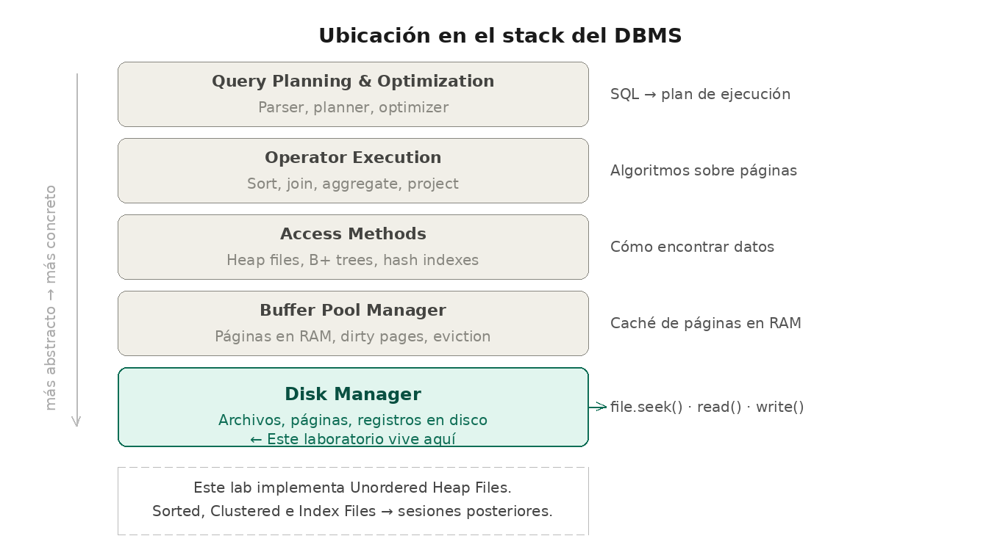
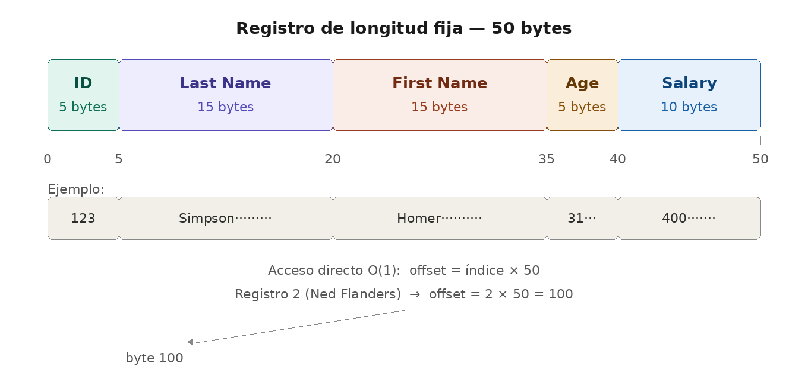
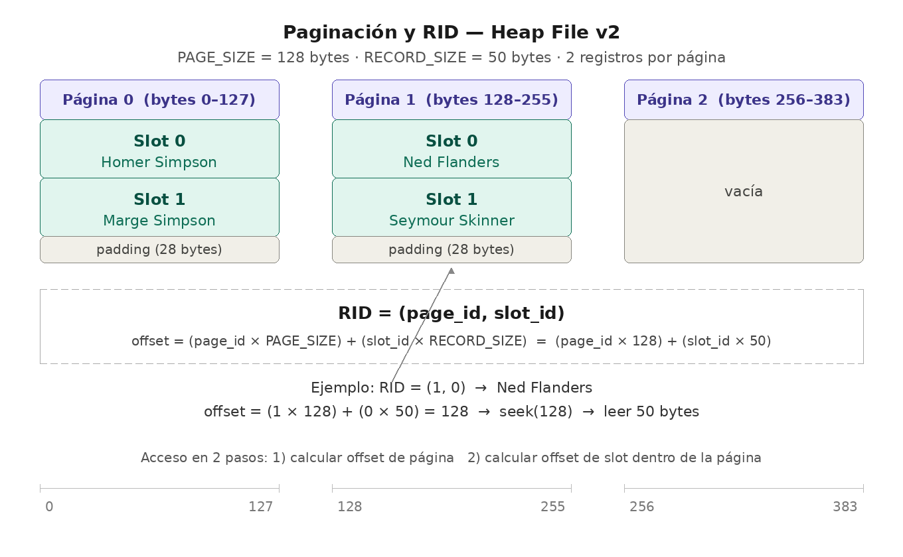
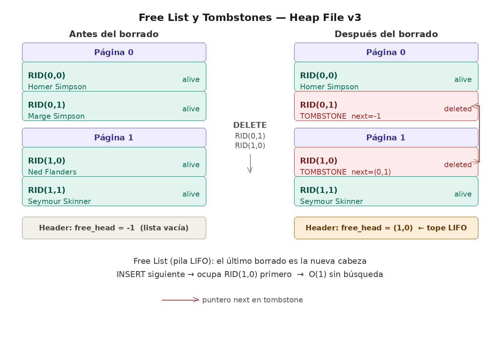

# Implementación de Heap Files (Registros de Longitud Fija)

## Introducción

> [!warning]
> Este material ha sido diseñado como apoyo directo a las diapositivas presentadas en la sesión magistral sobre **Almacenamiento Físico y Organización de Archivos**. Se sugiere tener dichas presentaciones a la mano para correlacionar la teoría con el código aquí desarrollado.

En esta sesión práctica, se abordará la manera en que los Sistemas Gestores de Bases de Datos (DBMS) almacenan la información físicamente en el disco. Se construirá un motor de almacenamiento paso a paso, partiendo de un archivo de texto plano hasta llegar a un sistema paginado con manejo de espacio libre.

Un DBMS real está organizado en capas. Este laboratorio implementa la capa más baja: el **Disk Manager**, responsable de leer y escribir datos en disco organizados en archivos, páginas y registros. El file.seek() de Python que usarás en el código es exactamente la operación que realiza el Disk Manager cuando el Buffer Pool le solicita una página del disco.

<div align="center">
  
</div>

> [!important]
> **Nota:** Este laboratorio implementa exclusivamente *Unordered Heap Files*.  
> Sorted Files, Clustered Heap e Index Files (B+, Hashing) se abordan en sesiones posteriores.

## 1. Repaso Teórico Fundamental

Antes de proceder con la ejecución del código, se presentan los conceptos 
clave que justifican el diseño de nuestro motor, junto con diagramas 
conceptuales de los formatos que implementaremos:

### Heap File y Registros de Longitud Fija

Representa la estructura de almacenamiento más básica. Los registros se insertan sin un orden específico predefinido. Al forzar que cada registro ocupe exactamente la misma cantidad de bytes (por ejemplo, 50 bytes), es posible calcular la ubicación de cualquier registro mediante una función matemática de complejidad O(1). Si el dato original es de menor tamaño, se rellena el espacio sobrante con caracteres en blanco (*Padding*).

<div align="center">
  
</div>

> [!note]
> El acceso directo a cualquier registro se logra con `offset = índice × RECORD_SIZE`.
> Para el registro 2 (Ned Flanders): `offset = 2 × 50 = 100` — el motor hace `file.seek(100)` sin leer Homer ni Marge.
> En el código: función `get_record(index)` en `heap_file_fixed.py`

---

### Paginación (Pages) y RID

El hardware de almacenamiento no opera byte a byte de manera eficiente, sino en bloques o "páginas" (típicamente de 4KB u 8KB). La unidad mínima de transferencia entre el disco y la memoria RAM es la página completa. En un modelo paginado, todo registro se ubica mediante una coordenada exacta conocida como Record ID o RID: **(Page_ID, Slot_ID)**.

<div align="center">
  
</div>

> [!note]
> El RID convierte la búsqueda en dos pasos: primero se salta a la página, luego al slot dentro de ella.
> `offset = (page_id × PAGE_SIZE) + (slot_id × RECORD_SIZE)`
> Para RID(1, 0): `offset = (1 × 128) + (0 × 50) = 128` — Ned Flanders, acceso O(1).
> En el código: función `get_record(page_id, slot_id)` en `heap_file_v2_pages.py`

---

### Borrado Lógico (Tombstones)

En las bases de datos relacionales no se eliminan físicamente los registros desplazando los adyacentes, ya que esto invalidaría los índices y generaría un alto costo de Entrada/Salida (I/O). En su lugar, se sobrescribe el inicio del registro con una "lápida" (tombstone), marcando el espacio como disponible. En nuestro laboratorio, usamos asteriscos `*****` en el campo del ID.

<div align="center">
  
</div>

> [!note]
> Mover registros para tapar el hueco invalida todos los RIDs posteriores — cualquier índice apuntaría a datos incorrectos.
> La lápida preserva la posición física de cada registro: su RID nunca cambia después de un borrado.
> En el código: función `delete_record()` en `heap_file_v2_pages.py`

---

### Lista Enlazada de Espacios Libres (Free List)

Para evitar la fragmentación y el desperdicio de disco generado por los borrados lógicos, se reutiliza el espacio de los registros eliminados. En lugar de una lápida simple, almacenamos un puntero al siguiente espacio disponible, formando una lista enlazada (una Pila LIFO) a nivel físico. El motor mantiene en RAM la cabeza de la lista.

<div align="center">
  
</div>

> [!note]
> Cada tombstone guarda la dirección del siguiente slot libre — la lista vive en el propio archivo, sin estructuras externas.
> El último slot borrado se convierte en la nueva cabeza: un INSERT consume ese slot en O(1) sin recorrer el archivo.
> En el código: funciones `delete_record()` e `insert_record()` en `heap_file_v3_freemospace.py`

## 2. Evolución de la Implementación

El laboratorio está organizado en cuatro archivos que representan una evolución incremental. Cada versión resuelve una limitación concreta de la anterior — no son archivos independientes sino capítulos de una misma historia:

| Archivo | Rol | Qué resuelve |
|---|---|---|
| `heap_file_fixed_init.py` | Plantilla de trabajo | Punto de partida de la sesión en vivo — contiene la estructura del esquema con los métodos vacíos (`pass`) listos para completar |
| `heap_file_fixed.py` | Snapshot v1 | Serialización de registros de longitud fija, acceso O(1) por índice, Full Scan |
| `heap_file_v2_pages.py` | Snapshot v2 | Paginación, RID = (page_id, slot_id), borrado lógico con tombstones |
| `heap_file_v3_freemospace.py` | Snapshot v3 | Free List en disco, reciclaje de espacio en O(1) |

> [!tip]
> Si estás siguiendo este material de manera autónoma, empieza por abrir `heap_file_fixed_init.py` e intenta completar los métodos vacíos antes de consultar `heap_file_fixed.py`. Cada snapshot es la solución de referencia de su etapa — úsalos para verificar tu trabajo o retomar si te perdiste.

> [!important]
> Los snapshots deben ejecutarse en orden. Cada versión genera su propio archivo `.dat` en disco — no sobreescriben el anterior, por lo que puedes comparar los archivos generados entre versiones para ver la evolución física del almacenamiento.

## 3. Guía de Ejecución y Validación

Abre tu terminal en el directorio donde residen los scripts y sigue las fases en orden. Cada fase construye sobre la anterior — no saltes fases.

---

### Fase 1: Comprensión de la Longitud Fija

**Archivo:** [`heap_file_fixed.py`](heap_file_fixed.py)


```bash
python heap_file_fixed.py
```

**Salida esperada en consola:**

```
--- Iniciando Laboratorio Heap Files ---
Tamaño esperado del registro: 50 bytes

Regla: 12345678901234567890123456789012345678901234567890
Dato :   123Simpson        Homer             31$400

--- Probando el Parseo (Deserialización) ---
Registro crudo (disco): '  123Simpson        Homer             31$400      '
Datos recuperados (RAM): (123, 'Simpson', 'Homer', 31, '$400')
Tipo de dato del ID recuperado: <class 'int'>

--- Poblando el Heap File en Disco ---
Insertado: Homer Simpson
Insertado: Marge Simpson
Insertado: Ned Flanders
Insertado: Seymour Skinner

¡Base de datos guardada en 'my_database.dat'!
Tamaño del archivo en disco: 200 bytes.
Registros esperados: 4.0

--- Lectura Secuencial (Full Table Scan) ---
Registro en índice 0: (123, 'Simpson', 'Homer', 31, '$400')
Registro en índice 1: (443, 'Simpson', 'Marge', 32, '$140')
Registro en índice 2: (244, 'Flanders', 'Ned', 55, '$300')
Registro en índice 3: (134, 'Skinner', 'Seymour', 55, '$400')

--- Acceso Aleatorio O(1) con Seek ---
Buscando directamente el registro en el índice 2...
Offset calculado: 100 bytes → file.seek(100)
¡Éxito! Encontrado: Ned Flanders

--- Fin del Laboratorio ---
```

> [!tip]
> Si no es la primera ejecución, verás la línea `Archivo viejo 'my_database.dat' eliminado.` antes de las inserciones — es comportamiento normal, el script limpia ejecuciones anteriores para empezar desde cero.

**Puntos de control:**
* [ ] Busca en la consola la línea `Offset calculado: 100 bytes → file.seek(100)`. Confirma que el motor saltó directamente al byte 100 sin leer a Homer (byte 0) ni a Marge (byte 50).
* [ ] Verifica que el Full Scan imprime exactamente 4 registros en el orden en que fueron insertados — Homer, Marge, Ned, Seymour.
* [ ] Abre el archivo `my_database.dat` con cualquier editor de texto. Deberías ver todos los registros pegados en una sola línea continua sin saltos de línea ni separadores — así es como el motor los almacena físicamente en disco.
  
  > [!tip]
  > En lugar de un editor de texto, usa una herramienta de inspección hexadecimal — verás no solo los caracteres sino el valor exacto en bytes de cada posición. Esto es lo más cercano a como un DBMS real "ve" el archivo.
  > - **Linux / macOS:** `xxd my_database.dat` o `hexdump -C my_database.dat` en la terminal.
  > - **Windows / VS Code:** instala la extensión **Hex Editor** de Microsoft. Clic derecho sobre el archivo `.dat` → *Open With... → Hex Editor*.
  > 
  > Con el Hex Editor activo podrás ver el padding de espacios como bytes `0x20` y confirmar visualmente que cada registro ocupa exactamente 50 bytes contiguos.


---

### Fase 2: Paginación y Lápidas

**Archivo:** [`heap_file_v2_pages.py`](heap_file_v2_pages.py)

```bash
python heap_file_v2_pages.py
```

**Salida esperada en consola:**

```
--- Laboratorio: Heap Files con Páginas ---
Tamaño de Página: 128 bytes
Tamaño de Registro: 50 bytes
Registros por Página: 2
Fragmentación Interna esperada: 28 bytes por página

--- Poblando el Heap File en Páginas ---
  RID asignado: (0, 0) → Homer Simpson
  RID asignado: (0, 1) → Marge Simpson
  RID asignado: (1, 0) → Ned Flanders
  RID asignado: (1, 1) → Seymour Skinner
¡Base de datos paginada guardada con éxito!

--- Búsqueda Directa O(1) con RID (Page_ID, Slot_ID) ---
Buscando RID(1, 0)...
  Offset calculado: (1 × 128) + (0 × 50) = 128 bytes → file.seek(128)
Encontrado: (244, 'Flanders', 'Ned', 55, '$300')

--- Operación de Borrado (Delete) ---
Borrando el registro en RID(0, 1)...
Registro borrado exitosamente (Lápida insertada).

--- Verificando la búsqueda tras el borrado ---
Buscando RID(0, 1) tras el borrado...
  Offset calculado: (0 × 128) + (1 × 50) = 50 bytes → file.seek(50)
RID(0, 1) → TOMBSTONE — el registro fue borrado lógicamente.
El RID sigue existiendo en disco pero el motor lo ignora en búsquedas normales.
````

**Puntos de control:**

* [ ] En la consola, localiza el bloque `--- Poblando el Heap File en Páginas ---`. Confirma que cada registro muestra un RID diferente — por ejemplo `RID asignado: (0, 0) → Homer Simpson` y `RID asignado: (0, 1) → Marge Simpson`. Esa coordenada `(page_id, slot_id)` es la dirección física permanente del registro en disco.

* [ ] En la consola, busca la línea `Offset calculado: (1 × 128) + (0 × 50) = 128 bytes → file.seek(128)`. Confirma que el motor saltó directamente al byte 128 — inicio exacto de la Página 1 — sin leer ningún byte de la Página 0.

* [ ] Tras el borrado, busca en la consola la línea `RID(0, 1) → TOMBSTONE`. Esto confirma que Marge sigue ocupando espacio en disco en la misma posición — el motor la marcó pero no la movió ni liberó su espacio físico. Ese es el problema que resuelve la v3.

* [ ] Abre `my_database_pages.dat` con el Hex Editor (extensión de VS Code) o con `xxd my_database_pages.dat` en la terminal. Localiza los bytes `2d2d2d2d` — esos son los guiones `-` en hexadecimal que representan los 28 bytes de fragmentación interna al final de cada página de 128 bytes.


---

### Fase 3: Lista Enlazada de Espacios Libres

**Archivo:** [`heap_file_v3_freemospace.py`](heap_file_v3_freemospace.py)

Esta fase tiene dos partes. Sigue el orden — la Parte A te permite *ver* la estructura de la Free List antes de que el reciclaje ocurra.

---

**Parte A — Inspección de punteros:**


Abre `heap_file_v3_freemospace.py` en tu editor. Busca las dos líneas marcadas con los comentarios:

```python
# --- INICIO BLOQUE RECICLAJE (comentar hasta FIN BLOQUE para la Parte A) ---
```

```python
# --- FIN BLOQUE RECICLAJE ---
```

Selecciona todas las líneas entre esos dos comentarios y agrégales `#` al inicio para desactivarlas. En VS Code puedes seleccionarlas y presionar `Ctrl+/` (Windows/Linux) o `Cmd+/` (macOS). Luego ejecuta:

```bash
python heap_file_v3_freemospace.py
```

**Salida esperada (Parte A):**

```
--- Laboratorio: Free List en Heap Files ---
Tamano de Pagina  : 128 bytes
Tamano de Registro: 50 bytes
Registros por Pagina: 2

--- Poblando el Heap File ---
  RID asignado: (0, 0) -> Homer Simpson
  RID asignado: (0, 1) -> Marge Simpson
  RID asignado: (1, 0) -> Ned Flanders
  RID asignado: (1, 1) -> Seymour Skinner
Base de datos inicial creada.

--- 1. Generando huecos (Deletes) ---
  [DELETE] RID(0, 1) -> lapida escrita: '*FREE*NONE'
           Free List head -> RID(0, 1)
  [DELETE] RID(1, 0) -> lapida escrita: '*FREE*P0000S0001'
           Free List head -> RID(1, 0)

>>> Inspecciona 'my_database_v3.dat' ahora para ver las lapidas.
>>> Busca cadenas como '*FREE*P0000S0001' o '*FREE*NONE' en los slots borrados.


--- Fin del Laboratorio ---
```

**Puntos de control (Parte A):**
* [ ] En la consola localiza la sección `--- 1. Generando huecos (Deletes) ---`. Deberías ver exactamente dos líneas `[DELETE]`. Si ves también líneas `[INSERT]`, el bloque de reciclaje no quedó comentado correctamente — vuelve al paso anterior.
* [ ] Lee la línea `[DELETE] RID(0, 1) -> lapida escrita: '*FREE*NONE'`. Marge fue el primer borrado y no había huecos anteriores, por eso su puntero dice `NONE` — es el fondo de la pila. Ahora lee `[DELETE] RID(1, 0) -> lapida escrita: '*FREE*P0000S0001'`. Ned fue el segundo — su lápida apunta a Marge. Ned es la cabeza de la pila porque fue el último en entrar.
* [ ] Abre `my_database_v3.dat` con el Hex Editor. El archivo tiene 256 bytes en total (2 páginas × 128 bytes). Navega al byte 50 — inicio del slot 1 de la Página 0 — y confirma que ves la cadena `*FREE*NONE`. Navega al byte 128 — inicio de la Página 1 — y confirma que ves `*FREE*P0000S0001`. Esas cadenas son la Free List viviendo físicamente en disco.

---

**Parte B — Verificación del reciclaje:**

Descomenta el bloque eliminando los `#` que agregaste en la Parte A. En VS Code selecciona las mismas líneas y presiona `Ctrl+/` o `Cmd+/` nuevamente. Luego ejecuta:

```bash
python heap_file_v3_freemospace.py
```

**Salida esperada (Parte B):**

```
--- Laboratorio: Free List en Heap Files ---
Tamano de Pagina  : 128 bytes
Tamano de Registro: 50 bytes
Registros por Pagina: 2

--- Poblando el Heap File ---
  RID asignado: (0, 0) -> Homer Simpson
  RID asignado: (0, 1) -> Marge Simpson
  RID asignado: (1, 0) -> Ned Flanders
  RID asignado: (1, 1) -> Seymour Skinner
Base de datos inicial creada.

--- 1. Generando huecos (Deletes) ---
  [DELETE] RID(0, 1) -> lapida escrita: '*FREE*NONE'
           Free List head -> RID(0, 1)
  [DELETE] RID(1, 0) -> lapida escrita: '*FREE*P0000S0001'
           Free List head -> RID(1, 0)

>>> Inspecciona 'my_database_v3.dat' ahora para ver las lapidas.
>>> Busca cadenas como '*FREE*P0000S0001' o '*FREE*NONE' en los slots borrados.

--- 2. Insertando nuevos registros (Reciclaje) ---
Insertando a Lisa Simpson...
  [INSERT] Lisa Simpson -> reciclado en RID(1, 0)
           Free List head -> RID(0, 1) (siguiente hueco disponible)

Insertando a Milhouse Van Houten...
  [INSERT] Milhouse Van Houten -> reciclado en RID(0, 1)
           Free List vacia -- proximo INSERT expandira el archivo

--- Fin del Laboratorio ---
```


**Puntos de control (Parte B):**
* [ ] En la consola localiza `[INSERT] Lisa Simpson -> reciclado en RID(1, 0)`. Lisa ocupó el slot de Ned porque Ned fue el último en ser borrado — en una pila LIFO el último en entrar es el primero en salir. Si hubiera entrado en RID(0,1) en cambio, significaría que el orden LIFO no se respetó.
* [ ] Localiza `[INSERT] Milhouse Van Houten -> reciclado en RID(0, 1)`. Milhouse ocupó el slot de Marge — el segundo hueco de la pila, que ahora se agotó.
* [ ] Confirma la línea `Free List vacia`. El motor ya no tiene huecos disponibles — el próximo INSERT no podrá reciclar y tendrá que agregar bytes al final del archivo.
* [ ] Verifica el tamaño del archivo ejecutando en tu terminal `ls -l my_database_v3.dat` (Linux/macOS) o revisando las propiedades del archivo en el explorador (Windows). Debe seguir siendo 256 bytes — exactamente igual que al final de la Parte A. Los nuevos registros de Lisa y Milhouse reemplazaron las lápidas sin agrandar el archivo.

## 4. Tip Avanzado: Inspección Hexadecimal (Hexdump)

En un DBMS real los datos se guardan en formato binario puro. El siguiente ejemplo muestra cómo se vería el inicio de `my_database_pages.dat` bajo una inspección hexadecimal — la columna izquierda es la dirección en bytes, el centro son los valores hex, y la derecha es la representación ASCII:

```text
00000000: 20203132 3353696d 70736f6e 20202020  ..123Simpson....
...
```

Los bytes `20` son espacios de padding. Los `2d` son los guiones de fragmentación interna al final de cada página.

## 5. Referencias y Material para Profundización

Los siguientes recursos permiten profundizar en los temas abordados, ordenados de más accesible a más formal:

* **UC Berkeley CS186 — Note 3: Storage** — el punto de partida más directo para este laboratorio. Cubre páginas, registros y heap files con ejemplos concretos.
  [https://cs186berkeley.net/notes/note3/](https://cs186berkeley.net/notes/note3/)

* **CMU 15-445 — Database Storage (Andy Pavlo)** — clases en video disponibles en YouTube. Busca "CMU Database Storage" para encontrar las lecciones sobre heap files y page layout.

* **Ramakrishnan & Gehrke** — *Database Management Systems*. Capítulos 9 y 10: almacenamiento en disco, organización de archivos y manejo de espacio libre.

* **Silberschatz, Korth & Sudarshan** — *Database System Concepts*. Capítulo 13: almacenamiento y estructura de archivos.

## 6. Nota Pedagógica: ¿Dónde está el Encabezado (Header)?

Durante la ejecución de estos tres ejercicios, es posible que se hayan percatado de un detalle arquitectónico: **no existe un encabezado (header) físico almacenado en el archivo del disco**. Metadatos vitales como la cantidad de registros permitidos, el tamaño de la página, o la variable `free_list_head` (que rastrea los espacios libres en la Versión 3) se han mantenido viviendo exclusivamente en la memoria RAM del script de Python.

Esta decisión fue puramente pedagógica. Si se hubiera introducido un *Page Header* físico (por ejemplo, reservando los primeros 16 bytes de cada página para guardar estos metadatos), la elegante fórmula matemática de nuestro desplazamiento (*offset*) en tiempo O(1) se habría vuelto más compleja en la primera etapa del aprendizaje:

`Offset = (Page_ID * Page_Size) + Tamaño_Del_Header + (Slot_ID * Record_Size)`

En un motor de base de datos real (como PostgreSQL o MySQL), este conocimiento no puede vivir solo en la memoria RAM; si el servidor sufre un corte de energía, se perdería todo el estado de la lista de espacios libres. Por ello, se reserva una sección de bytes al inicio de cada bloque (*Page Header*).

Este dilema es exactamente la motivación para nuestra próxima sesión (Versión 4), en la cual se introducirá el concepto de **Bitmaps**. Para implementar un Bitmap, nos veremos en la obligación de estructurar formalmente un Header físico dentro de la página en el disco, permitiéndonos abandonar la variable en RAM y persistir la integridad estructural directamente en el hardware.

> [!important]
> Este material fue desarrollado con apoyo de herramientas de IA como asistente de redacción y estructuración. El contenido ha sido supervisado, validado y refinado por intervención humana para garantizar su precisión técnica y coherencia pedagógica. No obstante, pueden haber errores.
