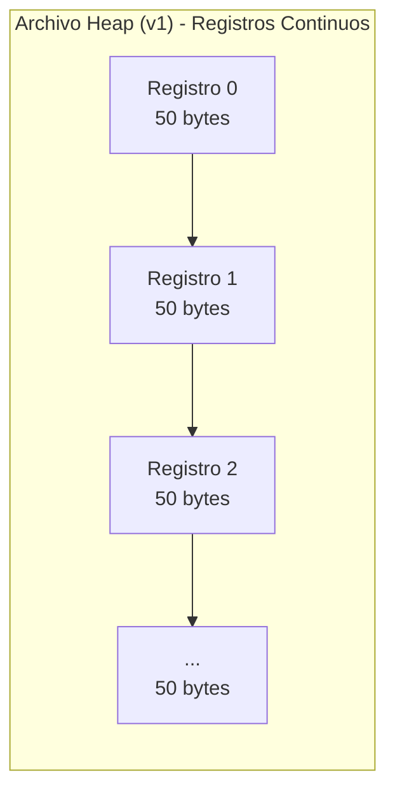
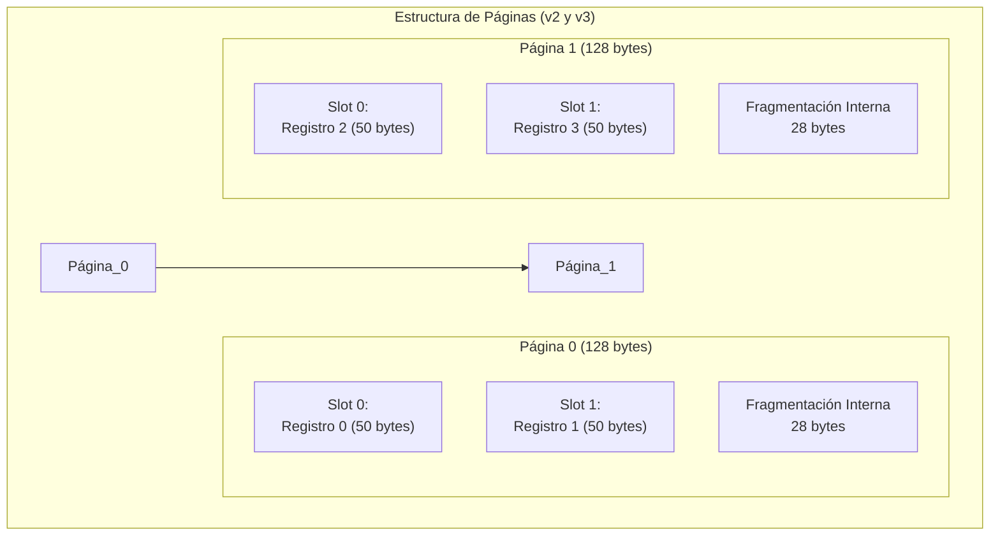
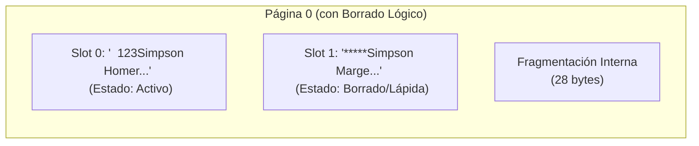
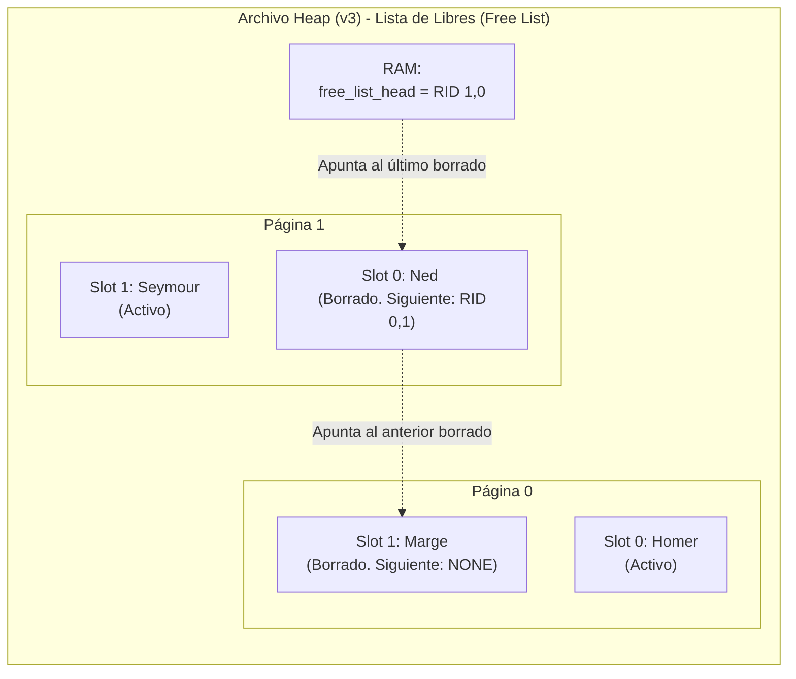

# Implementación de Heap Files (Registros de Longitud Fija)

En esta sesión práctica, se abordará la manera en que los Sistemas Gestores de Bases de Datos (DBMS) almacenan la información físicamente en el disco. Se construirá un motor de almacenamiento paso a paso, partiendo de un archivo de texto plano hasta llegar a un sistema paginado con manejo de espacio libre.

Este material ha sido diseñado como apoyo directo a las diapositivas presentadas en la sesión magistral sobre **Almacenamiento Físico y Organización de Archivos**. Se sugiere tener dichas presentaciones a la mano para correlacionar la teoría con el código aquí desarrollado.

## 1. Repaso Teórico Fundamental

Antes de proceder con la ejecución del código, es pertinente repasar los conceptos clave expuestos en las diapositivas de clase, los cuales justifican el diseño de nuestro motor. A continuación, se presentan diagramas conceptuales de los formatos que implementaremos:

### Heap File y Registros de Longitud Fija

Representa la estructura de almacenamiento más básica. Los registros se insertan sin un orden específico predefinido. Al forzar que cada registro ocupe exactamente la misma cantidad de bytes (por ejemplo, 50 bytes), es posible calcular la ubicación de cualquier registro mediante una función matemática de complejidad O(1). Si el dato original es de menor tamaño, se rellena el espacio sobrante con caracteres en blanco (*Padding*).



### Paginación (Pages) y RID

Como se ilustra en las diapositivas, el hardware de almacenamiento no opera byte a byte de manera eficiente, sino en bloques o "páginas" (típicamente de 4KB u 8KB). La unidad mínima de transferencia entre el disco y la memoria RAM es la página completa. En un modelo paginado, todo registro se ubica mediante una coordenada exacta conocida como Record ID o RID: **(Page_ID, Slot_ID)**.



### Borrado Lógico (Tombstones)

En las bases de datos relacionales no se eliminan físicamente los registros desplazando los adyacentes, ya que esto invalidaría los índices y generaría un alto costo de Entrada/Salida (I/O). En su lugar, se sobrescribe el inicio del registro con una "lápida" (tombstone), marcando el espacio como disponible. En nuestro laboratorio, usamos asteriscos `*****` en el campo del ID.



### Lista Enlazada de Espacios Libres (Free List)

Para evitar la fragmentación y el desperdicio de disco generado por los borrados lógicos, se reutiliza el espacio de los registros eliminados. En lugar de una lápida simple, almacenamos un puntero al siguiente espacio disponible, formando una lista enlazada (una Pila LIFO) a nivel físico. El motor mantiene en RAM la cabeza de la lista.



## 2. Evolución de la Implementación (Estructura de Archivos)

El código del laboratorio está fragmentado en tres archivos secuenciales. Cada versión resuelve una limitación arquitectónica de la versión anterior:

1. **heap_file_fixed.py (Versión 1 - Archivo Plano):** Implementa el caso base. Muestra cómo empaquetar variables en cadenas de texto de longitud fija, guardarlas secuencialmente y recuperarlas mediante el cálculo directo del desplazamiento (*offset*).
2. **heap_file_v2_pages.py (Versión 2 - Paginación y Borrado):** Introduce el concepto de Páginas y el cálculo mediante RID. Permite visualizar la fragmentación interna e implementa el borrado lógico simple.
3. **heap_file_v3_freemospace.py (Versión 3 - Reciclaje de Espacio):** Soluciona el problema del espacio inerte. Implementa una lista enlazada de espacios libres (*Free List*) directamente en el disco duro, logrando reciclar memoria en tiempo O(1).

## 3. Guía de Ejecución y Validación

Por favor, abran su terminal en el directorio donde residen los scripts y sigan estos pasos. Utilicen los siguientes puntos de control para confirmar que la ejecución es correcta.

### Fase 1: Comprensión de la Longitud Fija

* **Ejecute:** `python heap_file_fixed.py`
* **Puntos de Control (Checklist):**
* [ ] La salida en consola muestra los datos empaquetados y desempaquetados sin pérdida de información.
* [ ] Se confirma la búsqueda directa y exitosa en tiempo O(1) para el índice 2.
* [ ] Al abrir el archivo `my_database.dat` en un editor de texto, se observa que todos los datos residen en una única línea continua.


### Fase 2: Paginación y Lápidas

* **Ejecute:** `python heap_file_v2_pages.py`
* **Puntos de Control (Checklist):**
* [ ] La consola indica que un registro (Marge) fue eliminado lógicamente con éxito.
* [ ] Al intentar buscar de nuevo el registro eliminado, el motor reporta correctamente que "no existe".
* [ ] Al inspeccionar el archivo `my_database_pages.dat`, se aprecian secuencias de guiones (`-`) al final de cada bloque, lo que evidencia la fragmentación interna.
* [ ] En el mismo archivo, se verifica que el ID del registro borrado fue reemplazado por `*****`, pero los demás datos del registro permanecen como "fantasmas".


### Fase 3: Lista Enlazada de Espacios Libres

* **Parte A (Inspección de Punteros):** En el archivo `heap_file_v3_freemospace.py`, comenten temporalmente las líneas que efectúan las inserciones de reciclaje (hacia el final del archivo) y ejecuten el script.
* **Puntos de Control (Checklist):**
* [ ] Al abrir `my_database_v3.dat`, los espacios vacíos almacenan cadenas estructurales como `*FREE*P0000S0001` o `*FREE*NONE`.

* **Parte B (Verificación del Reciclaje):** Descomenten las líneas de inserción y vuelvan a ejecutar el script.
* **Puntos de Control (Checklist):**
* [ ] En la consola se confirma que los nuevos registros (Lisa y Milhouse) fueron insertados mediante reciclaje.
* [ ] Al inspeccionar el archivo `my_database_v3.dat`, se comprueba que los nuevos registros sobreescribieron exactamente los espacios marcados previamente por la lista enlazada, sin aumentar el tamaño total del archivo.

## 4. Tip Avanzado: Inspección Hexadecimal (Hexdump)

Aunque en este laboratorio estamos utilizando caracteres imprimibles por facilidad pedagógica, en un DBMS real los datos se guardan en formato binario puro. Para acostumbrar el ojo a la lectura a bajo nivel, se recomienda fuertemente inspeccionar los archivos `.dat` generados utilizando una herramienta de volcado hexadecimal (*hexdump*).

A continuación, se presenta un ejemplo de cómo se vería el inicio del archivo de la Versión 2 (`my_database_pages.dat`) bajo una inspección hexadecimal, donde se aprecia la dirección de memoria (columna izquierda), los bytes en hexadecimal y la representación ASCII (columna derecha). Note cómo los guiones de fragmentación interna son evidentes al final de la página:

```text
00000000: 20203132 3353696d 70736f6e 20202020  ..123Simpson....
00000010: 20202020 486f6d65 72202020 20202020  ....Homer.......
00000020: 20202020 20203331 20202020 20202020  ......31........
00000030: 20202032 30302020 20202d2d 2d2d2d2d  ...200....------
00000040: 2d2d2d2d 2d2d2d2d 2d2d2d2d 2d2d2d2d  ----------------
00000050: 2d2d2d2d 2d2d2d2d                    --------

```

* **En sistemas Linux / macOS:** Abran su terminal y ejecuten el comando `hexdump -C my_database_pages.dat` o `xxd my_database_pages.dat`.
* **En Windows / VS Code:** Se sugiere instalar la extensión oficial "Hex Editor" de Microsoft en Visual Studio Code. Al hacer clic derecho sobre el archivo `.dat` y seleccionar "Open With... -> Hex Editor", podrán visualizar la distribución exacta de cada byte y su correspondencia en caracteres ASCII a la derecha.

## 5. Referencias y Material para Profundización

Para consolidar los temas abordados en esta sesión y en las diapositivas magistrales, se recomienda consultar la siguiente literatura y recursos académicos:

* **Silberschatz, A., Korth, H. F., & Sudarshan, S.** *Fundamentos de Bases de Datos*. (Capítulos correspondientes a Almacenamiento y Estructura de Archivos).
* **Ramakrishnan, R., & Gehrke, J.** *Sistemas de Gestión de Bases de Datos*. (Excelente referencia para la estructura de páginas y el manejo de espacio libre).
* **UC Berkeley CS 186 (Curso de Introducción a Sistemas de Bases de Datos):** *Course Notes - Note 3: Storage*. Disponible en: [https://cs186berkeley.net/notes/note3/](https://cs186berkeley.net/notes/note3/).
* **Curso de la Universidad Carnegie Mellon (CMU):** *15-445/645 Intro to Database Systems* impartido por el profesor Andy Pavlo. Se recomiendan las clases teóricas sobre "Database Storage", disponibles en YouTube.

## 6. Nota Pedagógica: ¿Dónde está el Encabezado (Header)?

Durante la ejecución de estos tres ejercicios, es posible que se hayan percatado de un detalle arquitectónico: **no existe un encabezado (header) físico almacenado en el archivo del disco**. Metadatos vitales como la cantidad de registros permitidos, el tamaño de la página, o la variable `free_list_head` (que rastrea los espacios libres en la Versión 3) se han mantenido viviendo exclusivamente en la memoria RAM del script de Python.

Esta decisión fue puramente pedagógica. Si se hubiera introducido un *Page Header* físico (por ejemplo, reservando los primeros 16 bytes de cada página para guardar estos metadatos), la elegante fórmula matemática de nuestro desplazamiento (*offset*) en tiempo O(1) se habría vuelto más compleja en la primera etapa del aprendizaje:

`Offset = (Page_ID * Page_Size) + Tamaño_Del_Header + (Slot_ID * Record_Size)`

En un motor de base de datos real (como PostgreSQL o MySQL), este conocimiento no puede vivir solo en la memoria RAM; si el servidor sufre un corte de energía, se perdería todo el estado de la lista de espacios libres. Por ello, se reserva una sección de bytes al inicio de cada bloque (*Page Header*).

Este dilema es exactamente la motivación para nuestra próxima sesión (Versión 4), en la cual se introducirá el concepto de **Bitmaps**. Para implementar un Bitmap, nos veremos en la obligación de estructurar formalmente un Header físico dentro de la página en el disco, permitiéndonos abandonar la variable en RAM y persistir la integridad estructural directamente en el hardware.

> [!important]
> Este material fue desarrollado con apoyo de herramientas de IA como asistente de redacción y estructuración. El contenido ha sido supervisado, validado y refinado por intervención humana para garantizar su precisión técnica y coherencia pedagógica. No obstante, pueden haber errores.
