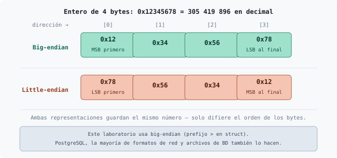
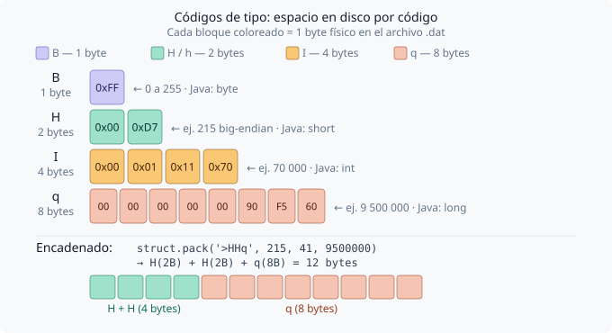
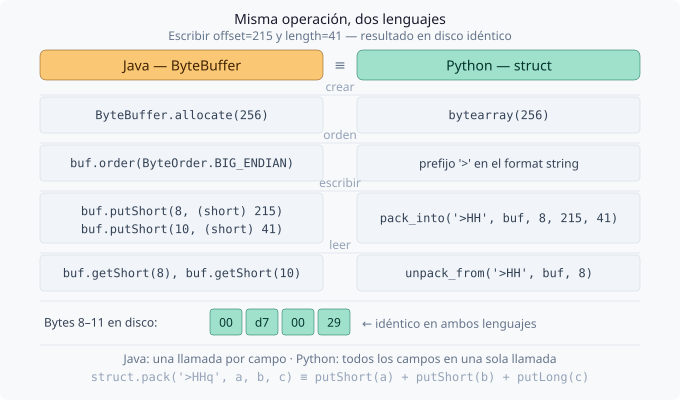
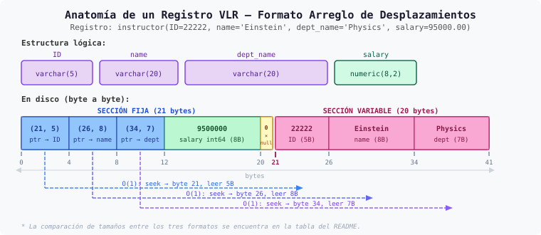
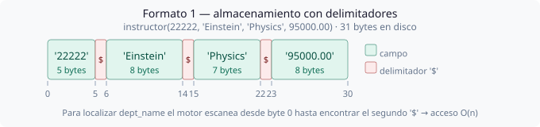
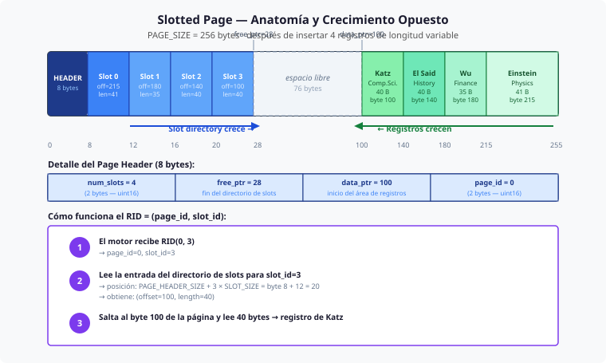
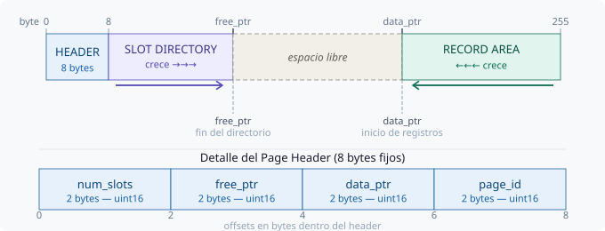
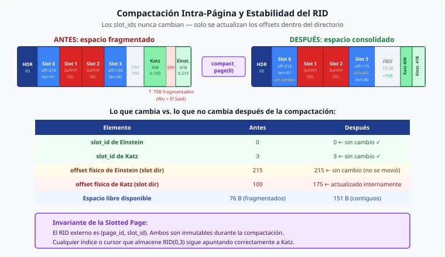

# Heap Files — Parte III: Registros de Longitud Variable y Slotted Pages

* **Laboratorio de Estructuras de Datos · Universidad de Antioquia**
* **Versiones del motor:** `heap_file_v5_vlr_formats.py` · `heap_file_v6_slotted_page.py` · `heap_file_v7_compaction.py`
* **Prerrequisito obligatorio:** Haber completado las Partes I y II (`packet/` y `bitmap/`)

---

> [!warning]
> Este material es un **apoyo al contenido de las diapositivas**, no un reemplazo. Se recomienda revisar primero las láminas de la Clase 4 (Parte 2) antes de ejecutar los scripts, ya que el código implementa directamente los conceptos allí presentados.

---

## Tabla de Contenido

- [Heap Files — Parte III: Registros de Longitud Variable y Slotted Pages](#heap-files--parte-iii-registros-de-longitud-variable-y-slotted-pages)
  - [Tabla de Contenido](#tabla-de-contenido)
  - [0. Conceptos Previos: `struct` y Endianness](#0-conceptos-previos-struct-y-endianness)
    - [0.1 ¿Qué es el Endianness?](#01-qué-es-el-endianness)
    - [0.2 El módulo `struct` de Python](#02-el-módulo-struct-de-python)
    - [0.3 Comparación con Java (`ByteBuffer`)](#03-comparación-con-java-bytebuffer)
    - [0.4 Ejemplo practico sobre `struct`](#04-ejemplo-practico-sobre-struct)
    - [0.5 Recursos para profundizar](#05-recursos-para-profundizar)
  - [1. Punto de Partida: ¿Por qué esta entrega existe?](#1-punto-de-partida-por-qué-esta-entrega-existe)
  - [2. Repaso Teórico](#2-repaso-teórico)
    - [2.1 Registros de Longitud Variable (VLR)](#21-registros-de-longitud-variable-vlr)
    - [2.2 Los Tres Formatos de Almacenamiento](#22-los-tres-formatos-de-almacenamiento)
      - [Formato 1 — Almacenamiento consecutivo con delimitadores](#formato-1--almacenamiento-consecutivo-con-delimitadores)
      - [Formato 2 — Prefijo de longitud](#formato-2--prefijo-de-longitud)
      - [Formato 3 — Arreglo de desplazamientos (el estándar de la industria)](#formato-3--arreglo-de-desplazamientos-el-estándar-de-la-industria)
    - [2.3 El Null Bitmap](#23-el-null-bitmap)
    - [2.4 La Slotted Page — Anatomía](#24-la-slotted-page--anatomía)
    - [2.5 Operaciones DML en la Slotted Page](#25-operaciones-dml-en-la-slotted-page)
      - [INSERT](#insert)
      - [DELETE](#delete)
      - [SELECT por RID](#select-por-rid)
    - [2.6 RID Estable y Compactación](#26-rid-estable-y-compactación)
  - [3. Evolución del Motor: v5 → v6 → v7](#3-evolución-del-motor-v5--v6--v7)
  - [4. Guía de Ejecución y Validación](#4-guía-de-ejecución-y-validación)
    - [4.1 Preparación del entorno](#41-preparación-del-entorno)
    - [4.2 Fase 1 — v5: Los tres formatos de serialización](#42-fase-1--v5-los-tres-formatos-de-serialización)
      - [Punto 1 — El mismo registro produce bytes distintos según el formato](#punto-1--el-mismo-registro-produce-bytes-distintos-según-el-formato)
      - [Punto 2 — El tamaño del registro depende del contenido, no del esquema](#punto-2--el-tamaño-del-registro-depende-del-contenido-no-del-esquema)
      - [Punto 3 — El null bitmap elimina los bytes del campo nulo](#punto-3--el-null-bitmap-elimina-los-bytes-del-campo-nulo)
    - [4.3 Fase 2 — v6: Slotted Page con INSERT, DELETE y SELECT](#43-fase-2--v6-slotted-page-con-insert-delete-y-select)
      - [Punto 4 — Los registros se insertan desde el final de la página hacia adelante](#punto-4--los-registros-se-insertan-desde-el-final-de-la-página-hacia-adelante)
      - [Punto 5 — El borrado lógico solo marca el slot, no toca los datos](#punto-5--el-borrado-lógico-solo-marca-el-slot-no-toca-los-datos)
      - [Punto 6 — Una nueva página se crea cuando el espacio físico es insuficiente](#punto-6--una-nueva-página-se-crea-cuando-el-espacio-físico-es-insuficiente)
      - [Punto 7 — Un campo NULL no ocupa bytes en la sección variable](#punto-7--un-campo-null-no-ocupa-bytes-en-la-sección-variable)
    - [4.4 Fase 3 — v7: Compactación y estabilidad del RID](#44-fase-3--v7-compactación-y-estabilidad-del-rid)
      - [Punto 8 — El borrado crea fragmentación que el espacio libre reportado no revela](#punto-8--el-borrado-crea-fragmentación-que-el-espacio-libre-reportado-no-revela)
      - [Punto 9 — La compactación consolida el espacio y actualiza los offsets internos](#punto-9--la-compactación-consolida-el-espacio-y-actualiza-los-offsets-internos)
      - [Punto 10 — El RID es estable: slot\_id nunca cambia durante la compactación](#punto-10--el-rid-es-estable-slot_id-nunca-cambia-durante-la-compactación)
      - [Punto 11 — El espacio recuperado permite reutilizar los slots eliminados](#punto-11--el-espacio-recuperado-permite-reutilizar-los-slots-eliminados)
  - [5. Inspección a Nivel de Bytes (Hexdump)](#5-inspección-a-nivel-de-bytes-hexdump)
  - [6. Referencias y Material de Profundización](#6-referencias-y-material-de-profundización)

---

## 0. Conceptos Previos: `struct` y Endianness

A diferencia de las entregas anteriores, los scripts de esta práctica leen y escriben **bytes binarios** sobre el archivo `.dat` con precisión quirúrgica: un campo de 2 bytes en la posición exacta 8, un entero de 8 bytes en la posición exacta 12, etc. Para hacer esto de forma confiable en Python se usa el módulo `struct` de la biblioteca estándar, junto con el concepto de **endianness**.

Ninguno de los dos es complejo, pero ambos son desconocidos para la mayoría de estudiantes que vienen de Java de alto nivel. Esta sección los presenta de forma concisa antes de entrar al código.

---

### 0.1 ¿Qué es el Endianness?

Cuando un número entero ocupa más de un byte en memoria, existe una decisión de diseño: ¿cuál byte se escribe primero? La respuesta define el **orden de bytes** o *endianness*.

Tome el número entero `0x12345678` (305 419 896 en decimal). Ocupa 4 bytes: `0x12`, `0x34`, `0x56`, `0x78`. Los dos órdenes posibles son:



Una forma de recordarlo: en **big-endian** el número se escribe igual que en papel, de izquierda a derecha empezando por el dígito más grande. En **little-endian** se invierte.

> [!note]
> Los procesadores Intel/AMD (x86-64) que probablemente usa su computador son **little-endian**. Sin embargo, los formatos de archivo de bases de datos —incluyendo PostgreSQL y los scripts de este laboratorio— usan **big-endian** por convención, porque es el orden estándar en redes y en la mayoría de protocolos de comunicación. Por eso todos los format strings en el código llevan el prefijo `>` (mayor que = big-endian).

---

### 0.2 El módulo `struct` de Python

`struct` permite convertir entre valores Python (`int`, `float`, etc.) y secuencias de bytes con un layout preciso. Su función central es `struct.pack(format, *values)`, que devuelve un objeto `bytes`.

El primer argumento es un **format string** compuesto por un carácter de orden de bytes y uno o más códigos de tipo:

**Carácter de orden de bytes:**

| Carácter | Significado | Uso en este laboratorio |
|:---:|---|:---:|
| `>` | Big-endian | ✅ Siempre |
| `<` | Little-endian | — |
| `=` | Orden nativo del sistema | — |

**Códigos de tipo más usados en el laboratorio:**

| Código | Tipo Python | Bytes | Equivalente Java | Ejemplo de valor |
|:---:|---|:---:|---|:---:|
| `B` | `int` (0–255) | 1 | `byte` / `Byte` | `0xFF` |
| `H` | `int` (0–65535) | 2 | `short` / `Short` | `256` |
| `h` | `int` (−32768 – 32767) | 2 | `short` (con signo) | `−1` |
| `I` | `int` (0–4294967295) | 4 | `int` / `Integer` | `70000` |
| `q` | `int` (int64 con signo) | 8 | `long` / `Long` | `9500000` |
| `s` | `bytes` | n (se indica antes) | `byte[]` | `b'AB'` |

Se pueden encadenar varios códigos en un solo format string. `'>HH'` empaqueta dos `uint16` big-endian consecutivos (4 bytes en total). `'>HHq'` empaqueta dos `uint16` seguidos de un `int64` (12 bytes en total).

**Funciones principales:**

| Función | Descripción | Retorna |
|---|---|---|
| `struct.pack(fmt, *v)` | Empaqueta valores en bytes | `bytes` |
| `struct.unpack(fmt, buf)` | Desempaqueta bytes en tupla | `tuple` |
| `struct.pack_into(fmt, buf, offset, *v)` | Escribe en un `bytearray` existente en una posición | `None` |
| `struct.unpack_from(fmt, buf, offset)` | Lee desde un `bytearray` en una posición | `tuple` |
| `struct.calcsize(fmt)` | Devuelve el número de bytes que ocupa el formato | `int` |

> [!tip]
> `pack_into` y `unpack_from` son las funciones más usadas en el laboratorio porque operan directamente sobre el `bytearray` que representa la página en memoria, sin crear copias intermedias. Esto es importante para la eficiencia cuando se manipulan páginas completas de 256 bytes.

El siguiente diagrama muestra visualmente cuántos bytes ocupa cada código de tipo y cómo se ven encadenados en disco para el format string `'>HHq'` (el que se usa en los scripts v6 y v7 para escribir un slot directory entry más el campo salary):



---

### 0.3 Comparación con Java (`ByteBuffer`)

Si ha usado `java.nio.ByteBuffer` en Java, `struct` de Python es conceptualmente idéntico. La siguiente tabla muestra las operaciones equivalentes:

| Operación | Java (`ByteBuffer`) | Python (`struct`) |
|---|---|---|
| Crear buffer vacío de N bytes | `ByteBuffer.allocate(N)` | `bytearray(N)` |
| Definir orden de bytes | `buf.order(ByteOrder.BIG_ENDIAN)` | prefijo `>` en el format string |
| Escribir `short` en posición | `buf.putShort(pos, value)` | `struct.pack_into('>H', buf, pos, value)` |
| Escribir `long` en posición | `buf.putLong(pos, value)` | `struct.pack_into('>q', buf, pos, value)` |
| Leer `short` desde posición | `buf.getShort(pos)` | `struct.unpack_from('>H', buf, pos)[0]` |
| Leer `long` desde posición | `buf.getLong(pos)` | `struct.unpack_from('>q', buf, pos)[0]` |
| Empaquetar varios campos | múltiples `put*()` | un solo `struct.pack('>HHq', a, b, c)` |

La diferencia más notable es que en Python un solo `pack` puede escribir varios campos de distintos tipos en una sola llamada, mientras que en Java se necesita una llamada `put*()` por campo.

El siguiente diagrama muestra ambas aproximaciones realizando exactamente la misma operación — escribir `offset=215` y `length=41` en un buffer de página — y confirma que los bytes resultantes son idénticos en los dos lenguajes:



---

### 0.4 Ejemplo practico sobre `struct`

El siguiente fragmento ilustra el ciclo completo: empaquetar una entrada del slot directory (un par `(offset, length)`), inspeccionarla byte a byte y recuperar los valores originales. Puede ejecutarse directamente en el intérprete de Python sin ninguna dependencia adicional.

```python
import struct

# ── Empaquetar ──────────────────────────────────────────────────────────────
# Una entrada del slot directory ocupa 4 bytes:
#   offset (2B, uint16 big-endian) + length (2B, uint16 big-endian)
offset = 215   # el registro comienza en el byte 215 de la página
length = 41    # el registro ocupa 41 bytes

packed = struct.pack('>HH', offset, length)

print(f"Bytes empaquetados : {packed.hex(' ')}")   # → d7 00 29 00  (¡big-endian!)
print(f"Tamaño             : {len(packed)} bytes") # → 4 bytes
print(f"Tamaño calculado   : {struct.calcsize('>HH')} bytes")

# ── Inspeccion byte a byte ───────────────────────────────────────────────────
# 215 en hexadecimal = 0x00D7  → bytes: 0x00, 0xD7  (big-endian: primero el MSB)
# 41  en hexadecimal = 0x0029  → bytes: 0x00, 0x29
for i, b in enumerate(packed):
    print(f"  byte[{i}] = 0x{b:02X} ({b:3d})")

# ── Desempaquetar ────────────────────────────────────────────────────────────
recovered_offset, recovered_length = struct.unpack('>HH', packed)

print(f"\nOffset recuperado  : {recovered_offset}")   # → 215
print(f"Length recuperado  : {recovered_length}")    # → 41
assert recovered_offset == offset
assert recovered_length == length
print("Round-trip OK ✓")

# ── Operación sobre bytearray (simulando una página) ────────────────────────
page = bytearray(256)                         # página de 256 bytes en blanco

SLOT_0_POS = 8                                # el primer slot empieza en el byte 8
struct.pack_into('>HH', page, SLOT_0_POS, offset, length)   # escribir en la página

read_back = struct.unpack_from('>HH', page, SLOT_0_POS)     # leer desde la página
print(f"\nLeído desde bytearray: offset={read_back[0]}, length={read_back[1]}")
```

**Salida esperada:**

```
Bytes empaquetados : 00 d7 00 29
Tamaño             : 4 bytes
Tamaño calculado   : 4 bytes
  byte[0] = 0x00 (  0)
  byte[1] = 0xD7 (215)
  byte[2] = 0x00 (  0)
  byte[3] = 0x29 ( 41)

Offset recuperado  : 215
Length recuperado  : 41
Round-trip OK ✓

Leído desde bytearray: offset=215, length=41
```

> [!tip]
> Note que `0xD7` es 215 en decimal. El byte más significativo (`0x00`) se escribió primero porque usamos big-endian. Si hubiera usado little-endian (`'<HH'`), el orden de los bytes habría sido `D7 00 29 00` — el mismo número, los mismos bytes, pero en orden inverso dentro de cada campo.

> [!tip]
> **¿Prefiere ver esto en Java?** El archivo [`StructEjemploMinimo.java`](StructEjemploMinimo.java)
> contiene el equivalente exacto usando `java.nio.ByteBuffer` —
> los mismos cuatro pasos, las mismas afirmaciones, la misma comparación
> big-endian vs little-endian. Puede compilarlo y ejecutarlo con:
> ```bash
> javac StructEjemploMinimo.java
> java  StructEjemploMinimo
> ```

---

### 0.5 Recursos para profundizar

Los siguientes recursos están ordenados de menor a mayor profundidad. Se recomienda empezar por los dos primeros antes de ejecutar los scripts.

**Documentación oficial de Python:**

- [`struct` — Interpret bytes as packed binary data](https://docs.python.org/3/library/struct.html)
  La referencia completa del módulo: tabla de format characters, alineación, y ejemplos. Útil como consulta rápida mientras se lee el código.

- [`bytearray` — Mutable sequence of bytes](https://docs.python.org/3/library/stdtypes.html#bytearray-objects)
  Describe el tipo `bytearray` que se usa para representar páginas en memoria. Es importante entender que es mutable (a diferencia de `bytes`), lo que permite modificar bytes individuales en su posición.

**Tutoriales y artículos:**

- [Real Python — Python's `struct` Module: Working With C-Style Binary Data](https://realpython.com/python-struct-module/)
  Tutorial paso a paso con ejemplos prácticos. Cubre `pack`, `unpack`, `pack_into`, `unpack_from` y el uso de `Struct` como clase. Muy recomendado como primera lectura complementaria.

- [Real Python — Endianness: Little-Endian vs Big-Endian](https://realpython.com/python-bitwise-operators/#big-endian-vs-little-endian)
  Explica endianness en el contexto de Python con visualizaciones. Útil para consolidar la intuición del Punto 0.1.

- [Python `struct` format characters — tabla de referencia rápida](https://docs.python.org/3/library/struct.html#format-characters)
  Enlace directo a la tabla de códigos de tipo dentro de la documentación oficial. Conveniente tenerlo abierto mientras se lee el código del laboratorio.

---

## 1. Punto de Partida: ¿Por qué esta entrega existe?

Al finalizar la Parte II se contaba con un motor capaz de persistir el estado de ocupación de los slots en disco, gracias a los bitmaps del encabezado. Sin embargo, el modelo seguía siendo fundamentalmente **rígido**: cada registro ocupaba exactamente `RECORD_SIZE = 50` bytes, independientemente de cuántos caracteres tuviera el nombre o el departamento almacenado.

Observe el efecto de este diseño sobre la tabla de profesores:

| Instructor | Nombre real | Bytes del nombre | Bytes reservados | Desperdicio |
|:---:|:---:|:---:|:---:|:---:|
| Wu | `Wu` | 2 bytes | 15 bytes | **13 bytes** |
| Srinivasan | `Srinivasan` | 10 bytes | 15 bytes | 5 bytes |
| Einstein | `Einstein` | 8 bytes | 15 bytes | 7 bytes |

En una tabla con millones de filas este desperdicio —conocido como **fragmentación interna**— acumula megabytes de espacio inutilizable. Además, la arquitectura de v4 hace imposible almacenar datos cuya longitud varía por naturaleza, como descripciones, correos electrónicos o textos de longitud arbitraria.

La Parte III resuelve este problema de raíz introduciendo los **Registros de Longitud Variable (VLR)** y la estructura de página que los gestiona eficientemente: la **Slotted Page**.

---

## 2. Repaso Teórico

### 2.1 Registros de Longitud Variable (VLR)

Como se presentó en clase, los VLR aparecen en los sistemas de bases de datos en tres escenarios principales:

**Escenario 1 — Tipos `varchar`:** Un campo declarado como `varchar(20)` puede almacenar cualquier cadena de 0 a 20 caracteres. Los registros resultantes no tienen un tamaño uniforme.

**Escenario 2 — Múltiples tipos de registro en un archivo:** Un mismo archivo puede contener registros de tipo `INSTRUCTOR` y de tipo `DEPARTMENT`, cada uno con una estructura diferente. Cada registro debe incluir una etiqueta de tipo para que el motor sepa cómo interpretarlo.

**Escenario 3 — Campos repetidos:** Modelos de datos más antiguos permitían que un campo almacenara varios valores (por ejemplo, varios números de teléfono). Esto hace que el registro crezca según el número de valores presentes.

> [!note]
> **Contraste fundamental con FLR:** En un registro de longitud fija, el motor calcula la posición de cualquier campo con aritmética pura: `offset(salary) = B + 5 + 20 + 20 = B + 45`. En un VLR, no es posible saber de antemano cuántos bytes ocupa `name`, por lo que se necesita un mecanismo adicional para localizar los campos.

---

### 2.2 Los Tres Formatos de Almacenamiento

Los formatos determinan **cómo se disponen los campos dentro de un único registro** para que el motor pueda localizarlos. Los tres formatos estudiados en clase se implementan en `heap_file_v5_vlr_formats.py`.



**Tabla complementaria — Comparación de tamaño entre los tres formatos:**

El diagrama muestra la estructura interna del **Formato 3** para un registro concreto. La siguiente tabla extiende esa información comparando los tres formatos para dos registros con nombres de longitud muy diferente, lo que ilustra directamente que el tamaño en disco depende del contenido real y no de una constante fija.

| Formato | Acceso a campo | Instructor 'Wu' | Instructor 'Srinivasan' | Diferencia |
|:---|:---:|:---:|:---:|:---:|
| Delimitadores (`$`) | O(n) — escaneo completo | 25 B | 36 B | 11 B |
| Prefijo de longitud | O(n) — recorre prefijos | 32 B | 43 B | 11 B |
| **Arreglo de desplazamientos** | **O(1) — salto directo** | **35 B** | **46 B** | **11 B** |

> [!note]
> La diferencia de 11 bytes entre 'Wu' y 'Srinivasan' se descompone exactamente en: `len("Srinivasan") − len("Wu") = 8 B` + `len("Comp. Sci.") − len("Finance") = 3 B`. No hay padding: cada registro ocupa exactamente lo que necesita y nada más. Compare esto con el motor `v4`, donde ambos registros ocupaban 50 bytes fijos independientemente del contenido.

#### Formato 1 — Almacenamiento consecutivo con delimitadores

Los campos se escriben uno tras otro separados por un carácter centinela (por ejemplo `$`) que no puede aparecer en los datos.

```python
# heap_file_v5_vlr_formats.py

def serialize_delimited(record: tuple) -> bytes:
    """Joins fields with a '$' delimiter byte. Simple but requires full scan."""
    emp_id, name, dept_name, salary = record
    parts = [str(emp_id), name, dept_name, f"{salary:.2f}"]
    return DELIMITER.join(p.encode('utf-8') for p in parts)
```



Para recuperar el campo `dept_name`, el motor debe leer desde el byte 0 hasta encontrar el segundo `$` —es decir, un escaneo **O(n)** en el tamaño del registro.

#### Formato 2 — Prefijo de longitud

El registro comienza con el conteo de campos y cada campo va precedido por su longitud en bytes.

```python
def serialize_length_prefix(record: tuple) -> bytes:
    """
    Prefixes the record with a field count (2B), then each field
    with its byte length (2B). Allows skipping fields without reading them.
    """
    emp_id, name, dept_name, salary = record
    fields = [str(emp_id), name, dept_name, f"{salary:.2f}"]

    buf = struct.pack('>H', len(fields))           # 2-byte field count
    for f in fields:
        enc = f.encode('utf-8')
        buf += struct.pack('>H', len(enc)) + enc   # 2-byte length + raw bytes
    return buf
```



El motor puede saltar un campo leyendo su prefijo de longitud y avanzando esa cantidad de bytes. Sin embargo, para llegar al campo `k`, aún debe recorrer los prefijos 0 … k−1 en secuencia.

#### Formato 3 — Arreglo de desplazamientos (el estándar de la industria)

Un encabezado al inicio del registro almacena un par `(offset, longitud)` por cada campo de longitud variable. El motor salta directamente a cualquier campo **en O(1)**.

```python
# heap_file_v5_vlr_formats.py
#
# Layout de un registro con el esquema instructor:
#
# Bytes  0– 3 : (offset_ID,        length_ID)        ← par (2B+2B)
# Bytes  4– 7 : (offset_name,      length_name)
# Bytes  8–11 : (offset_dept_name, length_dept_name)
# Bytes 12–19 : salary como int64 big-endian en centavos (campo fijo)
# Byte   20   : null bitmap (un bit por campo)
# Bytes 21…   : datos reales de ID, name, dept_name concatenados

FIXED_SECTION = N_VAR_FIELDS * 4 + SALARY_BYTES + NULL_BYTES  # 21 bytes

def serialize_offset_array(record: tuple, null_mask: int = 0) -> bytes:
    """
    Serializes a record using the offset-array format.
    Variable data starts at byte FIXED_SECTION (= 21).
    Each (offset, length) pair allows O(1) access to any varchar field.
    """
    emp_id, name, dept_name, salary = record
    varchar_vals = [str(emp_id), name, dept_name]

    var_data = b''
    pairs    = []
    cur      = FIXED_SECTION          # variable data begins right after the fixed section

    for i, val in enumerate(varchar_vals):
        if null_mask & (1 << i):      # field is NULL — zero bytes emitted
            pairs.append((0, 0))
        else:
            enc = val.encode('utf-8')
            pairs.append((cur, len(enc)))
            var_data += enc
            cur      += len(enc)

    fixed  = b''.join(struct.pack('>HH', off, ln) for off, ln in pairs)
    fixed += struct.pack('>q', int((salary or 0) * 100))
    fixed += struct.pack('B',  null_mask)
    return fixed + var_data
```


> [!tip]
> ¿Por qué este formato es el que usan PostgreSQL, SQLite y la mayoría de motores de producción? Porque combina las dos propiedades más deseadas: **acceso O(1)** a cualquier campo (sin escanear) y **almacenamiento compacto** (sin padding). El costo es el overhead de 4 bytes por campo variable en el encabezado, que es ampliamente justificado.

---

### 2.3 El Null Bitmap

El byte de `null_bitmap` es una máscara de bits donde cada posición corresponde a un campo. Si el bit `i` vale `1`, el campo `i` es `NULL` y no ocupa ningún byte en la sección variable.

```python
# En v5, las constantes de máscara son:
NULL_ID       = 0b00000001   # bit 0
NULL_NAME     = 0b00000010   # bit 1
NULL_DEPTNAME = 0b00000100   # bit 2
NULL_SALARY   = 0b00001000   # bit 3

# Para insertar a Crick sin salario conocido:
rec = (76766, "Crick", "Biology", None)
raw = serialize_offset_array(rec, null_mask=NULL_SALARY)
```

> [!note]
> Contraste con FLR: en un registro de longitud fija, un campo `NULL` igual reserva todos sus bytes (simplemente se llenan con un valor especial o con ceros). En el formato de arreglo de desplazamientos, un campo `NULL` contribuye **cero bytes** a la sección variable. El null bitmap indica al deserializador que debe devolver `None` sin intentar leer datos.

---

### 2.4 La Slotted Page — Anatomía

Una vez que los registros tienen longitud variable, la arquitectura de página también debe cambiar. Una página de longitud fija con slots de tamaño fijo no puede acomodar registros de distintos tamaños.

La **Slotted Page** resuelve este problema con una organización en tres zonas que crecen desde extremos opuestos:





El **Page Header** ocupa los primeros 8 bytes y almacena cuatro campos de 2 bytes cada uno:

```python
# heap_file_v6_slotted_page.py

def create_empty_page(page_id: int) -> bytearray:
    """
    Initializes PAGE_SIZE bytes with the page header.
    Initial state: num_slots=0, free_ptr=8, data_ptr=PAGE_SIZE.
    """
    page = bytearray(PAGE_SIZE)
    struct.pack_into('>HHHH', page, 0,
                     0,                # num_slots  — no slots yet
                     PAGE_HEADER_SIZE, # free_ptr   — slot dir starts here
                     PAGE_SIZE,        # data_ptr   — records start at the end
                     page_id)
    return page
```

El **Slot Directory** es un arreglo de entradas de 4 bytes, cada una con un par `(offset, length)` que apunta al registro correspondiente en el área de datos. Una entrada con `offset = 0xFFFF` indica que el slot ha sido eliminado lógicamente.

> [!note]
> Los punteros externos (los índices de la base de datos, los cursores activos) **nunca apuntan a la posición física** de un registro. Apuntan a la entrada del slot en el directorio. Esto es la clave que permite mover registros dentro de la página sin invalidar ninguna referencia externa.

---

### 2.5 Operaciones DML en la Slotted Page

#### INSERT

```python
# heap_file_v6_slotted_page.py

def insert_into_page(page: bytearray, record_bytes: bytes) -> int:
    """
    Protocol (slide 35):
      1. Search for a reusable deleted slot (avoids growing the directory).
      2. Check that the free gap fits: record bytes + (SLOT_SIZE if no reuse).
      3. Write the record at the new data_ptr (growing leftward).
      4. Write / update the slot entry with (data_ptr, rec_len).
      5. Update the page header.
    Returns the assigned slot_id, or -1 if the page is full.
    """
```

El registro se coloca en el extremo derecho del espacio libre (justo antes de `data_ptr`), y `data_ptr` se desplaza a la izquierda. Al mismo tiempo, el directorio de slots crece a la derecha añadiendo una nueva entrada, lo que desplaza `free_ptr` hacia la derecha. El espacio libre se mantiene **siempre contiguo** en el centro.

#### DELETE

```python
def delete_from_page(page: bytearray, slot_id: int) -> bool:
    """
    Logical delete (slide 36): marks the slot as deleted (offset = SLOT_DELETED = 0xFFFF).
    The record bytes are NOT overwritten — space is reclaimed lazily.
    """
```

El borrado en la Slotted Page es **puramente lógico**: un único valor de 2 bytes cambia en el directorio. Los bytes del registro permanecen en su posición física hasta que se ejecute una compactación.

#### SELECT por RID

```python
def read_from_page(page: bytearray, slot_id: int):
    """
    Indirection layer (slide 32):
      1. Read (offset, length) from the slot directory entry.
      2. If offset == SLOT_DELETED, return None immediately.
      3. Otherwise, jump to page[offset] and read 'length' bytes.
    """
```

---

### 2.6 RID Estable y Compactación

Después de varios ciclos de inserción y borrado, el área de datos se **fragmenta**: los registros eliminados dejan huecos que el motor no puede reutilizar directamente para registros de diferente tamaño. El espacio libre total puede ser suficiente pero no estar disponible como bloque contiguo.

La **compactación** resuelve esto deslizando todos los registros válidos hacia el extremo derecho de la página y actualizando los offsets en el directorio de slots:



```python
# heap_file_v7_compaction.py

def compact_page(page: bytearray):
    """
    Eliminates internal fragmentation (slide 37).

    Steps:
      1. Snapshot all valid (slot_id, record_bytes) pairs.
      2. Reset data_ptr to PAGE_SIZE.
      3. Rewrite each record from right to left, updating its slot offset.
      4. Update the page header.

    RID STABILITY: slot_ids are never changed. Only the (offset) field
    inside each slot directory entry is updated. External references
    holding RID = (page_id, slot_id) remain fully valid after compaction.
    """
```

> [!tip]
> Este es el motivo por el que el RID es un par `(page_id, slot_id)` y no un par `(page_id, byte_offset)`. Si el RID apuntara directamente a la posición física, cualquier movimiento de registro durante la compactación invalidaría todos los índices. Al apuntar al **slot** del directorio, el motor puede reubicar registros libremente sin notificar a ningún componente externo.

---

## 3. Evolución del Motor: v5 → v6 → v7

| Versión | Archivo | Nuevo concepto | Limitación resuelta |
|:---:|---|---|---|
| `v5` | `heap_file_v5_vlr_formats.py` | Los tres formatos VLR a nivel de registro | El padding fijo de v4 desperdicia espacio |
| `v6` | `heap_file_v6_slotted_page.py` | Slotted Page: INSERT, DELETE, SELECT por RID | Los registros variables no caben en páginas de slots fijos |
| `v7` | `heap_file_v7_compaction.py` | Compactación intra-página y RID estable | Los borrados fragmentan el espacio libre de la página |

---

## 4. Guía de Ejecución y Validación

### 4.1 Preparación del entorno

No se requieren dependencias externas. Solo se usa la biblioteca estándar de Python (`struct`, `os`).

```bash
# Verificar versión de Python (se requiere 3.10+)
python --version

# Situarse en la carpeta del laboratorio
cd laboratorio-almacenamiento/VLR/
```

---

### 4.2 Fase 1 — v5: Los tres formatos de serialización

**Objetivo:** comprender cómo el mismo registro lógico se representa de forma
diferente según el formato y verificar que el tamaño varía con el contenido.
```bash
python heap_file_v5_vlr_formats.py
```

**Salida completa esperada:**
```
==============================================================
  Heap Files v5 — VLR Record Formats
==============================================================

=== FORMAT 1 — Delimiter-based ===
  [Einstein]
    Size : 31 bytes
    Hex  : 32 32 32 32 32 24 45 69 6e 73 74 65 69 6e 24 50 68 79 73 69 63 73 24 39 35 30 30 30 2e 30 30
    Decoded: (22222, 'Einstein', 'Physics', 95000.0)
  [Wu]
    Size : 25 bytes
    Hex  : 31 32 31 32 31 24 57 75 24 46 69 6e 61 6e 63 65 24 39 30 30 30 30 2e 30 30
    Decoded: (12121, 'Wu', 'Finance', 90000.0)
  [Srinivasan]
    Size : 36 bytes
    Hex  : 31 30 31 30 31 24 53 72 69 6e 69 76 61 73 61 6e 24 43 6f 6d 70 2e 20 53 63 69 2e 24 36 35 30 30 30 2e 30 30
    Decoded: (10101, 'Srinivasan', 'Comp. Sci.', 65000.0)
  [Katz]
    Size : 30 bytes
    Hex  : 34 35 35 36 35 24 4b 61 74 7a 24 43 6f 6d 70 2e 20 53 63 69 2e 24 37 35 30 30 30 2e 30 30
    Decoded: (45565, 'Katz', 'Comp. Sci.', 75000.0)

=== FORMAT 2 — Length Prefix ===
  [Einstein]
    Size : 38 bytes
    Hex  : 00 04 00 05 32 32 32 32 32 00 08 45 69 6e 73 74 65 69 6e 00 07 50 68 79 73 69 63 73 00 08 39 35 30 30 30 2e 30 30
    Decoded: (22222, 'Einstein', 'Physics', 95000.0)
  [Wu]
    Size : 32 bytes
    Hex  : 00 04 00 05 31 32 31 32 31 00 02 57 75 00 07 46 69 6e 61 6e 63 65 00 08 39 30 30 30 30 2e 30 30
    Decoded: (12121, 'Wu', 'Finance', 90000.0)
  [Srinivasan]
    Size : 43 bytes
    Hex  : 00 04 00 05 31 30 31 30 31 00 0a 53 72 69 6e 69 76 61 73 61 6e 00 0a 43 6f 6d 70 2e 20 53 63 69 2e 00 08 36 35 30 30 30 2e 30 30
    Decoded: (10101, 'Srinivasan', 'Comp. Sci.', 65000.0)
  [Katz]
    Size : 37 bytes
    Hex  : 00 04 00 05 34 35 35 36 35 00 04 4b 61 74 7a 00 0a 43 6f 6d 70 2e 20 53 63 69 2e 00 08 37 35 30 30 30 2e 30 30
    Decoded: (45565, 'Katz', 'Comp. Sci.', 75000.0)

=== FORMAT 3 — Offset Array ===
  [Einstein]
    Size : 41 bytes
    Hex  : 00 15 00 05 00 1a 00 08 00 22 00 07 00 00 00 00 00 90 f5 60 00 32 32 32 32 32 45 69 6e 73 74 65 69 6e 50 68 79 73 69 63 73
    Decoded: (22222, 'Einstein', 'Physics', 95000.0)
  [Wu]
    Size : 35 bytes
    Hex  : 00 15 00 05 00 1a 00 02 00 1c 00 07 00 00 00 00 00 89 54 40 00 31 32 31 32 31 57 75 46 69 6e 61 6e 63 65
    Decoded: (12121, 'Wu', 'Finance', 90000.0)
  [Srinivasan]
    Size : 46 bytes
    Hex  : 00 15 00 05 00 1a 00 0a 00 24 00 0a 00 00 00 00 00 63 2e a0 00 31 30 31 30 31 53 72 69 6e 69 76 61 73 61 6e 43 6f 6d 70 2e 20 53 63 69 2e
    Decoded: (10101, 'Srinivasan', 'Comp. Sci.', 65000.0)
  [Katz]
    Size : 40 bytes
    Hex  : 00 15 00 05 00 1a 00 04 00 1e 00 0a 00 00 00 00 00 72 70 e0 00 34 35 35 36 35 4b 61 74 7a 43 6f 6d 70 2e 20 53 63 69 2e
    Decoded: (45565, 'Katz', 'Comp. Sci.', 75000.0)

=== FORMAT 3 — Null Bitmap Demo ===
  [Crick — salary=NULL]
    Size : 38 bytes
    Hex  : 00 15 00 05 00 1a 00 05 00 1f 00 07 00 00 00 00 00 00 00 00 08 37 36 37 36 36 43 72 69 63 6b 42 69 6f 6c 6f 67 79
    Decoded: (76766, 'Crick', 'Biology', None)
    salary field → None
  [Kim — dept_name=NULL]
    Size : 29 bytes
    Hex  : 00 15 00 05 00 1a 00 03 00 00 00 00 00 00 00 00 00 7a 12 00 04 39 38 33 34 35 4b 69 6d
    Decoded: (98345, 'Kim', None, 80000.0)

=== Size comparison (same record each time) ===

  Record: Einstein
  Delimiter  :  31 bytes
  Len-prefix :  38 bytes
  Offset arr :  41 bytes

  Record: Wu
  Delimiter  :  25 bytes
  Len-prefix :  32 bytes
  Offset arr :  35 bytes

  Record: Srinivasan
  Delimiter  :  36 bytes
  Len-prefix :  43 bytes
  Offset arr :  46 bytes

  Record: Katz
  Delimiter  :  30 bytes
  Len-prefix :  37 bytes
  Offset arr :  40 bytes

  Observation:
  'Wu'         → offset-array: 35 bytes (delimiter: 25)
  'Srinivasan' → offset-array: 46 bytes (delimiter: 36)
  Difference   : 11 bytes — only the actual data, no padding
```

Con esa salida en pantalla, verifique los siguientes puntos:

---

#### Punto 1 — El mismo registro produce bytes distintos según el formato

En las secciones `FORMAT 1`, `FORMAT 2` y `FORMAT 3` de la salida, localice el
registro de Einstein. Observe que el campo `Size` cambia en cada sección:
31 bytes, 38 bytes y 41 bytes respectivamente. El registro lógico es idéntico
en los tres casos — lo que varía es el mecanismo de almacenamiento.

**Lista de verificación — Punto 1:**

- [ ] Einstein ocupa 31 B en Formato 1, 38 B en Formato 2 y 41 B en Formato 3
- [ ] En los tres casos `Decoded` muestra exactamente `(22222, 'Einstein', 'Physics', 95000.0)`
- [ ] El script no lanza ningún `AssertionError` — todos los round-trips son correctos

---

#### Punto 2 — El tamaño del registro depende del contenido, no del esquema

En la sección `Size comparison` de la salida, compare las filas de Wu y
Srinivasan para el Formato 3 (offset array):
```
  'Wu'         → offset-array: 35 bytes (delimiter: 25)
  'Srinivasan' → offset-array: 46 bytes (delimiter: 36)
  Difference   : 11 bytes — only the actual data, no padding
```

**Lista de verificación — Punto 2:**

- [ ] Wu ocupa 35 bytes y Srinivasan 46 bytes en formato offset-array
- [ ] La diferencia de 11 bytes corresponde a `len("Srinivasan") − len("Wu") = 8` más `len("Comp. Sci.") − len("Finance") = 3`
- [ ] Ambos registros tienen el mismo esquema — la diferencia es solo el contenido

---

#### Punto 3 — El null bitmap elimina los bytes del campo nulo

En la sección `FORMAT 3 — Null Bitmap Demo` de la salida, localice el registro
de Crick:
```
  [Crick — salary=NULL]
    Size : 38 bytes
    Decoded: (76766, 'Crick', 'Biology', None)
    salary field → None
```

**Lista de verificación — Punto 3:**

- [ ] El registro de Crick ocupa 38 bytes — el campo `salary` no contribuye ningún byte a la sección variable
- [ ] Al decodificarlo, `salary` es `None`, no un valor numérico
- [ ] El byte en la posición 20 del hex (el null bitmap) tiene el bit 3 en `1`: valor `08` en hexadecimal

---

### 4.3 Fase 2 — v6: Slotted Page con INSERT, DELETE y SELECT

**Objetivo:** observar cómo la Slotted Page organiza registros de longitud
variable dentro de una página física, cómo el borrado lógico funciona a nivel
de slot, y qué ocurre cuando la página no tiene espacio suficiente para un
nuevo registro.

```bash
python heap_file_v6_slotted_page.py
```

**Salida completa esperada:**

```
==============================================================
  Heap Files v6 — Slotted Page
==============================================================

[Phase 1] Inserting records
[INSERT] 'Einstein' → RID(0,0)  [41 bytes]  ← new page
[INSERT] 'Wu' → RID(0,1)  [35 bytes]
[INSERT] 'El Said' → RID(0,2)  [40 bytes]
[INSERT] 'Katz' → RID(0,3)  [40 bytes]
[INSERT] 'Srinivasan' → RID(0,4)  [46 bytes]

[SCAN] Full table scan:
  RID(0,0) → (22222, 'Einstein', 'Physics', 95000.0)
  RID(0,1) → (12121, 'Wu', 'Finance', 90000.0)
  RID(0,2) → (32343, 'El Said', 'History', 60000.0)
  RID(0,3) → (45565, 'Katz', 'Comp. Sci.', 75000.0)
  RID(0,4) → (10101, 'Srinivasan', 'Comp. Sci.', 65000.0)

  ── Page 0 Layout ──────────────────────────────
  Header     : bytes   0 – 7
  Slot dir   : bytes   8 –  27   (5 slots, 20 bytes)
  Free space : bytes  28 –  53   (26 bytes available)
  Record area: bytes  54 – 255
  Slots:
    [0] offset=215, len=41  →  id=22222, name='Einstein', dept='Physics', salary=95000.0
    [1] offset=180, len=35  →  id=12121, name='Wu', dept='Finance', salary=90000.0
    [2] offset=140, len=40  →  id=32343, name='El Said', dept='History', salary=60000.0
    [3] offset=100, len=40  →  id=45565, name='Katz', dept='Comp. Sci.', salary=75000.0
    [4] offset= 54, len=46  →  id=10101, name='Srinivasan', dept='Comp. Sci.', salary=65000.0

[Phase 2] Deleting El Said: (0, 2)
[DELETE] RID(0,2) marked as deleted
[SELECT] RID(0, 2) after delete → None

[Phase 3] Inserting Mozart — expect slot reuse
[INSERT] 'Mozart' → RID(1,0)  [37 bytes]  ← new page
  El Said was at (0, 2), Mozart landed at (1, 0)

[SCAN] Full table scan:
  RID(0,0) → (22222, 'Einstein', 'Physics', 95000.0)
  RID(0,1) → (12121, 'Wu', 'Finance', 90000.0)
  RID(0,3) → (45565, 'Katz', 'Comp. Sci.', 75000.0)
  RID(0,4) → (10101, 'Srinivasan', 'Comp. Sci.', 65000.0)
  RID(1,0) → (15151, 'Mozart', 'Music', 40000.0)

[Phase 4] Inserting Crick with salary=NULL
[INSERT] 'Crick' → RID(1,1)  [38 bytes]
[SELECT] RID(1, 1) → (76766, 'Crick', 'Biology', None)
  salary field is: None

[Phase 5] Final page layout inspection

  ── Page 0 Layout ──────────────────────────────
  Header     : bytes   0 – 7
  Slot dir   : bytes   8 –  27   (5 slots, 20 bytes)
  Free space : bytes  28 –  53   (26 bytes available)
  Record area: bytes  54 – 255
  Slots:
    [0] offset=215, len=41  →  id=22222, name='Einstein', dept='Physics', salary=95000.0
    [1] offset=180, len=35  →  id=12121, name='Wu', dept='Finance', salary=90000.0
    [2] DELETED
    [3] offset=100, len=40  →  id=45565, name='Katz', dept='Comp. Sci.', salary=75000.0
    [4] offset= 54, len=46  →  id=10101, name='Srinivasan', dept='Comp. Sci.', salary=65000.0

  ── Page 1 Layout ──────────────────────────────
  Header     : bytes   0 – 7
  Slot dir   : bytes   8 –  15   (2 slots, 8 bytes)
  Free space : bytes  16 – 180   (165 bytes available)
  Record area: bytes 181 – 255
  Slots:
    [0] offset=219, len=37  →  id=15151, name='Mozart', dept='Music', salary=40000.0
    [1] offset=181, len=38  →  id=76766, name='Crick', dept='Biology', salary=None
```

Con esa salida en pantalla, verifique los siguientes puntos:

---

#### Punto 4 — Los registros se insertan desde el final de la página hacia adelante

En la sección `Page 0 Layout` de la Phase 1, observe la columna `offset` del
directorio de slots:

```
    [0] offset=215, len=41  →  Einstein  (primero insertado = más a la derecha)
    [4] offset= 54, len=46  →  Srinivasan (último insertado = más a la izquierda)
```

Einstein, el primer registro insertado, quedó en el byte 215 —cerca del final
de la página— porque los registros crecen hacia la izquierda. Cada inserción
posterior ocupa los bytes inmediatamente anteriores al registro previo.

**Lista de verificación — Punto 4:**

- [ ] El Slot 0 (Einstein) tiene el `offset` más alto: 215
- [ ] Cada slot siguiente tiene un `offset` menor que el anterior
- [ ] El área de datos comienza en `byte 54` = 256 − 41 − 35 − 40 − 40 − 46
- [ ] El slot directory ocupa exactamente `5 × 4 = 20 bytes` (bytes 8 a 27)

---

#### Punto 5 — El borrado lógico solo marca el slot, no toca los datos

En la Phase 2 de la salida, observe que el motor reporta el borrado en una
sola línea y que el SELECT inmediato devuelve `None`:

```
[DELETE] RID(0,2) marked as deleted
[SELECT] RID(0, 2) after delete → None
```

Luego en `Page 0 Layout` de la Phase 5 confirme que el slot quedó marcado pero
los demás registros permanecen intactos:

```
    [2] DELETED
    [3] offset=100, len=40  →  id=45565, name='Katz' ...
```

**Lista de verificación — Punto 5:**

- [ ] El SELECT por `RID(0,2)` retorna `None` después del borrado
- [ ] El Slot 2 aparece como `DELETED` en el layout final de la Página 0
- [ ] Los slots 0, 1, 3 y 4 conservan sus `offset` y `len` sin modificación
- [ ] No hay ninguna línea de escritura sobre los bytes de El Said — el borrado fue solo en el directorio

---

#### Punto 6 — Una nueva página se crea cuando el espacio físico es insuficiente

En la Phase 3 de la salida, Mozart aterriza en la Página 1 aunque el Slot 2
estaba disponible:

```
[INSERT] 'Mozart' → RID(1,0)  [37 bytes]  ← new page
  El Said was at (0, 2), Mozart landed at (1, 0)
```

> [!note]
> El slot_id 2 estaba libre para reutilizarse, pero el registro de Mozart
> necesita 37 bytes de espacio físico contiguo en el área de datos. La Página 0
> solo tiene 26 bytes libres en ese momento — insuficientes para los 37 bytes
> del registro más los 4 bytes de overhead del slot directory. El motor crea
> una nueva página. La reutilización del slot ocurriría únicamente si el nuevo
> registro cupiera en el espacio físico disponible.

En el layout final (Phase 5) confirme el estado de ambas páginas: la Página 0
sigue con el Slot 2 como `DELETED` y la Página 1 contiene a Mozart y Crick.

**Lista de verificación — Punto 6:**

- [ ] Mozart aparece en `RID(1,0)` — página diferente a los registros anteriores
- [ ] La Página 1 tiene 2 slots (Mozart en Slot 0, Crick en Slot 1) y 165 bytes libres
- [ ] La Página 0 conserva el Slot 2 como `DELETED` — el espacio físico no fue reutilizado
- [ ] El scan de la Phase 3 muestra 5 registros distribuidos en dos páginas

---

#### Punto 7 — Un campo NULL no ocupa bytes en la sección variable

En la Phase 4, Crick se inserta con `salary=NULL` y el SELECT lo recupera
correctamente:

```
[INSERT] 'Crick' → RID(1,1)  [38 bytes]
[SELECT] RID(1, 1) → (76766, 'Crick', 'Biology', None)
  salary field is: None
```

En el layout de la Página 1 (Phase 5) confirme que Crick ocupa el slot
inmediatamente después de Mozart:

```
    [1] offset=181, len=38  →  id=76766, name='Crick', dept='Biology', salary=None
```

**Lista de verificación — Punto 7:**

- [ ] Crick ocupa 38 bytes — sin el campo `salary` en la sección variable
- [ ] El campo `salary` se recupera como `None`, no como cero ni como cadena vacía
- [ ] `offset=181` confirma que Crick ocupa los bytes 181–218 de la Página 1


---

### 4.4 Fase 3 — v7: Compactación y estabilidad del RID

**Objetivo:** confirmar que `compact_page()` consolida el espacio libre
fragmentado sin modificar ningún `slot_id`, y que los RIDs obtenidos antes
de la compactación siguen siendo válidos después de ella.

```bash
python heap_file_v7_compaction.py
```

**Salida completa esperada:**

```
==============================================================
  Heap Files v7 — Compaction & RID Stability
==============================================================

[Phase 1] Inserting records to fill a page
[INSERT] 'Einstein' → RID(0,0)  [41B]  ← new page
[INSERT] 'Wu' → RID(0,1)  [35B]
[INSERT] 'El Said' → RID(0,2)  [40B]
[INSERT] 'Katz' → RID(0,3)  [40B]

  ── Page 0 [after 4 inserts] ──────────────────────────────────
  Free space  :  76 B  (bytes 24 – 99)
  Slot [0] : offset=215, len=41  →  'Einstein' / 'Physics'
  Slot [1] : offset=180, len=35  →  'Wu' / 'Finance'
  Slot [2] : offset=140, len=40  →  'El Said' / 'History'
  Slot [3] : offset=100, len=40  →  'Katz' / 'Comp. Sci.'

[Phase 2] Deleting Wu and El Said — creating fragmentation
[DELETE] RID(0,1) marked as deleted
[DELETE] RID(0,2) marked as deleted

  ── Page 0 [after 2 deletes — fragmented] ──────────────────────────────────
  Free space  :  76 B  (bytes 24 – 99)
  Slot [0] : offset=215, len=41  →  'Einstein' / 'Physics'
  Slot [1] : DELETED  (bytes not yet reclaimed)
  Slot [2] : DELETED  (bytes not yet reclaimed)
  Slot [3] : offset=100, len=40  →  'Katz' / 'Comp. Sci.'

  RID(0, 0) → (22222, 'Einstein', 'Physics', 95000.0)
  RID(0, 3)     → (45565, 'Katz', 'Comp. Sci.', 75000.0)

[Phase 3] compact_page_by_id(0) — consolidate free space
[COMPACT] Page 0:
          Free space  : 76 B  →  151 B  (+75 B recovered)
          data_ptr    : 100  →  175

  ── Page 0 [after compaction] ──────────────────────────────────
  Free space  : 151 B  (bytes 24 – 174)
  Slot [0] : offset=215, len=41  →  'Einstein' / 'Physics'
  Slot [1] : DELETED  (bytes not yet reclaimed)
  Slot [2] : DELETED  (bytes not yet reclaimed)
  Slot [3] : offset=175, len=40  →  'Katz' / 'Comp. Sci.'

[Phase 4] RID stability check
  RID(0, 0) → (22222, 'Einstein', 'Physics', 95000.0)   ← SAME RID as before compaction
  RID(0, 3)     → (45565, 'Katz', 'Comp. Sci.', 75000.0)   ← SAME RID as before compaction
  [OK] All RIDs remain valid after compaction.

[Phase 5] Inserting Mozart into the recovered space
[INSERT] 'Mozart' → RID(0,1)  [37B]
[INSERT] 'Brandt' → RID(0,2)  [42B]

  ── Page 0 [final state] ──────────────────────────────────
  Free space  :  72 B  (bytes 24 – 95)
  Slot [0] : offset=215, len=41  →  'Einstein' / 'Physics'
  Slot [1] : offset=138, len=37  →  'Mozart' / 'Music'
  Slot [2] : offset= 96, len=42  →  'Brandt' / 'Comp. Sci.'
  Slot [3] : offset=175, len=40  →  'Katz' / 'Comp. Sci.'

[SCAN] Full table scan:
  RID(0,0) → (22222, 'Einstein', 'Physics', 95000.0)
  RID(0,1) → (15151, 'Mozart', 'Music', 40000.0)
  RID(0,2) → (83821, 'Brandt', 'Comp. Sci.', 92000.0)
  RID(0,3) → (45565, 'Katz', 'Comp. Sci.', 75000.0)

  Summary of RID assignments:
    Einstein     → RID(0, 0)
    Katz         → RID(0, 3)
    Mozart       → RID(0, 1)
    Brandt       → RID(0, 2)
```

Con esa salida en pantalla, verifique los siguientes puntos:

---

#### Punto 8 — El borrado crea fragmentación que el espacio libre reportado no revela

Compare los layouts de la Phase 1 y la Phase 2 en la salida. Tras los dos
borrados el encabezado reporta el mismo espacio libre:

```
  Phase 1 — Free space  :  76 B  (bytes 24 – 99)
  Phase 2 — Free space  :  76 B  (bytes 24 – 99)
```

Sin embargo los registros de Wu (35B) y El Said (40B) siguen ocupando bytes
físicos en el área de datos — sus Slots están marcados como `DELETED` pero sus
75 bytes combinados no forman parte del espacio libre contiguo. El motor no
puede usar ese espacio hasta que se ejecute una compactación.

**Lista de verificación — Punto 8:**

- [ ] El espacio libre reportado es `76 B` tanto antes como después de los borrados
- [ ] Los Slots 1 y 2 aparecen como `DELETED  (bytes not yet reclaimed)`
- [ ] Los RIDs de Einstein y Katz siguen respondiendo correctamente en la Phase 2

---

#### Punto 9 — La compactación consolida el espacio y actualiza los offsets internos

En la Phase 3, compare el layout antes y después de la compactación:

```
  Antes  — Free space  :  76 B    Slot [3] : offset=100
  Después — Free space  : 151 B    Slot [3] : offset=175
```

El motor desplazó el registro de Katz hacia la derecha (de byte 100 a byte
175) para consolidar el espacio libre. Ese movimiento físico se refleja
únicamente en el campo `offset` del Slot 3 dentro del directorio — nada más
cambia.

**Lista de verificación — Punto 9:**

- [ ] El espacio libre pasa de `76 B` a `151 B` (= 76 + 35 + 40)
- [ ] `data_ptr` cambia de `100` a `175`
- [ ] El `offset` del Slot 3 (Katz) cambia de `100` a `175`
- [ ] El `offset` del Slot 0 (Einstein) permanece en `215` — no se movió

---

#### Punto 10 — El RID es estable: slot_id nunca cambia durante la compactación

En la Phase 4, el script verifica con `assert` que los mismos RIDs de antes de
la compactación siguen apuntando a los mismos registros:

```
  RID(0, 0) → (22222, 'Einstein', 'Physics', 95000.0)   ← SAME RID as before compaction
  RID(0, 3)     → (45565, 'Katz', 'Comp. Sci.', 75000.0)   ← SAME RID as before compaction
  [OK] All RIDs remain valid after compaction.
```

El `offset` físico de Katz cambió, pero `RID(0,3)` sigue siendo válido porque
el RID apunta al slot en el directorio, no al byte físico. El directorio es el
que actualiza su `offset` internamente — el exterior nunca se entera.

**Lista de verificación — Punto 10:**

- [ ] El script termina con `[OK] All RIDs remain valid after compaction.`
- [ ] `RID(0,0)` sigue retornando a Einstein y `RID(0,3)` a Katz
- [ ] Ningún `AssertionError` fue lanzado

---

#### Punto 11 — El espacio recuperado permite reutilizar los slots eliminados

En la Phase 5, Mozart y Brandt se insertan en la misma Página 0, ocupando
exactamente los slots que Wu y El Said dejaron:

```
[INSERT] 'Mozart' → RID(0,1)  [37B]
[INSERT] 'Brandt' → RID(0,2)  [42B]
```

En el layout final confirme que los cuatro registros conviven en una sola
página sin que se haya creado ninguna adicional:

```
  Slot [0] : offset=215, len=41  →  'Einstein' / 'Physics'
  Slot [1] : offset=138, len=37  →  'Mozart' / 'Music'
  Slot [2] : offset= 96, len=42  →  'Brandt' / 'Comp. Sci.'
  Slot [3] : offset=175, len=40  →  'Katz' / 'Comp. Sci.'
```

**Lista de verificación — Punto 11:**

- [ ] Mozart recibe `RID(0,1)` — reutiliza el slot_id de Wu
- [ ] Brandt recibe `RID(0,2)` — reutiliza el slot_id de El Said
- [ ] El scan final muestra los 4 registros en una sola página
- [ ] El espacio libre final es `72 B` = 151 − 37 − 42

---

## 5. Inspección a Nivel de Bytes (Hexdump)

Es posible inspeccionar el archivo binario generado por v6 para confirmar la estructura de la Slotted Page directamente sobre el disco. El archivo `my_database_v6.dat` se crea en el mismo directorio desde donde se ejecuta el script.

```bash
# Ejecutar v6 primero (genera my_database_v6.dat en el directorio actual)
python heap_file_v6_slotted_page.py

# Unix / macOS / Linux
hexdump -C my_database_v6.dat | head -4

# Windows (PowerShell)
Format-Hex my_database_v6.dat | Select-Object -First 4
```

**Salida esperada (primeros 32 bytes — Page Header + directorio de slots completo):**
```
00000000  00 05 00 1c 00 36 00 00  00 d7 00 29 00 b4 00 23  |.....6...)...#|
00000010  ff ff 00 00 00 64 00 28  00 36 00 2e 00 00 00 00  |.....d.(.6......|
```

La siguiente tabla desglosa los primeros 8 bytes — el Page Header de la Página 0:

| Offset (hex) | Bytes hex | Valor decimal | Campo |
|:---:|:---:|:---:|---|
| `0x00–0x01` | `00 05` | 5 | `num_slots` — 5 slots en el directorio |
| `0x02–0x03` | `00 1c` | 28 | `free_ptr` — fin del slot directory (byte 28) |
| `0x04–0x05` | `00 36` | 54 | `data_ptr` — inicio del área de registros (byte 54) |
| `0x06–0x07` | `00 00` | 0 | `page_id` — esta es la página 0 |

Los bytes `0x08–0x1B` contienen el slot directory completo (5 slots × 4 bytes):

| Slot | Offset (hex) | Bytes hex | offset / length | Registro |
|:---:|:---:|:---:|:---:|---|
| 0 | `0x08–0x0B` | `00 d7 00 29` | offset=215, len=41 | Einstein |
| 1 | `0x0C–0x0F` | `00 b4 00 23` | offset=180, len=35 | Wu |
| 2 | `0x10–0x13` | `ff ff 00 00` | `0xFFFF` = DELETED | El Said (borrado lógico) |
| 3 | `0x14–0x17` | `00 64 00 28` | offset=100, len=40 | Katz |
| 4 | `0x18–0x1B` | `00 36 00 2e` | offset=54,  len=46 | Srinivasan |

> [!note]
> El Slot 2 muestra `ff ff` en el campo offset — ese es el valor centinela
> `SLOT_DELETED = 0xFFFF` que el motor escribe durante el borrado lógico de
> El Said. Los bytes del registro en el área de datos permanecen intactos;
> solo el puntero en el directorio fue invalidado.

> [!note]
> `0x00d7` = 215 en decimal. Einstein, el primer registro insertado, quedó
> en el byte 215 porque los registros crecen hacia la izquierda:
> `256 − 41 = 215`. Cada inserción posterior reduce `data_ptr` en la longitud
> del registro recién escrito.

**Lista de verificación — Hexdump:**

- [ ] Los bytes `0x00–0x01` son `00 05` (`num_slots = 5`)
- [ ] Los bytes `0x02–0x03` son `00 1c` (`free_ptr = 28`)
- [ ] Los bytes `0x04–0x05` son `00 36` (`data_ptr = 54`)
- [ ] Los bytes `0x10–0x11` son `ff ff` (Slot 2 marcado como `DELETED`)
- [ ] Los bytes `0x08–0x09` son `00 d7` (offset=215 del registro de Einstein)


## 6. Referencias y Material de Profundización

Los conceptos implementados en esta práctica corresponden directamente a los capítulos de organización de registros y páginas de la literatura estándar de sistemas de bases de datos.

- **Silberschatz, A., Korth, H. F., & Sudarshan, S.** *Fundamentos de Bases de Datos*. Capítulo sobre organización de archivos: registros de longitud fija vs. variable, null bitmaps.

- **Ramakrishnan, R., & Gehrke, J.** *Sistemas de Gestión de Bases de Datos*. Sección sobre Page Layout, Slotted Pages y Free Space Management.

- **UC Berkeley — CS 186:** *Course Notes, Note 3: Storage*.
  Disponible en: [https://cs186berkeley.net/notes/note3/](https://cs186berkeley.net/notes/note3/)

- **Carnegie Mellon University — CMU 15-445/645:** *Intro to Database Systems — Database Storage I*.
  Disponible en: [https://15445.courses.cs.cmu.edu](https://15445.courses.cs.cmu.edu)

- **PostgreSQL Internals — Page Layout:** Documentación oficial de la estructura interna de una página en PostgreSQL.
  Disponible en: [https://www.postgresql.org/docs/current/storage-page-layout.html](https://www.postgresql.org/docs/current/storage-page-layout.html)

- **SQLite File Format:** Descripción del formato de página de SQLite, que implementa una variante de Slotted Page.
  Disponible en: [https://www.sqlite.org/fileformat.html](https://www.sqlite.org/fileformat.html)

---

> [!important]
> Este material fue desarrollado con apoyo de herramientas de IA como asistente de redacción y estructuración. El contenido ha sido supervisado, validado y refinado por intervención humana para garantizar su precisión técnica y coherencia pedagógica. No obstante, pueden haber errores.
