# Laboratorio 1: Control de Versiones con Git y GitHub

## 1. Objetivos

* Familiarizarse con el control de versiones de código fuente mediante el uso de Git.
* Crear su primer repositorio de Git.
* Aprender comandos de Git de gran utilidad que se emplearán a lo largo de todo el curso.
* Crear un repositorio en GitHub y aprender a cargar (push) y descargar (pull) código desde dicho repositorio.

## 2. Requisitos

* Cuenta de GitHub.
* Git instalado (Opcionalmente puede instalar clientes graficos como GitHub Desktop o GitKraken).
* Python 3.10+.
* Editor de código (VS Code recomendado).

## Recomendación antes de empezar

To Do!
* https://learngitbranching.js.org/?locale=es_ES
* https://docs.github.com/es/get-started/using-git/about-git

## 3. Introducción

GitHub es mucho más que un simple lugar para guardar código. Es una plataforma de colaboración que permite a equipos de todos los tamaños trabajar juntos, llevar un control de versiones y construir proyectos de manera ordenada.

El objetivo principal de este laboratorio es facilitar el aprendizaje de GitHub desde sus fundamentos, priorizando la colaboración y el control de versiones. Este espacio está diseñado para quienes no cuentan con experiencia previa, siendo ideal para estudiantes y equipos que desean dar sus primeros pasos en el ecosistema del desarrollo colaborativo.

Durante la práctica, se aprenderá a crear un repositorio, gestionar ramas, realizar cambios e integrar fusiones de código de manera efectiva. Todo esto se llevará a cabo mediante ejercicios prácticos con archivos sencillos de Python, permitiendo al estudiante familiarizarse con el flujo de trabajo técnico de forma clara.

Al finalizar este laboratorio, los participantes habrán consolidado una base sólida para el trabajo en equipo y la gestión de evidencias de sus avances, competencias que son pilares fundamentales para el desempeño en cualquier entorno de desarrollo profesional.

## 4. Conceptos Teoricos

### Manejo de repositorios usando git

[Git](https://en.wikipedia.org/wiki/Git) es un sistema de control de versiones (VCS) diseñado para realizar el seguimiento de los cambios en los diversos archivos de un repositorio determinado. En particular, esta herramienta resulta de gran utilidad para:
* Mantener un registro detallado de las versiones de sus archivos.
* Facilitar el trabajo de forma paralela gracias al concepto de ramas (branches).
* Resguardar la información mediante copias de seguridad en un servidor remoto ([github](https://en.wikipedia.org/wiki/GitHub) o [gitlab](https://en.wikipedia.org/wiki/GitHub) por ejemplo).

La siguiente figura resume el flujo de trabajo empleando repositorios:


#### Flujo de Trabajo con Git (VCS Workflow)

Para utilizar Git de manera efectiva, es fundamental comprender que el código no se envía directamente al servidor. 

En su lugar, el trabajo transita por un ciclo de estados que permite gestionar versiones de forma organizada y segura. Este flujo se divide en dos entornos principales: el Entorno Local (su computadora) y el Entorno Remoto (el servidor en la nube, como GitHub).


#### Áreas de Git

A continuación, se describen las áreas clave representadas en el diagrama anterior:
* **Working Directory (Directorio de Trabajo)**: Es el entorno donde usted interactúa directamente con los archivos del proyecto. Aquí es donde crea, edita o elimina líneas de código en su editor de preferencia.
* **Staging Area (Área de Preparación)**: Actúa como una zona intermedia o "borrador". En esta área, usted selecciona específicamente qué cambios realizados en el directorio de trabajo desea incluir en su próxima versión o "fotografía" del proyecto.  
* **Local Repository (Repositorio Local)**: Es la base de datos interna en su equipo donde Git almacena el historial completo de todas las versiones confirmadas. Una vez que un cambio llega aquí, queda registrado permanentemente en su historial personal.
* **Remote Repository (Repositorio Remoto)**: Es la instancia del proyecto alojada en un servidor externo  (como GitHub o GitLab). Su función principal es servir como punto central de colaboración, permitiendo que otros integrantes del equipo accedan a su código y viceversa.

#### Comandos esenciales de Git

Estos son los comandos fundamentales de Git que usted utilizará regularmente para gestionar su código y colaborar con otros.
* **`git add`**: Mueve los cambios desde el directorio de trabajo hacia el área de preparación. Puede añadir archivos específicos o todos los cambios.
* **`git commit`**: Toma los cambios preparados y los guarda de forma permanente en el repositorio local con un mensaje descriptivo.
* **`git push`**: Carga sus confirmaciones (commits) locales a un repositorio remoto, poniéndolas a disposición de otros miembros del equipo.
* **`git pull`**: Descarga los cambios de un repositorio remoto y los integra en su repositorio local.
* **`git checkout`**: Cambia entre ramas o restaura archivos desde una confirmación (commit) específica. También se utiliza para crear nuevas ramas.

La siguiente tabla muestra de manera resumida los comandos que mas se van a utilizar durante este laboratorio:


<table>
<thead>
  <tr>
    <th colspan="2"> Comandos git basicos
  </th>
  </tr>
  </thead>
<tbody>
  <tr>
  <td colspan="2"> <b> Creación de repositorios </b></td>
  <tr>
    <td><code>git config --global user.name "[name]"</code></td>
    <td>Establece el nombre que desea esté anexado a sus transacciones de commit</td>
  </tr>
  <tr>
    <td><code>git config --global user.email "[email address]"</code></td>
    <td>Establece el e-mail que desea esté anexado a sus transacciones de commit</td>
  </tr>
  <tr>
    <td colspan="2"><b> Creación de repositorios</b></td>
  </tr>
  <tr>
    <td><code>git clone [url]</code></td>
    <td>Descarga un proyecto y toda su historia de versión</td>
  </tr>
  <tr>
    <td colspan="2"><b> Creación de repositorios </b></td>
  </tr>
  <tr>
    <td><code>git status</code></td>
    <td>Enumera todos los archivos nuevos o modificados que se deben confirmar</td>
  </tr>
  <tr>
    <td><code>git add [file]</code></td>
    <td>Toma una instantánea del archivo para preparar la versión</td>
  </tr>
  <tr>
    <td><code>git commit -m "[descriptive message]"</code></td>
    <td>Registra las instantáneas del archivo permanentemente en el historial de versión</td>
  </tr>
  <tr>
    <td colspan="2"><b> Creación de repositorios </b></td>
  </tr>
  <tr>
    <td><code>git push [alias] [branch]</code></td>
    <td>Carga todos los commits de la rama local al GitHub</td>
  </tr>
  <tr>
    <td><code>git pull</code></td>
    <td>Descarga el historial del marcador e incorpora cambios</td>
  </tr>
</tbody>
</table>

> [!TIP] 
> Para profundizar mas consulte la pagina **Tips with Git, Bash** ([link](https://www.mit.edu/~amidi/teaching/data-science-tools/study-guide/engineering-productivity-tips/))


En el siguiente [link](https://rogerdudler.github.io/git-guide/index.es.html) se ilustra y explica muy bien lo más necesario.

A continuación, se comparten algunos resúmenes que le pueden servir, el cacharreo va de cuenta suya:

> [!note]
> **Resumen de comandos**: En las siguientes paginas se muestra una lista de comandos utiles para tener a la mano:
> 1. **Git Cheat Sheet** (github) [[link]]([command_memento.pdf](https://training.github.com/downloads/github-git-cheat-sheet.pdf))
> 2. **Git Cheat Sheet** (Roger Dudler) [[link]](https://rogerdudler.github.io/git-guide/files/git_cheat_sheet.pdf)
> 3. **Git Cheat Sheet** (GitLab) [[link]](https://about.gitlab.com/images/press/git-cheat-sheet.pdf)
> 4. **Git Cheat Sheet** (github) [[español]](https://training.github.com/downloads/es_ES/github-git-cheat-sheet.pdf) [[ingles]](https://education.github.com/git-cheat-sheet-education.pdf)

#### Resumen grafico de Git

La mejor tener una visión amplia de `git` es a traves del **git cheat sheet** de [Julia Evans](https://x.com/b0rk)


### Entornos virtuales en Python

#### Introducción

En el desarrollo de software, es frecuente que distintos proyectos **requieran versiones específicas** o **contradictorias de una misma librería**. Instalar dependencias de forma global en el sistema puede generar conflictos, romper aplicaciones existentes y dificultar la replicación del proyecto en otras máquinas.

Un **entorno virtual** es un directorio aislado que contiene su propia instalación de Python y sus propias librerías. Esto garantiza que el proyecto sea autónomo y funcional, independientemente de la configuración del sistema operativo.

Los entornos virtuales son claves ya que permiten los siguientes beneficios:
* **Aislamiento**: Las librerías de un proyecto no afectan a los demás.
* **Reproducibilidad**: Permite que cualquier colaborador recree exactamente el mismo entorno.
* **Colaboración limpia**: Evita el "en mi máquina funciona" al estandarizar versiones.
* **Seguridad**: Permite probar librerías sin alterar la instalación principal del sistema.

#### Flujo de trabajo

El siguiente diagrama detalla el ciclo de vida estándar al trabajar con entornos virtuales:

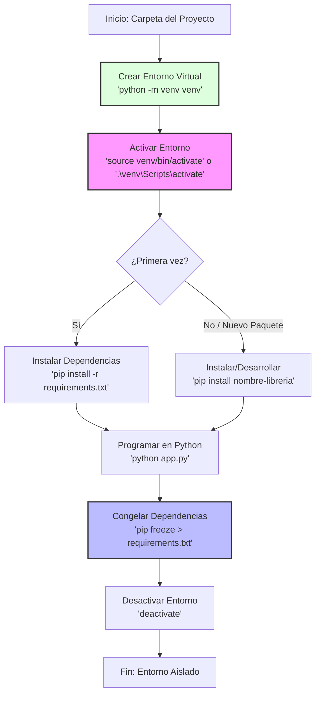

En la siguiente tabla se muestran los principales comandos empleados:

<table>
<thead>
  <tr>
    <th colspan="2"> Comandos básicos — Entornos virtuales en Python (venv)
  </th>
  </tr>
</thead>
<tbody>
  <tr>
    <td colspan="2"><b> Creación del entorno virtual </b></td>
  </tr>
  <tr>
    <td><code>python -m venv .venv</code></td>
    <td>Crea un entorno virtual llamado <code>.venv</code> en la carpeta del proyecto</td>
  </tr>

  <tr>
    <td colspan="2"><b> Activación del entorno virtual </b></td>
  </tr>
  <tr>
    <td><code>.venv\Scripts\Activate.ps1</code></td>
    <td>Activa el entorno virtual en Windows usando PowerShell</td>
  </tr>
  <tr>
    <td><code>.venv\Scripts\activate.bat</code></td>
    <td>Activa el entorno virtual en Windows usando CMD</td>
  </tr>
  <tr>
    <td><code>source .venv/bin/activate</code></td>
    <td>Activa el entorno virtual en Linux o macOS</td>
  </tr>

  <tr>
    <td colspan="2"><b> Gestión de dependencias </b></td>
  </tr>
  <tr>
    <td><code>pip install [dependencia]</code></td>
    <td>Instala una dependencia dentro del entorno virtual activo</td>
  </tr>
  <tr>
    <td><code>pip freeze &gt; requirements.txt</code></td>
    <td>Guarda las dependencias del proyecto en un archivo <code>requirements.txt</code></td>
  </tr>
  <tr>
    <td><code>pip install -r requirements.txt</code></td>
    <td>Instala todas las dependencias listadas en <code>requirements.txt</code></td>
  </tr>

  <tr>
    <td colspan="2"><b> Salir del entorno virtual </b></td>
  </tr>
  <tr>
    <td><code>deactivate</code></td>
    <td>Desactiva el entorno virtual y regresa al Python del sistema</td>
  </tr>
</tbody>
</table>

#### Buenas practicas

* **No versionar el entorno**: Nunca suba la carpeta `.venv/` a GitHub. Es pesada y depende de tu sistema operativo local.
* **Uso de `.gitignore`**: Asegúrese de incluir `.venv/` en tu archivo `.gitignore` desde el inicio.
* **Actualizar `requirements.txt`**: Cada vez que instale una nueva librería necesaria para el proyecto, actualice el archivo de requisitos.
* **Activación obligatoria**: Acostúmbrese a verificar que el nombre del entorno aparezca en tu terminal (ej. `(.venv) >`) antes de ejecutar cualquier script.

>[!tip]
> Para mas información:
> * https://gto76.github.io/python-cheatsheet/
> * https://realpython.com/python-virtual-environments-a-primer/
> * https://www.datacamp.com/tutorial/virtual-environment-in-python
> * https://www.codecademy.com/resources/docs/python/virtual-environment
> * https://www.codecademy.com/article/environments


## Ejercicio 1 - flujo completo con PR + verificación

### 0. Checklist

Al terminar, debe tener:
- [ ] Repositorio creado con estructura base.
- [ ] Pruebas corriendo localmente (pytest).
- [ ] Un PR creado desde una rama `feature/...` y mergeado a `main`.
- [ ] Evidencia: enlaces al repo y al PR.

### 1. Crear el repositorio en GitHub

1. Crear un repositorio llamado: `lab-github-<tu_usuario>`
   
   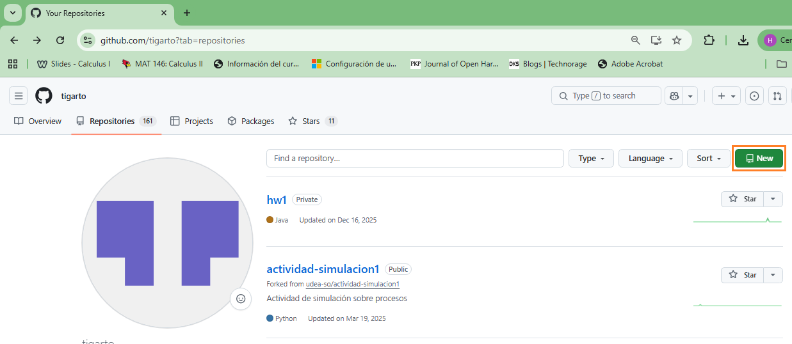

2. Inicialice el repositorio con:
   - **Choose visibility**: Public 
   - **Add README**: On
   - **Add .gitignore**: Python
   - **Add license**: Licencia MIT (opcional)

   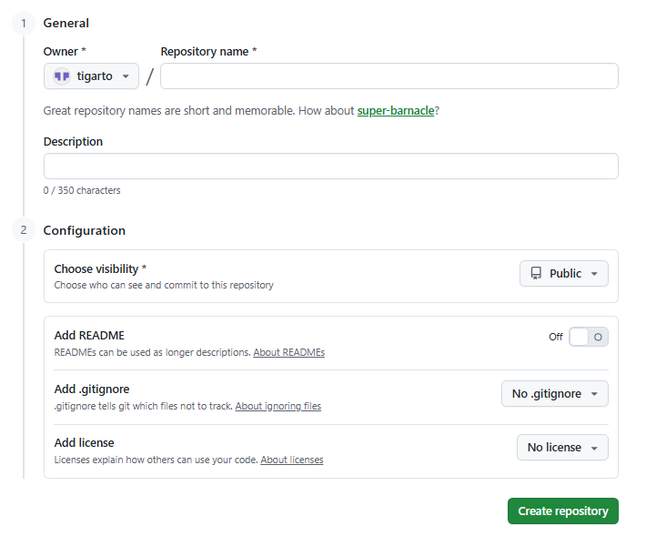 

> ✅ **Checkpoint 1 (resultado esperado)**
> 
> En GitHub se ve el repositorio con `README.md` y `.gitignore`.
> 
> 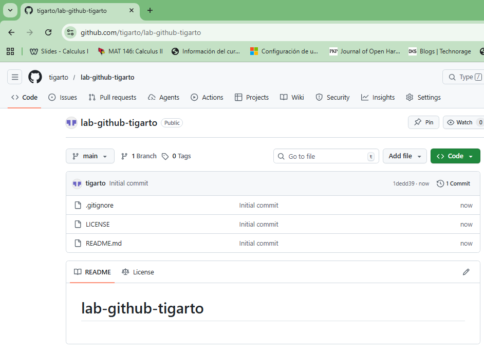 

---

### 2. Clonar y preparar entorno local

Para clonar en el entorno local, lo primero que se debe realizar es abrir la terminal del git:

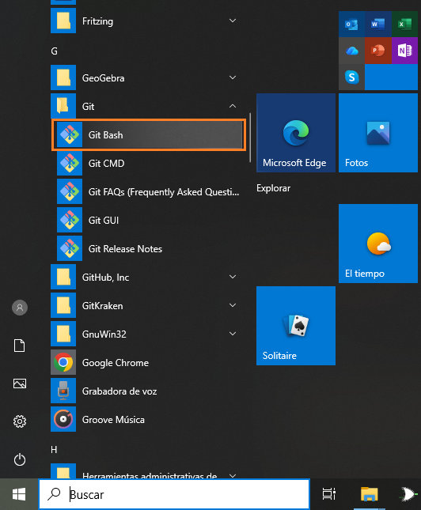 

> [!note]
> En nuestro caso, tal y como se muestra en la figura anterior, abrimos la terminal **Git bash**, sin embargo, usted puede hacerlo con la terminal con la que se sienta trabajando mas comodamente. Lo realmente importante es que los comandos funcionen.

Una vez que esta se encuentra abierta, estará lista para recibir comandos:

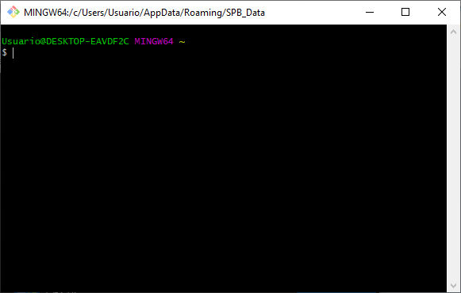 

El siguiente paso, es definir un lugar en el sistema de archivos local en el cual descargar el repositorio. En nuestro caso, se eligió en la ruta: `C:\Users\Usuario\Documents\UdeA\2026-1\repos\labs-repos`. La siguiente imagen muestra este directorio vacio:

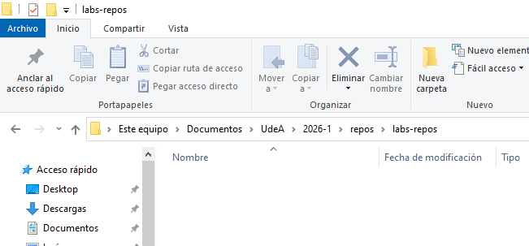 

Mediante el uso del comando `cd` nos ubicamos en esta ruta y mediante el comando `pwd` verificamos que esta ruta, sea la corresponiente al directorio actual:

```
cd <path>
pwd
```

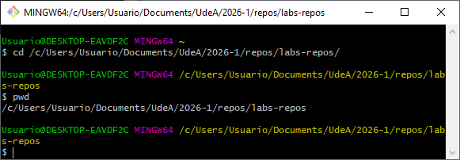 

> [!warning]
> Note el formato del path ingresado en la terminal es Linux, el cual es diferente al formato Windows. En nuestro ejemplo quedo el **path** como  ` /c/Users/Usuario/Documents/UdeA/2026-1/repos/labs-repos`

Luego, copie la ruta en la cual se encuentra el repositorio en github:

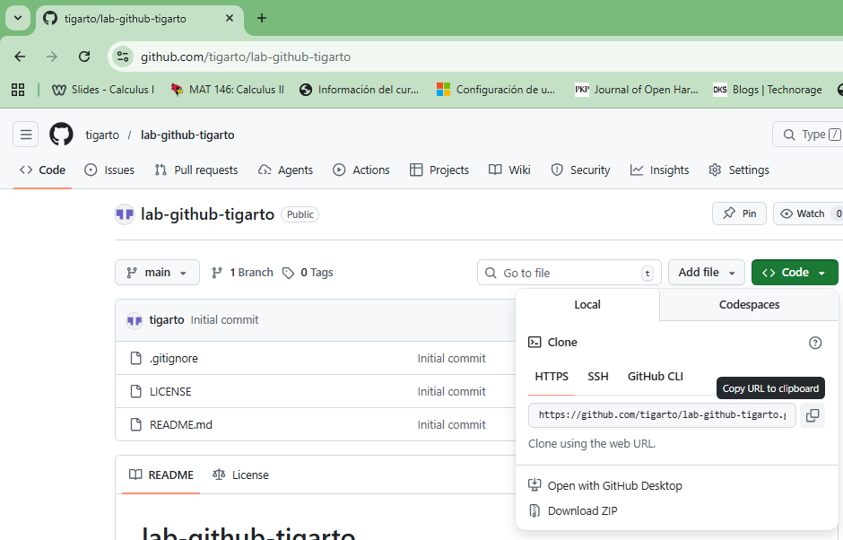 

Finalmente, emplee e comando `git clone` para descargar el repositorio:

```
git clone <repo_link>
```

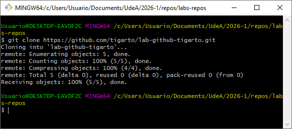 

Si el repositorio se descargo con exito, notara una salida como la de la figura anterior y si observa el sistema de archivos este ya contara con una carpeta cuyo nombre coincide con el del repositorio de github:

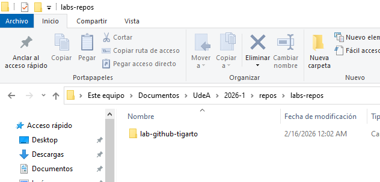 

Ingrese ahora a este directorio y verifique su contenido:

```
git clone <dir_repo>
ls -ahl
```

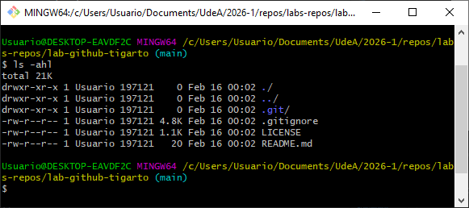 


> ✅ **Checkpoint 2 (resultado esperado)** <br>
> Empleando nuestro IDE favorito abrir el directorio asociado al repositorio (recuerde la ruta). La siguiente figura muestra el resultado esperado: 
> 
> 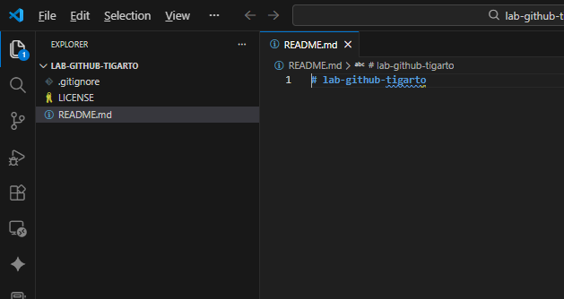 

### 3. Crear y configurar el entorno virtual 

Para continuar emplee su IDE preferido. En nuestro caso, vamos a emplear el VS Code y vamos a realizar la creación del entorno a traves de la linea de comandos. Para esto empleamos el siguiente comando:

```
python -m venv .venv
```

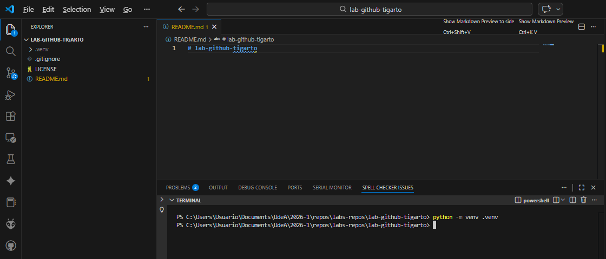 

> [!tip]
> Consulte en internet este procedimiento en el entorno de su preferencia sin necesidad de linea de comandos.

>[!note]
>Observe que el resultado, creo una nuevo directorio llamado **.env** dentro del directorio raiz del proyecto.

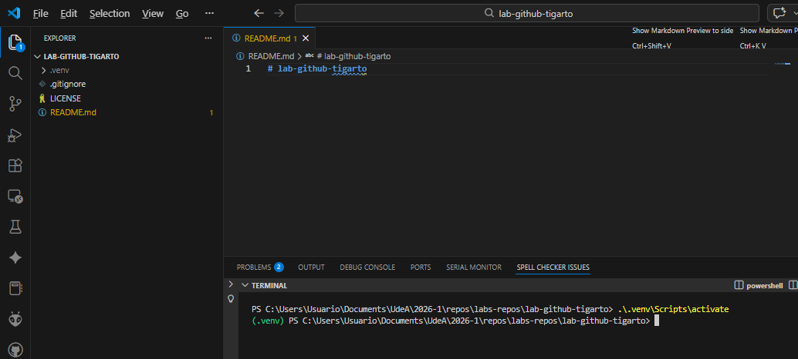 

Ahora procedemos a activar el entorno. En el caso de VS Code, la terminal por defecto en nuestro caso es **powershell** (**ps**) de modo que para activar el entorno empleamos el comando:

```
.venv\Scripts\Activate
```

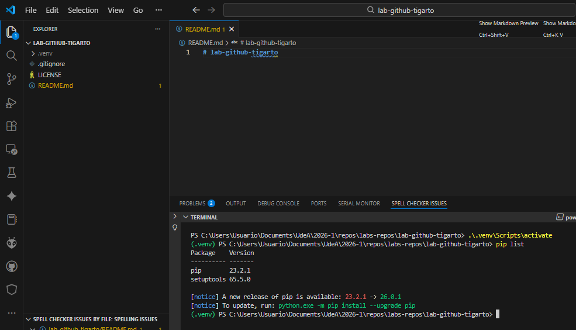 

>[!note]
>Si el resultado esta bien, aparecera como promt un indicador del entorno virtual `.(venv)`

Como vamos a hacer uso de [`pytest`](https://docs.pytest.org/en/stable/), el siguiente paso consiste en instalar las librerias, usando `pip`, en el entorno virtual para usarlas:

```
pip install pytest
```

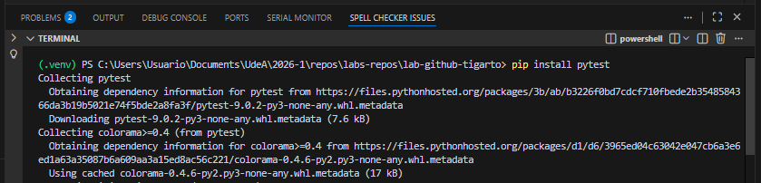 


Despues la instalación, es util comprobar que el `pytest` haya quedado correctamente instalado empleando el siguiente comando:

```
pip list
```

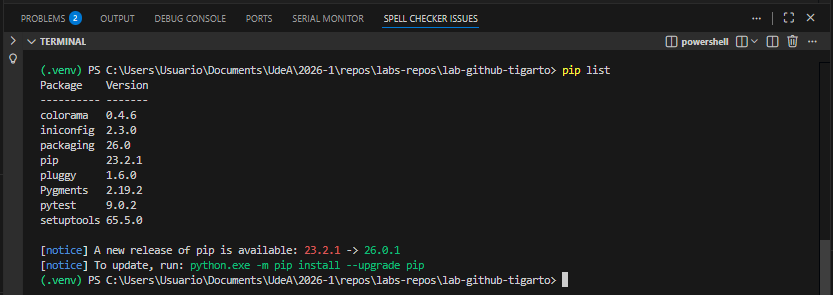 

Finalmente, la recomendación es almacenar las librerias necesarias en un archivo `requirements.txt` para no tener que configurar desde cero el entorno mediante la instalación paso a paso de librerias necesarias mediante `pip`.

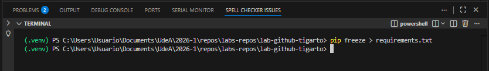 

> ✅ **Checkpoint 3 (resultado esperado)**
> 
> Se debe visualizar el archivo `requirements.txt` generado con un contenido similar al siguiente:
> 
> 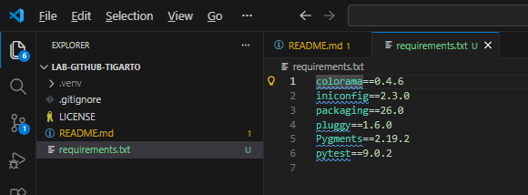 

> [!tip]
> Si tiene el archivo `requirements.txt` no tiene que usar el comando `pip install [libreria]` para instalar cada dependencia sino que basta con correr el siguiente comando para instalar todas las dependencias que alli se encuentren:
>
> ```
> pip install -r requirements.txt
> ```
> 

### 4. Estructura base del proyecto

Codifique el proyecto de tal manera que tenga la siguiente estructura:

```
lab-github-<tu_usuario>/
  src/
    __init__.py
    greeter.py
  tests/
    __init__.py
    test_greeter.py
  pyproject.toml
```

El archivo `greeter.py` será el siguiente:

```py
def greet(name: str) -> str:
    return f"Hola, {name}!"

if __name__ == "__main__":
    nom = input("¿Cómo te llamas? ")
    print(greet(nom))
```

El archivo `test_greeter.py` será el siguiente:

```py
from src.greeter import greet

def test_greet():
    assert greet("don Ramon") == "Hola, don Ramon!"
```

El archivo `pyproject.toml` tendra el siguiente contenido:

```toml
[tool.pytest.ini_options]
pythonpath = ["."]
testpaths = ["tests"]
```

Finalmente, los archivos `__init__.py` serán archivos vacios.

> ✅ **Checkpoint 4 (resultado esperado)**
>
> Si todo esta bien, se espera una salida similar a la obtenida a continuación:
>
>  
>
> Notese que además de los archivos anteriormente codificados, se encuentran los archivos que previamente existian.

### 5. Ejecución y test de los archivos

Pruebe que todo funciona bien:

```bash
pytest -q
```

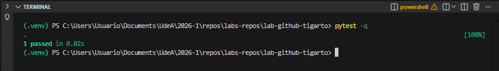 

```bash
python .\src\greeter.py
```

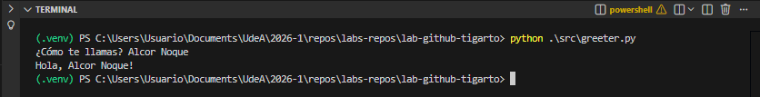 

Finalmente desactive del entorno virtual.

> ✅ **Checkpoint 5 (resultado esperado)**
>
> Si todo esta bien, la salida de la ejecución de las pruebas y los scripts tendran una salida similar a las de las imagenes anteriormente mostradas.

```bash
deactivate
```

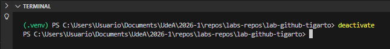 


## Referencias

1. https://carpentries-incubator.github.io/open-science-with-r/09-collaborating/index.html
2. https://colab.research.google.com/github/astg606/py_materials/blob/master/git_tutorial/git_and_github.ipynb
3. https://lmu-osc.github.io/Collaborative-RStudio-GitHub/
4. https://learning.nceas.ucsb.edu/2021-11-RRCourse/git-collaboration-and-conflict-management.html
5. https://blog.devgenius.io/git-workflow-complete-guide-for-beginners-with-commands-examples-afcccd50f195
6. https://smartprogramming.in/tutorials/git-and-github/git-add-files-to-staging
7. https://pages.cs.wisc.edu/~lcai64/
8. https://kevinsguides.com/guides/code/devops/file-mgmt/git-github-workflow-branch-merge/
9. https://blog.ltgt.net/teaching-git/
10. https://ocw.mit.edu/courses/6-170-software-studio-spring-2013/9395cd5506f95fee592ddadfa920b0ee_MIT6_170S13_rec1-Git.pdf