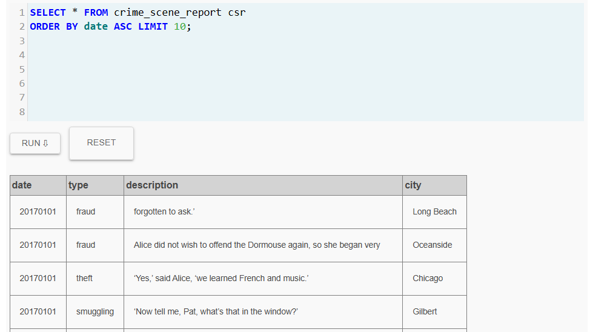
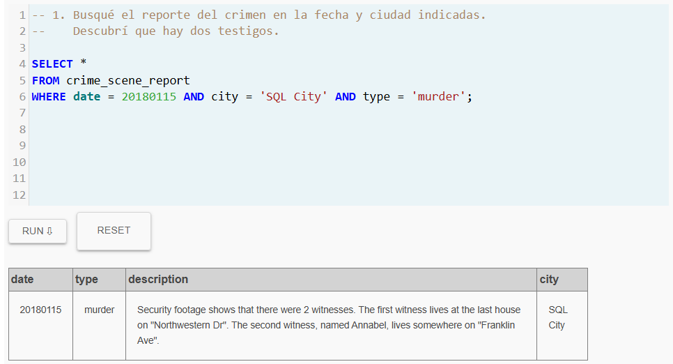
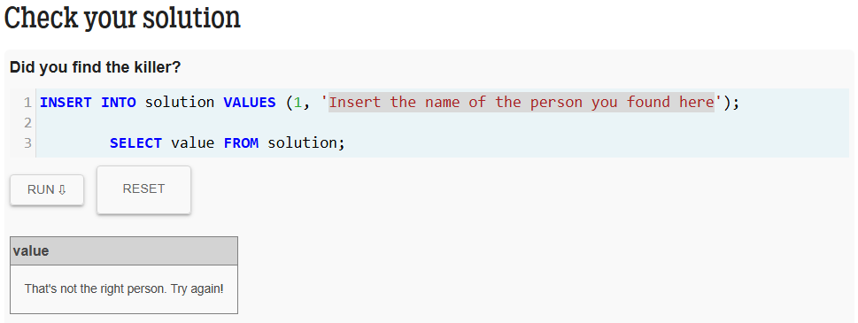

# Laboratorio: Introducción a SQL y Documentación en GitHub 

¡Bienvenidos a esta actividad introductoria! Hasta ahora hemos explorado cómo organizar datos en memoria, pero en el mundo real, los datos persistentes viven en Bases de Datos. Aunque ya tienen instalado PostgreSQL y han visto cómo ejecutar algunas consultas (*queries*), en esta práctica daremos un paso atrás para fortalecer la sintaxis fundamental de SQL y luego la pondremos a prueba resolviendo un misterio.

Además, aprenderemos a documentar nuestro proceso de forma profesional utilizando Markdown en GitHub.

## Objetivos de la Actividad

1. **Comprender la sintaxis básica de SQL:** Aprender a extraer y filtrar información de tablas relacionadas utilizando instrucciones como `SELECT`, `WHERE`, `JOIN`, entre otras.
2. **Desarrollar lógica de consultas:** Aplicar los comandos SQL para resolver un problema estructurado.
3. **Mejorar habilidades de documentación:** Emplear el lenguaje de marcado Markdown para crear un reporte claro y ordenado en un repositorio de GitHub.

## Requisitos Previos

* Contar con una cuenta activa en [GitHub](https://github.com/).
* Repasar los conceptos básicos de uso de repositorios (clonar, hacer *commit*, hacer *push*), vistos en el [Laboratorio 1](https://github.com/DS-UdeA/2026-1/tree/main/labs/lab1).
* ¡Mucha disposición para investigar y aprender!

## Recursos a Utilizar

Para el desarrollo de este laboratorio, se emplearán las siguientes herramientas gratuitas y en línea, las cuales no requieren instalación adicional:

* **[SQLBolt](https://sqlbolt.com/):** Plataforma web interactiva diseñada para aprender SQL desde cero. Proporciona lecciones cortas con ejercicios prácticos que se ejecutan directamente en el navegador, ideales para adquirir o repasar los fundamentos de la manipulación de datos en tablas.
* **[SQL Murder Mystery](https://mystery.knightlab.com/):** Entorno interactivo e inmersivo creado por Knight Lab. Funciona como un juego de rol donde asumirán el papel de detectives y deberán explorar una base de datos relacional mediante consultas SQL para encontrar al culpable de un crimen.

## Creación y configuración del repositorio

El repositorio a entregar contendrá únicamente la documentación y consultas relacionadas con el reto del asesinato.

Antes de iniciar con la lectura y desarrollo de los recursos, es fundamental preparar el espacio de trabajo. A continuación, se detallan los pasos exactos para crear, configurar y vincular su repositorio, estableciendo una estructura base.


### Paso 1: Creación en GitHub (Entorno Remoto)

1. Ingrese a sus cuenta de GitHub y hagan clic en el botón **"New"** para crear un nuevo repositorio.
   
2. Asigne como nombre del repositorio `lab2-sql-murder-NombreApellido`. Por ejemplo, si su nombre es Ruben Aguirre, el repositorio se deberá nombrar como: `lab2-sql-murder-RubenAguirre`
3. Para la configuración del repositorio, solo marque los siguientes items:
   - [x] **Visibilidad**: "Public"
   - [x] **Readme** "Add a README file"
    
5. Haga clic en el botón verde **"Create repository"**.


> [!important]
> Si todo esta bien, ya debe aparecer el repositorio previamente creado en su cuenta de github.

### Paso 2: Clonación al Equipo (Entorno Local)

1. En la página de su nuevo repositorio en GitHub, haga clic en el botón verde **"<> Code"** y copie la URL (se recomienda usar HTTPS para esta etapa).
2. Abra la terminal o línea de comandos en su equipos y navegue hasta la carpeta donde desea guardar el proyecto.
3. Ejecute el siguiente comando para descargar el repositorio a su máquina:
   
   ```bash
   git clone <URL_DEL_REPOSITORIO>
   ```

### Paso 3: Configuración de la Estructura Base Local

1. Ingrese a la carpeta que acaban de clonar o abrala desde su IDE favorito:
   
   ```bash
   cd lab2-sql-murder-NombreApellido
   ```

2. La estructura de esta carpeta será la siguiente:
   
   ```
   lab2-sql-murder-nombreapellido/
   │
   ├── README.md
   ├── evidencia/
   |   ├── .gitkeep
   │   ├── paso1.png
   │   ├── paso2.png
   │   └── ...
   │
   └── consultas/
       └── respuestas.sql
   ```

   Para crear las carpetas puede emplear el IDE, el explorador de windows o la terminal. Tenga en cuenta que los archivos `.gitkeep` y `respuestas.sql` son archivos vacios, y las imagenes aun no existen (pues no se ha desarrollado la actividad). De modo que el estado del repo hasta este momento será como se muestra a continuación:
   
   ```
   lab2-sql-murder-nombreapellido/
   │
   ├── README.md
   ├── evidencia/
   |   └── .gitkeep
   │
   └── consultas/
       └── respuestas.sql
   ```
   
   > [!note]
   > **Sobre el archivo `.gitkeep`**: Como que Git no rastrea carpetas vacías por defecto, crear un archivo oculto dentro de la carpeta `evidencia` obliga a Git a reconocerla.


### Paso 4: Sincronización Inicial (Commit y Push)

Para asegurar que el flujo de trabajo funciona correctamente y que la estructura base está asegurada en la nube, envie estos cambios a GitHub. En su terminal, ejecute:

1. Agregar los cambios al área de preparación:
   
   ```bash
   git add .
   ```

2. Crear un *commit* con un mensaje descriptivo:

   ```bash
   git commit -m "Configuración inicial: Estructura base laboratorio SQL Murder Mystery"
   ```

3. Subir los cambios al repositorio remoto:

   ```bash
   git push origin main
   ```

   > [!note]
   > Hasta este punto el contenido del repositorio local y en la nube deben coincidir en su contenido.

## Desarrollo de la Actividad

### Parte 1: Nivelación Teórica con SQLBolt

Dado que las bases de datos relacionales almacenan la información en tablas conectadas entre sí, es fundamental saber cómo interactuar con ellas a través del lenguaje SQL antes de intentar resolver el misterio. Esta etapa es puramente de preparación y **no requiere subir evidencias al repositorio**, pero es indispensable para adquirir las habilidades requeridas.

1. Ingrese a la plataforma interactiva [SQLBolt](https://sqlbolt.com/).
2. Diríjase a la sección de lecciones y complete *todas las lecciones* de **Introduction to SQL** disponibles en la plataforma. Esto le brindará las bases completas, desde las consultas de selección más simples hasta el manejo avanzado de múltiples tablas.
3. A medida que avance, en cada lección:
   * Lea cuidadosamente la explicación.
   * Ejecute los ejercicios propuestos.
   * Corrija los errores hasta que la plataforma indique que la lección ha sido completada.

> [!tip]
> **Recomendación de estudio:** Tome nota de los comandos principales y su sintaxis. Comprender cómo extraer información específica y cómo cruzar datos entre dos tablas será su principal herramienta como detective en la siguiente etapa. No avance al misterio sin antes sentirse cómodo escribiendo sus propias consultas (*queries*).

#### Lista de Verificación: Fundamentos SQL

Antes de asumir su rol como detective y pasar al reto principal, realice una autoevaluación. Asegúrese de poder marcar las siguientes casillas con base en lo aprendido en SQLBolt:

- [ ] **Consultas básicas:** Comprendo cómo extraer todas las columnas (`SELECT *`) o columnas específicas (`SELECT columna1, columna2`) de una tabla usando `FROM`.
- [ ] **Filtrado de datos:** Sé cómo utilizar la cláusula `WHERE` para restringir los resultados devueltos según condiciones exactas numéricas o de texto.
- [ ] **Operadores lógicos y comodines:** Entiendo el uso de `AND`, `OR` y el operador `LIKE` junto con el comodín `%` para buscar patrones de texto (por ejemplo, buscar un nombre que contenga cierta palabra).
- [ ] **Ordenamiento y límite:** Puedo ordenar los resultados de forma ascendente o descendente usando `ORDER BY` y limitar la cantidad de filas devueltas con la instrucción `LIMIT`.
- [ ] **Unión de tablas (Crucial para el reto):** Sé cómo utilizar `JOIN` ... `ON` para combinar información de dos o más tablas distintas valiéndose de las columnas que las relacionan (llaves primarias y foráneas).
- [ ] **Funciones de agregación:** Conozco cómo usar funciones matemáticas básicas como `COUNT()` o `MAX()` combinadas con `GROUP BY` para agrupar y resumir información.

> [!important]
> * Si alguna de estas herramientas no le resulta del todo clara, le sugerimos repasar la lección correspondiente en SQLBolt. ¡Un buen detective conoce sus herramientas a la perfección antes de ir a la escena del crimen!
> * Para facilitar el desarrollo del reto, se recomienda tener a mano la siguiente hoja resumen: **SQL Basics Cheat Sheet** [[pdf]](./sql/sql-basics-cheat-sheet-a4.pdf) [[link]](https://learnsql.com/blog/sql-basics-cheat-sheet/) 

A continuación, le presento la redacción para la **Parte 2**, integrando perfectamente las instrucciones del reto con la estructura de carpetas que definió previamente (`consultas/respuestas.sql` y `evidencia/`).

### Parte 2: El Reto - *SQL Murder Mystery*

En esta etapa se aplicarán los conocimientos adquiridos en un entorno que simula una investigación real, donde la única herramienta disponible será el lenguaje SQL.

Para este caso, ha ocurrido un crimen y usted ha sido asignado como el detective principal para resolverlo. En esta etapa, pondrá a prueba su capacidad para unir pistas cruzando información entre múltiples tablas.

El objetivo no es únicamente encontrar al culpable, sino:
* Explorar una base de datos desconocida.
* Formular hipótesis progresivas.
* Construir consultas cada vez más específicas.
* Relacionar información proveniente de múltiples tablas.
* Documentar de manera estructurada el proceso de análisis.

#### Procedimiento

1. Ingrese a [SQL Murder Mystery](https://mystery.knightlab.com/).
2. Lea cuidadosamente el planteamiento inicial. El crimen ocurrió el **15 de enero de 2018** en **SQL City**. Estos son los únicos datos iniciales con los que cuenta para comenzar su investigación (pista: comience revisando la tabla `crime_scene_report`).

   > [!tip]
   > En la pagina **SQL Murder Mystery** hay una guia paso a paso [**SQL Murder Mystery - Walkthrough**](https://mystery.knightlab.com/walkthrough.html) por si quiere emplear pistas en ves de seguir su instinto.

3. Desplácese hacia la parte inferior de la página para familiarizarse con el esquema de la base de datos. Este diagrama será su mapa para entender cómo están conectadas las diferentes tablas (personas, licencias de conducir, entrevistas, membresías de gimnasio, etc.).

   

   
4. Utilice la consola SQL de la página web para ejecutar sus *queries* y seguir el rastro del culpable paso a paso.
   
   

#### Reglas de Documentación durante la Investigación

Para que su trabajo como detective sea evaluado, debe registrar rigurosamente su proceso en el repositorio local siguiendo estas reglas:

* **Registro de Consultas (`consultas/respuestas.sql`):** No pierda su trabajo. Cada vez que ejecute una consulta (*query*) que le revele una pista importante, copie el código SQL y péguelo en el archivo `respuestas.sql`. Utilice comentarios de SQL (iniciando la línea con `--`) justo arriba de cada consulta para explicar en lenguaje natural qué estaba buscando y qué pista obtuvo.
  
  *Ejemplo de cómo debe verse el interior de su archivo `respuestas.sql`:*
  ```sql
  -- 1. Busqué el reporte del crimen en la fecha y ciudad indicadas. Descubrí que hay dos testigos.
  SELECT * FROM crime_scene_report 
  WHERE date = 20180115 AND city = 'SQL City' AND type = 'murder';
  
  -- 2. Busqué al primer testigo basándome en la pista anterior...
  SELECT *
  FROM ...

  ```

* **Registro Visual (`evidencia/`):** Tome capturas de pantalla de los momentos clave de su investigación (por ejemplo, el descubrimiento de una pista crucial, la tabla con los sospechosos filtrados y el mensaje final de victoria emitido por la plataforma). Guarde estas imágenes en la carpeta `evidencia/` con nombres secuenciales y descriptivos (ej. `paso1_reporte.png`, `paso2_testigo.png`, `solucion_final.png`).
  
  

> [!important]
> **Verificación del culpable:** La plataforma del juego tiene una consulta especial (indicada al final de la página web) para verificar si la persona que usted sospecha es realmente el asesino. Asegúrese de ejecutar esa consulta de verificación y tomar una captura de pantalla del mensaje de éxito para incluirla en sus evidencias.



## Referencias

* https://selectstarsql.com/
* 