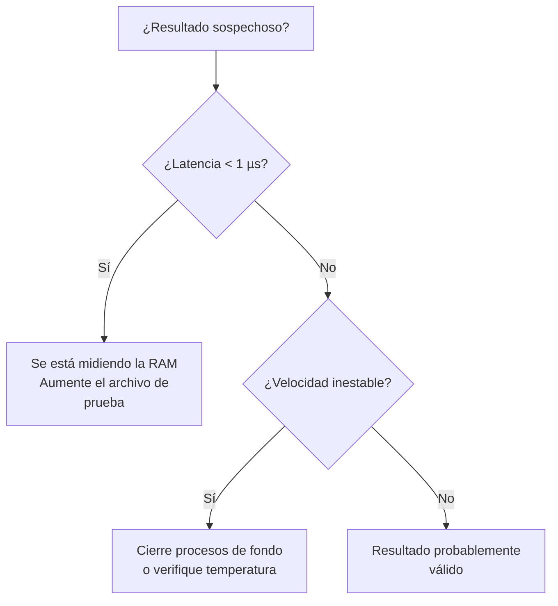

# Lab — Acceso a Disco y Costo de I/O

## Introducción

¿Alguna vez se ha preguntado por qué una consulta a una base de datos 
puede tardar milisegundos en un caso y varios segundos en otro, aunque 
los datos sean exactamente los mismos? La respuesta frecuentemente no 
está en el algoritmo, sino en **dónde están almacenados los datos y cómo 
se accede a ellos**.

En este laboratorio se medirá de forma empírica el impacto del patrón 
de acceso a disco sobre el rendimiento de un sistema. Para ello se 
compararán dos estrategias — acceso secuencial y acceso aleatorio — 
sobre un archivo de prueba controlado, y se contrastarán los resultados 
obtenidos con un modelo teórico de costo de I/O. Al finalizar, se contará 
con evidencia concreta para responder por qué los motores de bases de datos 
están diseñados para favorecer la lectura contigua de bloques.

> [!note]
> Este laboratorio complementa directamente los conceptos vistos en clase 
> sobre jerarquía de memoria, bloques de I/O y modelo de costo. Se 
> recomienda tener a mano las notas de la Clase 3 — Almacenamiento de datos.

## Objetivos

Al finalizar este laboratorio el estudiante será capaz de:

* Comprender cómo se almacena la información en disco en bloques.
* Entender la diferencia entre acceso secuencial y acceso aleatorio.
* Medir empíricamente el rendimiento de acceso a disco.
* Comparar resultados experimentales con un modelo teórico de costo de I/O.
* Analizar el impacto del patrón de acceso a datos en el rendimiento de sistemas.

---

## Contexto y conceptos claves

En muchos sistemas modernos el rendimiento **no depende únicamente del algoritmo**, sino también de **cómo se accede a los datos**.

Los datos pueden almacenarse en distintos niveles de la jerarquía de memoria:


<div align="center">
  
</div>

Cada nivel tiene grandes diferencias en:

* Latencia
* Throughput
* Costo

En particular, el acceso a disco puede ser **millones de veces más lento que el acceso a memoria**.

Por esta razón los sistemas de bases de datos y los sistemas operativos están diseñados para **minimizar accesos costosos a disco**.

Este laboratorio explora uno de los factores más importantes: **el patrón de acceso a datos**

---

### Bloques de I/O

Los dispositivos de almacenamiento **no leen bytes individuales**.

La unidad mínima de transferencia es un **bloque de datos**. Por ejemplo, dependiendo del contexto en el cual se este hablando tenemos:
* **Sistemas operativos**: bloque = 4 KB
* **Motores de bases de datos**: página de base de datos = 4 KB – 16 KB

Incluso si un programa solicita **1 byte**, el sistema leerá **todo el bloque**.

### Acceso secuencial vs acceso aleatorio

Cuando los datos se almacenan en disco, el **patrón de acceso** afecta significativamente el rendimiento.

<div align="center">
  
</div>

#### Acceso secuencial

En acceso secuencial los bloques se encuentran **uno después del otro en el disco**.

Este tipo de acceso se caracteriza por:
* Pocos accesos físicos al disco
* Alto throughput
* Rendimiento alto

#### Acceso aleatorio

En acceso aleatorio los bloques se encuentran **dispersos en el disco**.

Para este tipo se acceso se tiene:
* Múltiples accesos al disco
* Mayor latencia
* Menor throughput

#### ¿Por qué el acceso aleatorio es costoso incluso en SSD?

A diferencia de un HDD, un SSD no tiene partes móviles, por lo que no 
existe tiempo de seek ni latencia rotacional. Sin embargo, el acceso 
aleatorio sigue siendo más lento que el secuencial por dos razones:

- **Granularidad de escritura:** Los SSDs leen en páginas de 4–16 KB 
  pero borran en bloques de 128–512 KB. Cada acceso aleatorio pequeño 
  obliga al controlador a leer, modificar y reescribir bloques enteros 
  (*write amplification*).
- **Saturación del controlador:** Con miles de solicitudes dispersas 
  por segundo, el controlador interno del SSD se convierte en el cuello 
  de botella, sin importar la velocidad del medio de almacenamiento.

Por esta razón, incluso en NVMe de alto rendimiento, el throughput en 
acceso aleatorio puede ser entre 5 y 20 veces menor que en acceso 
secuencial.

---

### Modelo teórico de costo de I/O

Utilizaremos el siguiente modelo simplificado:

$$
TotalTime =
AccessLatency \times M +
\frac{DataSize}{ScanThroughput}
$$

Donde:
* **$AccessLatency$**: Tiempo para acceder a un bloque
* **$M$**: Número de accesos no contiguos
* **$DataSize$**: Tamaño total de datos
* **$ScanThroughput$**: Velocidad de transferencia


> [!note]
> **Relación con el modelo del HDD visto en clase**
> 
> En clase se estudió que el tiempo de acceso a un disco duro magnético 
> se descompone en tres componentes físicos:
>
> $$T_{access} = T_{seek} + T_{rotation} + T_{transfer}$$
>
> El modelo utilizado en este laboratorio es una **abstracción** de ese 
> modelo: el término $AccessLatency$ agrupa los componentes de seek y 
> rotación en un único valor promedio, mientras que $DataSize / ScanThroughput$ 
> corresponde al tiempo de transferencia escalado al volumen total de datos. 
> Esta simplificación es válida para comparar tecnologías de almacenamiento 
> entre sí, pero no captura la variabilidad interna de un HDD real.


<div align="center">
  
</div>

---

## Requerimientos para la práctica

### Software

Se requiere tener instalado:

* Python **3.9 o superior**
* Jupyter Notebook o **Google Colab**
* Git
* GitHub

### Hardware mínimo recomendado

En la siguiente tabla se describen las características de hardware mínimas recomendadas:

| Recurso                | Requerimiento           |
| ---------------------- | ----------------------- |
| Espacio libre en disco | **1 GB**                |
| Memoria RAM            | **4 GB**                |
| CPU                    | cualquier CPU moderna   |
| Sistema operativo      | Windows / Linux / macOS |

### Espacio en disco necesario

Durante el laboratorio se creará un archivo de prueba que se utilizará para simular almacenamiento en disco.

Tamaño aproximado del archivo:
* Archivo recomendado: 1 GB
* Archivo mínimo permitido: 512 MB

Por seguridad se recomienda tener al menos: 2 GB de espacio libre

### Herramientas necesarias

El laboratorio utiliza las siguientes librerías de Python:

```
os
time
numpy
pandas
matplotlib
```

En **Google Colab** estas librerías ya están instaladas.

---

## Preparación y Normalización del Entorno Experimental

Para que las mediciones sean válidas y comparables entre equipos, es 
necesario controlar algunas variables antes de ejecutar el experimento. 
Los pasos a continuación toman menos de cinco minutos y marcan una 
diferencia real en la calidad de los resultados.

### Paso 1: Identificación de la Tecnología de Almacenamiento

El tipo de unidad física determina la latencia base del sistema. Utilice el comando correspondiente a su sistema operativo para identificar si su disco es mecánico o de estado sólido.

#### **En Linux**

Ejecute el siguiente comando en la terminal:

```bash
lsblk -d -o name,rota,size,model
```

> [!note]
> **Interpretación (Columna ROTA):**
> * **1:** Indica un medio rotativo (**HDD**).
> * **0:** Indica un medio no rotativo (**SSD/NVMe**).
 

#### **En Windows**

Abra PowerShell como administrador y ejecute:

```powershell
Get-PhysicalDisk | Select-Object FriendlyName, MediaType, BusType
```

> [!note]
> De acuerdo a los valores resultantes para las columnas, se obtiene la información sobre el disco de acuerdo a los siguientes resultados:
> * **MediaType:** Identifica si es HDD o SSD.
> * **BusType:** Ayuda a distinguir entre un SSD convencional (SATA) y un NVMe.

#### **En macOS**

Use la utilidad de sistema:

```bash
diskutil info disk0 | grep "Solid State"
```

### Paso 2: Registro de Especificaciones del Sistema

Antes de iniciar las pruebas, complete la siguiente tabla de metadatos. Esta información permitirá contextualizar las desviaciones en los tiempos de respuesta.

| Parámetro | Valor de Referencia |
| --- | --- |
| **Sistema Operativo** | Ej: Ubuntu 22.04 / Windows 11 23H2 |
| **CPU (Modelo y Núcleos)** | Ej: Intel i5-12400 / 6 núcleos |
| **Memoria RAM Total** | Ej: 16 GB DDR4 |
| **Tipo de Disco** | Ej: SSD NVMe PCIe 4.0 |
| **Carga de CPU en Reposo** | Ej: < 5% |

### Paso 3: Aislamiento del Experimento (Reducción de Ruido)

El "ruido" en las mediciones suele ser causado por procesos en segundo plano que compiten por el ancho de banda del bus de datos o ciclos de CPU. **Antes de ejecutar el benchmark:**

* **Cierre aplicaciones de alto consumo:** Navegadores, IDEs, Spotify o clientes de juegos.
* **Suspenda actualizaciones:** Verifique que el sistema operativo no esté descargando parches en segundo plano.
* **Desconecte entornos virtuales:** Las Máquinas Virtuales (VMs) o contenedores (Docker) añaden capas de abstracción que falsean la latencia real.

### Paso 4: Control de la Caché del Sistema Operativo

Los sistemas operativos modernos utilizan una porción de la RAM como **Page Cache** para acelerar los accesos al disco. Si los datos se leen desde la RAM, la latencia medida será de nanosegundos y no representará la realidad del disco.

Para mitigar este efecto (técnica de **Cold Cache Simulation**):

1. **Tamaño del Archivo:** Se utilizará un archivo que idealmente supere el tamaño de la caché de disco disponible.
2. **Accesos Dispersos:** El acceso aleatorio se realiza mediante saltos largos para evitar el *read-ahead* (pre-lectura) del sistema.
3. **Ejecución Única:** Cada prueba debe ser independiente para evitar que el SO "aprenda" el patrón de acceso.

### Referencias de Rendimiento Teórico


Utilice estos valores como línea base para validar si sus resultados son coherentes con la teoría:

| Tecnología | Latencia Promedio | Throughput Típico | IOPS Típico (4 KB aleatorio) | Escala de Tiempo |
| --- | --- | --- | --- | --- |
| **HDD** | 10 ms | 100 - 150 MB/s | 75 – 300 | Milisegundos |
| **SSD (SATA)** | 100 µs | 500 - 550 MB/s | 50,000 – 100,000 | Microsegundos |
| **SSD NVMe** | 10 - 20 µs | 2 - 7 GB/s | 500,000 – 1,000,000+ | Microsegundos |

Los valores de la tabla son **aproximaciones conceptuales**.

> [!note]
> **¿Qué es IOPS?** Las siglas corresponden a *Input/Output Operations 
> Per Second* — es decir, cuántas operaciones de lectura o escritura 
> completa el dispositivo por segundo. Se calcula como:
>
> $$IOPS = \frac{1}{T_{I/O}}$$
>
> A diferencia del throughput, que mide el volumen de datos transferidos, 
> IOPS mide la frecuencia de operaciones. Es especialmente relevante en 
> cargas de trabajo con muchas lecturas pequeñas y dispersas, como las 
> consultas a bases de datos sin índice.

> [!warning]
> **Nota**: Un valor de latencia inusualmente bajo (ej. < 1 µs) suele ser un indicador de que el experimento está midiendo la **Caché en RAM** y no el disco físico.

---

## Actividad de laboratorio

Con el entorno preparado, es momento de pasar a la práctica. La actividad 
se organiza en tres etapas: caracterización del equipo, ejecución del 
notebook y análisis de los resultados.

### Etapa 1 — Caracterización del Equipo

Antes de ejecutar cualquier celda de código, registre las especificaciones 
del equipo en la siguiente tabla. Esta información es fundamental para 
interpretar los resultados: dos máquinas con distinto tipo de disco pueden 
arrojar diferencias de rendimiento de hasta dos órdenes de magnitud, y sin 
este registro no es posible saber a qué atribuir esas diferencias.

| Parámetro | Valor Observado |
| --- | --- |
| **Sistema Operativo** | Ej: Windows 11 / Ubuntu 22.04 |
| **CPU (Modelo y Frecuencia)** | Ej: Intel i7-11800H @ 2.30GHz |
| **Arquitectura y Núcleos** | Ej: x64 / 8 núcleos físicos |
| **Memoria RAM Total** | Ej: 16 GB DDR4 |
| **Tecnología de Almacenamiento** | Ej: SSD NVMe Gen 3 |
| **Carga de CPU en Reposo (%)** |  |

> [!tip] 
> **Cómo medir la carga de CPU en reposo**
> 
> La **carga en reposo** representa el esfuerzo del procesador cuando no hay tareas intensivas activas. Para obtener una medición real, cierre navegadores, IDEs y herramientas de comunicación. Utilice el comando según su sistema:
> * **Windows (PowerShell):** `(Get-Counter '\Processor(_Total)\% Processor Time').CounterSamples.CookedValue`
> * **Linux (Terminal):** `top -bn1 | grep "Cpu(s)"` (Observe la suma de `%us` y `%sy`).
> * **macOS (Terminal):** `top -l 1 | grep "CPU usage"`.
> 
> 
> **Nota técnica:** Si la carga inicial supera el **10%**, existe "ruido" en el sistema que podría distorsionar los tiempos de latencia del experimento.

#### ¿Por qué es importante la carga en reposo?

Imagine que el procesador es un operario. Si este se encuentra ocupado al 40% atendiendo otras tareas (como actualizaciones de sistema o escaneos de antivirus), tardará más en responder a las peticiones de entrada/salida (I/O). El retraso no se deberá necesariamente a la lentitud del disco, sino a que la CPU se encuentra distraída con procesos ajenos al experimento.

### Etapa 2 — Configuración y Ejecución del Notebook

> [!important]
> Esta es la etapa central del laboratorio. Antes de continuar, 
> asegúrese de haber completado la tabla de caracterización de la 
> Etapa 1 y de haber aplicado los pasos de preparación del entorno.

#### Paso 1 — Cree el repositorio y obtenga los archivos necesarios para la practica

Tal y como se hizo en la practica anterior, cree un repositorio en github publico para la entrega del laboratorio cuyo nombre tenga el siguiente formato `lab3-IO_performance-NombreApellido`.

Luego clone este repositorio en su máquina local:

```bash
git clone lab3-IO_performance-NombreApellido
cd lab3-IO_performance-NombreApellido
```

Si prefiere trabajar en Google Colab, abra el notebook directamente 
desde GitHub usando el botón **"Open in Colab"** que aparece al inicio 
del archivo `.ipynb`.

> [!warning]
> **Limitación importante de Google Colab:** Colab ejecuta el código 
> en servidores remotos con disco de red. Los tiempos medidos **no 
> reflejarán el hardware de su máquina** sino el de la infraestructura 
> de Google. Los resultados serán válidos para analizar el comportamiento 
> del modelo, pero no para comparar con las especificaciones de su equipo 
> personal. Para mediciones reales de su hardware, ejecute en local.

La estructura de este repositorio será la siguiente:

```text
lab3-IO_performance-NombreApellido/
├── README.md                # Su informe: análisis, respuestas y capturas
├── disk_io_lab_guided.ipynb # Notebook ejecutado con todas las celdas visibles
└── images/                  # Imágenes exportadas desde el notebook
    ├── fig_throughput.png
    ├── fig_tiempo_teoria_vs_practica_secuencial.png
    ├── fig_tiempo_teoria_vs_practica_aleatorio.png
    └── fig_speedup.png
```

De modo que antes de iniciar, asegurese de dejar lista la estructura de archivos y descargar el notebook.

#### Paso 2 — Abra el notebook

Desde la carpeta del laboratorio, ejecute:

```bash
jupyter notebook disk_io_lab_guided.ipynb
```

#### Paso 3 — Ejecute las celdas en orden

Recorra el notebook de arriba hacia abajo, ejecutando cada celda de 
forma secuencial. **No omita celdas ni cambie el orden de ejecución**, 
ya que cada sección depende de los resultados de la anterior.

El notebook realizará automáticamente las siguientes tareas:

1. **Verificación del entorno:** Confirma que las librerías están disponibles.
2. **Generación del archivo de prueba:** Crea un archivo binario de tamaño controlado.
3. **Benchmark secuencial:** Mide la lectura contigua de bloques.
4. **Benchmark aleatorio:** Simula saltos dispersos para medir latencia de acceso.
5. **Cálculo del modelo teórico:** Compara sus mediciones con las estimaciones teóricas.
6. **Visualizaciones:** Genera las gráficas que deberá incluir en su informe.


> [!tip]
> **¿Desea cambiar el tamaño del archivo de prueba?**
> Si modifica el parámetro `FILE_SIZE_MB` en el notebook y quiere que 
> el archivo se regenere, elimine primero el archivo anterior ejecutando 
> en la terminal:
> ```bash
> rm -rf 2026-1/labs/lab3/io_lab_data/
> ```
> En Windows (PowerShell):
> ```powershell
> Remove-Item -Recurse -Force .\io_lab_data\
> ```

### Etapa 3 — Análisis e Interpretación de Hallazgos

El notebook generará automáticamente una serie de visualizaciones. Su labor consiste en interpretar qué indican estas gráficas sobre la interacción entre el software y el hardware.

#### Visualizaciones Clave a Analizar:

* **Throughput por tamaño de bloque:** Observe cómo la eficiencia del acceso aleatorio se degrada o mejora según el tamaño de la página de datos.
* **Comparación teoría vs. experimento:** Esta gráfica superpone sus mediciones reales sobre el modelo matemático de costo de I/O. ¿Qué tan cerca se encuentra su hardware del límite teórico?
* **Ventaja del acceso secuencial:** Un indicador numérico de cuántas veces es más eficiente leer linealmente en su dispositivo actual.

> [!warning] 
> **Diagnóstico de anomalías (Troubleshooting)**
> 
> Si obtiene resultados inusuales (ej. velocidades superiores a 20 GB/s o latencias menores a 1 µs), es muy probable que se esté midiendo la **Caché en RAM** y no el disco físico. En ese caso, aumente el tamaño del archivo en la sección de configuración del notebook para forzar la salida al almacenamiento físico.



#### Preguntas de Análisis Científico

Responda de manera argumentada en el `README.md` de su repositorio de entrega. 
Para cada pregunta incluya al menos un párrafo de análisis apoyado en los 
resultados obtenidos en el notebook.

1. **Diferencial de Desempeño:** ¿Cuál patrón de acceso resultó ser más eficiente en su máquina y cuál es la proporción de diferencia (*ventaja secuencial*)?
2. **Efecto del Tamaño de Bloque:** ¿Cómo influye el tamaño de la unidad de lectura en la mitigación del costo del acceso aleatorio?
3. **Correlación con la Teoría:** ¿En qué puntos su hardware se alejó más del modelo teórico y qué factores físicos (interfaz, temperatura, caché) podrían explicarlo?
4. **Costo de Acceso:** Explique por qué, incluso en unidades de estado sólido (SSD) sin componentes mecánicos, el acceso aleatorio sigue siendo más costoso que el secuencial.
5. **Implicaciones en Sistemas:** Si usted estuviera diseñando un **Motor de Base de Datos**, ¿de qué manera utilizaría estos hallazgos para optimizar la velocidad de recuperación de registros?

---

## Evidencias y Entregables

> [!tip]
> **¿Cómo exportar las gráficas?** Al finalizar la ejecución del notebook, 
> haga clic derecho sobre cada gráfica → *"Guardar imagen como"* y 
> guárdela en la carpeta `images/` con el nombre indicado en la estructura 
> de entrega. En Google Colab puede usar el menú *Archivo → Descargar*.

Al finalizar el laboratorio, cree un repositorio en GitHub con la siguiente 
estructura:

```text
lab-io/
├── README.md                # Su informe: análisis, respuestas y capturas
├── disk_io_lab_guided.ipynb # Notebook ejecutado con todas las celdas visibles
└── images/                  # Imágenes exportadas desde el notebook
    ├── fig_throughput.png
    ├── fig_tiempo_teoria_vs_practica_secuencial.png
    ├── fig_tiempo_teoria_vs_practica_aleatorio.png
    └── fig_speedup.png
```

### ¿Qué debe contener su README.md?

Su README de entrega **no es una copia de esta guía** — es su informe. 
Debe contener las siguientes secciones en este orden:

#### 1. Especificaciones del equipo

La tabla de caracterización completada con sus datos reales.

#### 2. Resultados del experimento

Las cuatro gráficas generadas por el notebook, incrustadas con el 
formato ``.

#### 3. Análisis y conclusiones

Las cinco preguntas respondidas. Para cada una se espera:

- Al menos un párrafo de argumentación propia
- Referencia explícita a los valores numéricos obtenidos en el notebook
- Conexión con los conceptos teóricos vistos en clase

#### Lista de verificación antes de entregar

Antes de hacer el commit final, verifique que su repositorio cumple con 
lo siguiente:

- [ ] El notebook tiene todas las celdas ejecutadas y los resultados visibles
- [ ] La carpeta `images/` contiene las cuatro gráficas con los nombres correctos
- [ ] El README incluye la tabla de caracterización con datos reales (no los ejemplos)
- [ ] Cada pregunta tiene al menos un párrafo de respuesta argumentada
- [ ] Las gráficas están incrustadas correctamente en el README y se visualizan
- [ ] El repositorio es público o fue compartido con el docente

---

## Referencias

## Referencias

- Silberschatz, A., Korth, H. F., & Sudarshan, S. (2019). *Database System Concepts* (7th ed.). McGraw-Hill. Capítulo 12.
- [CS145 — Stanford](https://cs145-fa20.github.io/)
- [CSE444 — University of Washington](https://courses.cs.washington.edu/courses/cse444/)
- [15-445 — Carnegie Mellon University](https://15445.courses.cs.cmu.edu/spring2026/)
- [CS186 — UC Berkeley](https://cs186berkeley.net/notes/note3/)

> [!important]
> Este material fue desarrollado con apoyo de herramientas de IA como asistente de redacción y estructuración. El contenido ha sido supervisado, validado y refinado por intervención humana para garantizar su precisión técnica y coherencia pedagógica. No obstante, pueden haber errores.