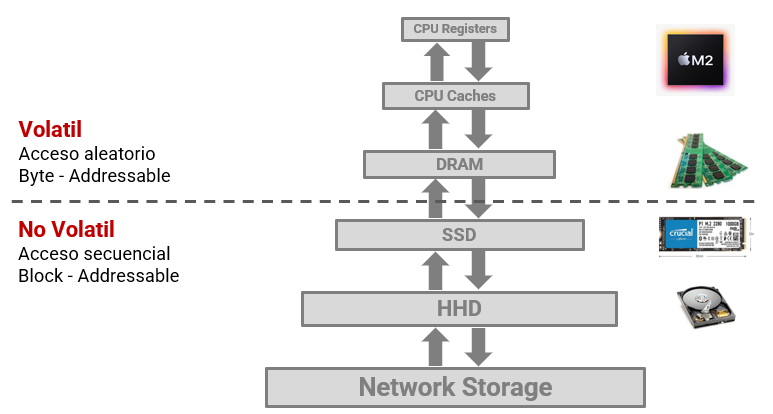
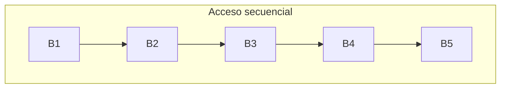
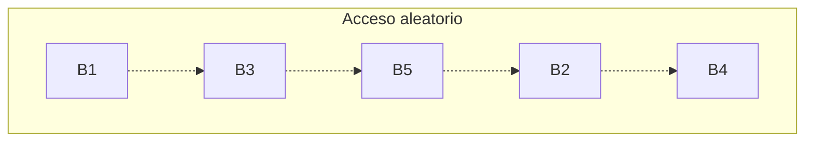
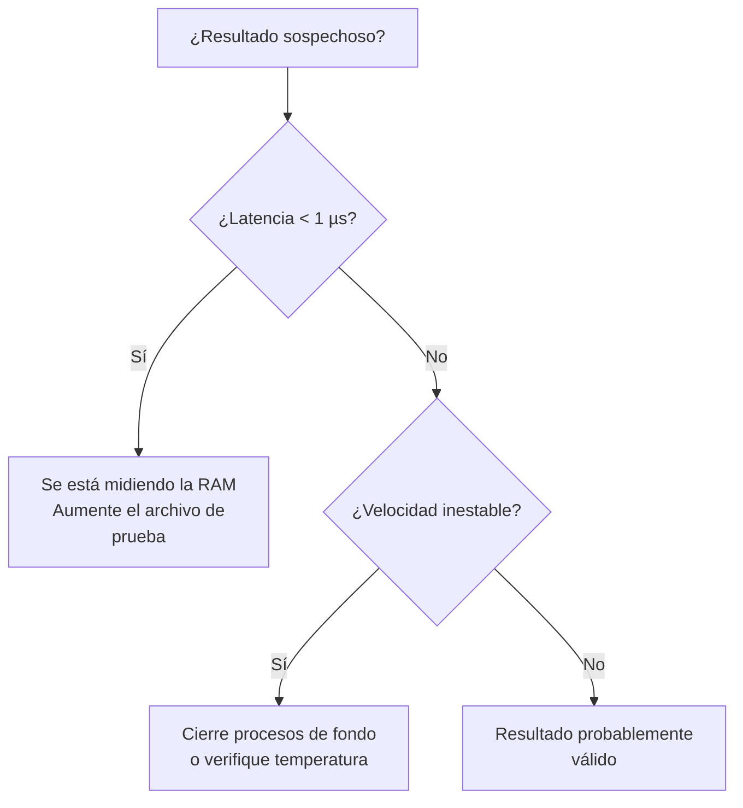

# Lab — Acceso a Disco y Costo de I/O

## Objetivos

Al finalizar este laboratorio el estudiante será capaz de:

* Comprender cómo se almacena la información en disco en bloques.
* Entender la diferencia entre acceso secuencial y acceso aleatorio.
* Medir empíricamente el rendimiento de acceso a disco.
* Comparar resultados experimentales con un modelo teórico de costo de I/O.
* Analizar el impacto del patrón de acceso a datos en el rendimiento de sistemas.

---

## Requerimientos para la práctica

### Software

Se requiere tener instalado:

* Python **3.9 o superior**
* Jupyter Notebook o **Google Colab**
* Git
* GitHub

### Hardware mínimo recomendado

En la siguiente tabla se describen las caracteristicas de hardware minimas recomentadas:

| Recurso                | Requerimiento           |
| ---------------------- | ----------------------- |
| Espacio libre en disco | **1 GB**                |
| Memoria RAM            | **4 GB**                |
| CPU                    | cualquier CPU moderna   |
| Sistema operativo      | Windows / Linux / macOS |

### Espacio en disco necesario

Durante el laboratorio se creará un archivo de prueba que se utilizará para simular almacenamiento en disco.

Tamaño aproximado del archivo:
* Archivo recomendado: 1 GB
* Archivo mínimo permitido: 512 MB

Por seguridad se recomienda tener al menos: 2 GB de espacio libre

### Herramientas necesarias

El laboratorio utiliza las siguientes librerías de Python:

```python
os
time
numpy
pandas
matplotlib
```

En **Google Colab** estas librerías ya están instaladas.

---

## Contexto

En muchos sistemas modernos el rendimiento **no depende únicamente del algoritmo**, sino también de **cómo se accede a los datos**.

Los datos pueden almacenarse en distintos niveles de la jerarquía de memoria:




Cada nivel tiene grandes diferencias en:

* Latencia
* Throughput
* Costo

En particular, el acceso a disco puede ser **millones de veces más lento que el acceso a memoria**.

Por esta razón los sistemas de bases de datos y los sistemas operativos están diseñados para **minimizar accesos costosos a disco**.

Este laboratorio explora uno de los factores más importantes: **el patrón de acceso a datos**

---

## Conceptos clave

### Bloques de I/O

Los dispositivos de almacenamiento **no leen bytes individuales**.

La unidad mínima de transferencia es un **bloque de datos**. Por ejemplo, dependiendo del contexto en el cual se este hablando tenemos:
* **Sistemas operativos**: bloque = 4 KB
* **Motores de bases de datos**: página de base de datos = 4 KB – 16 KB

Incluso si un programa solicita **1 byte**, el sistema leerá **todo el bloque**.

### Acceso secuencial vs acceso aleatorio

Cuando los datos se almacenan en disco, el **patrón de acceso** afecta significativamente el rendimiento.

#### Acceso secuencial

En acceso secuencial los bloques se encuentran **uno después del otro en el disco**.



Este tipo de acceso se caracteriza por:
* Pocos accesos físicos al disco
* Alto throughput
* Rendimiento alto

#### Acceso aleatorio

En acceso aleatorio los bloques se encuentran **dispersos en el disco**.



Para este tipo se acceso se tiene:
* Múltiples accesos al disco
* Mayor latencia
* Menor throughput

---

### Modelo teórico de costo de I/O

Utilizaremos el siguiente modelo simplificado:

$$
TotalTime =
AccessLatency \times M +
\frac{DataSize}{ScanThroughput}
$$

Donde:
* **$AccessLatency$**: Tiempo para acceder a un bloque
* **$M$**: Número de accesos no contiguos
* **$DataSize$**: Tamaño total de datos
* **$ScanThroughput$**: Velocidad de transferencia

---

## Preparación y Normalización del Entorno Experimental

Con el fin de garantizar la validez de nuestras pruebas y la consistencia de los datos, necesitamos controlar las variables que podrían generar ruido en los resultados. Dado que el hardware de cada computador influye directamente en la velocidad de lectura y escritura, es necesario realizar los siguientes pasos de normalización para que todos partamos de una base comparable.

### Paso 1: Identificación de la Tecnología de Almacenamiento

El tipo de unidad física determina la latencia base del sistema. Utilice el comando correspondiente a su sistema operativo para identificar si su disco es mecánico o de estado sólido.

#### **En Linux**

Ejecute el siguiente comando en la terminal:

```bash
lsblk -d -o name,rota,size,model
```

> [!note]
> **Interpretación (Columna ROTA):**
> * **1:** Indica un medio rotativo (**HDD**).
> * **0:** Indica un medio no rotativo (**SSD/NVMe**).
 

#### **En Windows**

Abra PowerShell como administrador y ejecute:

```powershell
Get-PhysicalDisk | Select-Object FriendlyName, MediaType, BusType
```

> [!note]
> De acuerdo a los valores resultantes para las columnas, se obtiene la información sobre el disco de acuerdo a los siguientes resultados:
> * **MediaType:** Identifica si es HDD o SSD.
> * **BusType:** Ayuda a distinguir entre un SSD convencional (SATA) y un NVMe.

#### **En macOS**

Use la utilidad de sistema:

```bash
diskutil info disk0 | grep "Solid State"
```

### Paso 2: Registro de Especificaciones del Sistema

Antes de iniciar las pruebas, complete la siguiente tabla de metadatos. Esta información permitirá contextualizar las desviaciones en los tiempos de respuesta.

| Parámetro | Valor de Referencia |
| --- | --- |
| **Sistema Operativo** | Ej: Ubuntu 22.04 / Windows 11 23H2 |
| **CPU (Modelo y Núcleos)** | Ej: Intel i5-12400 / 6 núcleos |
| **Memoria RAM Total** | Ej: 16 GB DDR4 |
| **Tipo de Disco** | Ej: SSD NVMe PCIe 4.0 |
| **Carga de CPU en Reposo** | Ej: < 5% |

### Paso 3: Aislamiento del Experimento (Reducción de Ruido)

El "ruido" en las mediciones suele ser causado por procesos en segundo plano que compiten por el ancho de banda del bus de datos o ciclos de CPU. **Antes de ejecutar el benchmark:**

* **Cierre aplicaciones de alto consumo:** Navegadores, IDEs, Spotify o clientes de juegos.
* **Suspenda actualizaciones:** Verifique que el sistema operativo no esté descargando parches en segundo plano.
* **Desconecte entornos virtuales:** Las Máquinas Virtuales (VMs) o contenedores (Docker) añaden capas de abstracción que falsean la latencia real.

### Paso 4: Control de la Caché del Sistema Operativo

Los sistemas operativos modernos utilizan una porción de la RAM como **Page Cache** para acelerar los accesos al disco. Si los datos se leen desde la RAM, la latencia medida será de nanosegundos y no representará la realidad del disco.

Para mitigar este efecto (técnica de **Cold Cache Simulation**):

1. **Tamaño del Archivo:** Se utilizará un archivo que idealmente supere el tamaño de la caché de disco disponible.
2. **Accesos Dispersos:** El acceso aleatorio se realiza mediante saltos largos para evitar el *read-ahead* (pre-lectura) del sistema.
3. **Ejecución Única:** Cada prueba debe ser independiente para evitar que el SO "aprenda" el patrón de acceso.

### Referencias de Rendimiento Teórico

Utilice estos valores como línea base para validar si sus resultados son coherentes con la teoría:

| Tecnología | Latencia Promedio | Throughput Típico | Escala de Tiempo |
| --- | --- | --- | --- |
| **HDD** | 10 ms | 100 - 150 MB/s | Milisegundos |
| **SSD (SATA)** | 100 µs | 500 - 550 MB/s | Microsegundos |
| **SSD NVMe** | 10 - 20 µs | 2 - 7 GB/s | Microsegundos |

Los valores de la tabla son **aproximaciones conceptuales**.

> [!warning]
> **Nota**: Un valor de latencia inusualmente bajo (ej. < 1 µs) suele ser un indicador de que el experimento está midiendo la **Caché en RAM** y no el disco físico.

---
Aquí tienes la actualización de la sección **Actividad de laboratorio**. He ajustado la narrativa para que mantenga ese equilibrio entre la formalidad académica y una guía cercana, asegurando que el flujo desde la caracterización del hardware hasta el análisis de resultados sea coherente y profesional.

---
Aquí tiene la actualización de la sección **Actividad de laboratorio** con un tono formal, utilizando el tratamiento de "usted" y manteniendo el rigor académico y la claridad narrativa para el estudiante.

---

## Actividad de laboratorio

Una vez comprendidos los conceptos teóricos y normalizado el entorno, se iniciará la fase práctica. Esta actividad se divide en tres etapas fundamentales: caracterización del equipo, ejecución del protocolo y análisis crítico de los datos.

### Etapa 1 — Caracterización de la Estación de Trabajo

Para que los resultados obtenidos tengan **validez científica**, es indispensable documentar las especificaciones del hardware utilizado. Esta "ficha técnica" no es un mero requisito administrativo; es la herramienta que le permitirá discernir si las variaciones en el rendimiento se deben a la lógica del algoritmo o a las capacidades y limitaciones físicas de su arquitectura.

Antes de ejecutar cualquier celda de código, por favor complete el siguiente registro de metadatos (Actualice los valores de la tabla con los observados para el equipo en el cual va a llevar a cabo las pruebas):

| Parámetro | Valor Observado |
| --- | --- |
| **Sistema Operativo** | Ej: Windows 11 / Ubuntu 22.04 |
| **CPU (Modelo y Frecuencia)** | Ej: Intel i7-11800H @ 2.30GHz |
| **Arquitectura y Núcleos** | Ej: x64 / 8 núcleos físicos |
| **Memoria RAM Total** | Ej: 16 GB DDR4 |
| **Tecnología de Almacenamiento** | Ej: SSD NVMe Gen 3 |
| **Carga de CPU en Reposo (%)** |  |

> [!tip] 
> **Cómo medir la carga de CPU en reposo**
> 
> La **carga en reposo** representa el esfuerzo del procesador cuando no hay tareas intensivas activas. Para obtener una medición real, cierre navegadores, IDEs y herramientas de comunicación. Utilice el comando según su sistema:
> * **Windows (PowerShell):** `(Get-Counter '\Processor(_Total)\% Processor Time').CounterSamples.CookedValue`
> * **Linux (Terminal):** `top -bn1 | grep "Cpu(s)"` (Observe la suma de `%us` y `%sy`).
> * **macOS (Terminal):** `top -l 1 | grep "CPU usage"`.
> 
> 
> **Nota técnica:** Si la carga inicial supera el **10%**, existe "ruido" en el sistema que podría distorsionar los tiempos de latencia del experimento.

#### ¿Por qué es importante la carga en reposo?

Imagine que el procesador es un operario. Si este se encuentra ocupado al 40% atendiendo otras tareas (como actualizaciones de sistema o escaneos de antivirus), tardará más en responder a las peticiones de entrada/salida (I/O). El retraso no se deberá necesariamente a la lentitud del disco, sino a que la CPU se encuentra distraída con procesos ajenos al experimento.

### Etapa 2 — Configuración y Ejecución del Notebook

El núcleo del experimento se encuentra en el archivo de Python Notebook adjunto. Este entorno está diseñado para automatizar las mediciones complejas y permitir que usted centre su esfuerzo en el análisis de los datos.

1. **Localice el archivo:** `disk_io_lab_guided.ipynb`.
2. **Entorno de ejecución:** Puede utilizar un entorno local (**Jupyter Notebook/Lab**) para medir su propio hardware, o **Google Colab** para observar el comportamiento de máquinas virtuales en la nube.

#### Flujo de ejecución

Ejecute el notebook de manera secuencial (de arriba hacia abajo). El sistema realizará de forma automática las siguientes tareas:

1. **Generación del Dataset:** Creación de un archivo de prueba de tamaño controlado.
2. **Benchmark Secuencial:** Medición de lectura contigua de bloques.
3. **Benchmark Aleatorio:** Simulación de saltos (*seeks*) aleatorios para medir la latencia de acceso.
4. **Procesamiento Estadístico:** Cálculo de *throughput* y promedios de tiempo.

### Etapa 3 — Análisis e Interpretación de Hallazgos

El notebook generará automáticamente una serie de visualizaciones. Su labor consiste en interpretar qué indican estas gráficas sobre la interacción entre el software y el hardware.

#### Visualizaciones Clave a Analizar:

* **Throughput por tamaño de bloque:** Observe cómo la eficiencia del acceso aleatorio se degrada o mejora según el tamaño de la página de datos.
* **Comparación teoría vs. experimento:** Esta gráfica superpone sus mediciones reales sobre el modelo matemático de costo de I/O. ¿Qué tan cerca se encuentra su hardware del límite teórico?
* **Ventaja del acceso secuencial:** Un indicador numérico de cuántas veces es más eficiente leer linealmente en su dispositivo actual.

> [!warning] 
> **Diagnóstico de anomalías (Troubleshooting)**
> 
> Si obtiene resultados inusuales (ej. velocidades superiores a 20 GB/s o latencias menores a 1 µs), es muy probable que se esté midiendo la **Caché en RAM** y no el disco físico. En ese caso, aumente el tamaño del archivo en la sección de configuración del notebook para forzar la salida al almacenamiento físico.



---

## Evidencias y Entregables

Para la validación de esta práctica, su repositorio debe mantener la siguiente estructura organizada:

```text
lab-io/
├── README.md                # Informe principal con análisis y respuestas
├── disk_io_lab_guided.ipynb # Notebook ejecutado con resultados visibles
└── images/                  # Capturas de pantalla de las gráficas generadas

```

### Capturas Requeridas en el Informe

Incluya las siguientes imágenes en su `README.md` (utilizando el formato: ``):

1. **Tabla resumida de resultados** (última celda del notebook).
2. **Gráfica de Throughput Comparativo**.
3. **Gráfica de Tiempo Total (Teoría vs. Práctica)**.

---

## Preguntas de Análisis Científico

Responda de manera argumentada en su archivo `README.md`:

1. **Diferencial de Desempeño:** ¿Cuál patrón de acceso resultó ser más eficiente en su máquina y cuál es la proporción de diferencia (*ventaja secuencial*)?
2. **Efecto del Tamaño de Bloque:** ¿Cómo influye el tamaño de la unidad de lectura en la mitigación del costo del acceso aleatorio?
3. **Correlación con la Teoría:** ¿En qué puntos su hardware se alejó más del modelo teórico y qué factores físicos (interfaz, temperatura, caché) podrían explicarlo?
4. **Costo de Acceso:** Explique por qué, incluso en unidades de estado sólido (SSD) sin componentes mecánicos, el acceso aleatorio sigue siendo más costoso que el secuencial.
5. **Implicaciones en Sistemas:** Si usted estuviera diseñando un **Motor de Base de Datos**, ¿de qué manera utilizaría estos hallazgos para optimizar la velocidad de recuperación de registros?

---

## Reflexión Final

Este experimento demuestra que el rendimiento de los sistemas modernos está dictado por la **localidad de los datos**. Un algoritmo óptimo puede volverse ineficiente si ignora la manera en que el hardware recupera los bloques de información. Comprender el costo del I/O es el paso fundamental para diseñar sistemas escalables, desde estructuras de datos en disco (como **B+ Trees**) hasta sistemas de archivos de alto rendimiento.

> [!important]
> Este material fue desarrollado con apoyo de herramientas de IA como asistente de redacción y estructuración. El contenido ha sido supervisado, validado y refinado por intervención humana para garantizar su precisión técnica y coherencia pedagógica. No obstante, pueden haber errores.