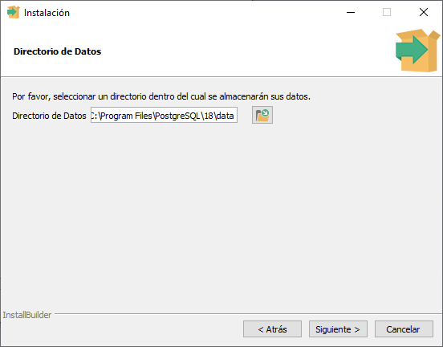
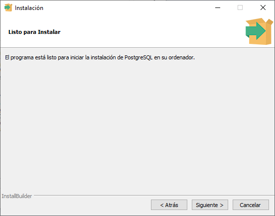
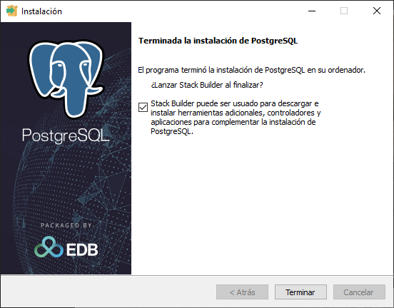
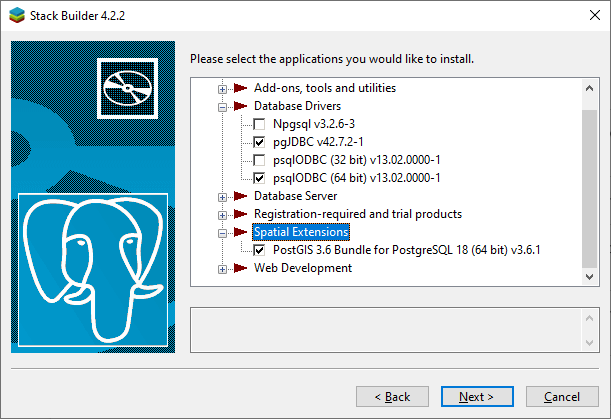
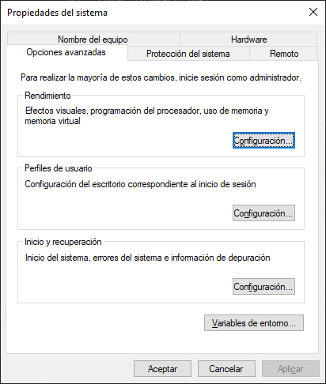
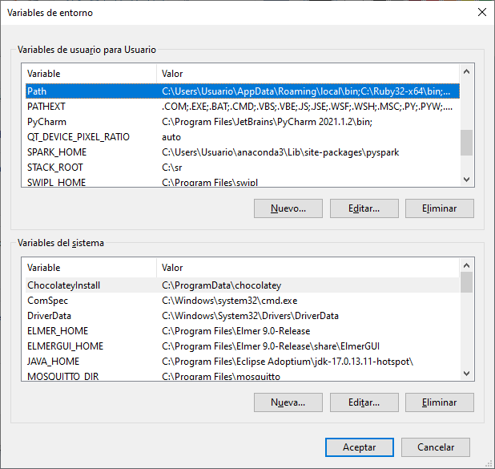

# Guía de Instalación de PostgreSQL en Windows

**Laboratorio de Estructura de Datos - Universidad de Antioquia**

Esta guía detalla el proceso para instalar PostgreSQL, el sistema de gestión de bases de datos relacionales que utilizaremos para nuestras prácticas.

---

## 1. Descarga del Instalador

1. Ve al sitio oficial de **EnterpriseDB** (distribuidor oficial de instaladores para Windows): [postgresql.org/download/windows](https://www.postgresql.org/download/windows/).
2. Haz clic en el enlace **"Download the installer"**.
3. Selecciona la versión más reciente y estable (por ejemplo, la 16.x o 17.x) para la arquitectura **Windows x86-64**.

> [!TIP]
> **Nota:** Asegúrate de descargar la versión de 64 bits a menos que tu equipo sea muy antiguo.

---

## 2. Inicio de la Instalación

1. Una vez descargado el archivo `.exe`, ejecútalo como **Administrador**.
2. Se abrirá el asistente de instalación. Haz clic en **Next**.

### 2.1 Selección del Directorio

* El instalador sugerirá una ruta por defecto (generalmente `C:\Program Files\PostgreSQL\XX`). Puedes dejarla así. Haz clic en **Next**.

---

## 3. Selección de Componentes

Asegúrate de que los siguientes componentes estén seleccionados:

* **PostgreSQL Server:** El motor de la base de datos.
* **pgAdmin 4:** Herramienta gráfica para gestionar tus bases de datos (¡Vital para el lab!).
* **Stack Builder:** Para instalar drivers o herramientas adicionales (opcional).
* **Command Line Tools:** Para usar la terminal (`psql`).

---

## 4. Directorio de Datos

El instalador te preguntará dónde guardar los datos físicos de la base de datos. Se recomienda dejar la carpeta `data` dentro de la ruta de instalación por defecto. Haz clic en **Next**.

---

## 5. Configuración Crítica: Contraseña del Superusuario

Este es el paso donde la mayoría de los estudiantes fallan. Debes definir una contraseña para el usuario **`postgres`**.

> [!CAUTION]
> **¡IMPORTANTE!** No olvides esta contraseña. Sin ella, no podrás acceder a tus bases de datos más adelante. Te sugiero algo simple como `admin123` para fines de laboratorio.

---

## 6. Puerto y Localización

1. **Puerto:** Por defecto es el **5432**. No lo cambies a menos que otra aplicación lo esté usando.
2. **Localización (Locale):** Selecciona **"[Default locale]"** o tu región (Spanish, Colombia) para que el manejo de caracteres (ñ, tildes) sea correcto.

> [!CAUTION]
> **¡IMPORTANTE!** En la imagen anterior apareció el puerto (**5433**) debido a que la máquina en la que se realizo la instalación tenia una version previa instalada.

---

## 7. Instalación Final

* El asistente te mostrará un resumen de la configuración. Haz clic en **Next** hasta que comience la barra de progreso.
* Al finalizar, desmarca la casilla de **Stack Builder** si no planeas instalar complementos extra por ahora.

---

## 8. Configuración de Stack Builder (Complementos)

Al finalizar la instalación, se te preguntará si deseas abrir el **Stack Builder**. Selecciónalo y elige tu servidor en la lista desplegable.

**Recomendaciones del Laboratorio:**

Solo instala lo estrictamente necesario para evitar saturar el sistema:

| Categoría | Herramienta | ¿Por qué? |
| :--- | :--- | :--- |
| **Database Drivers** | **pgJDBC** | **Obligatorio** si usas Java para conectar la DB. |
| **Database Drivers** | **psqlODBC** | Útil para conexiones con Excel o herramientas externas. |
| **Spatial Extensions** | **PostGIS** | Opcional (solo si trabajarán con datos geográficos). |
| **Web Development** | **Nada** | **No es útil** para el enfoque de Estructura de Datos. |

---

## 9. Verificación de la Instalación

Para confirmar que todo funciona:

1. Busca en el menú inicio la aplicación **pgAdmin 4** y ábrela.
2. Te pedirá una contraseña maestra (para la app) y luego la contraseña del servidor (la que pusiste en el paso 5).
3. Si puedes ver el árbol de "Servers" y la base de datos "postgres", **¡lo lograste!**

---

## 10. (Opcional) Variables de Entorno

Si deseas usar PostgreSQL desde la terminal de Windows (`CMD` o `PowerShell`), debes agregar la carpeta `bin` a tu **PATH**:

1. Busca "Editar las variables de entorno del sistema".
   
   

2. En **Variables de entorno**, busca `Path` en "Variables del sistema" y haz clic en Editar.
   
   

3. Agrega la ruta: `C:\Program Files\PostgreSQL\XX\bin`.
   
   

